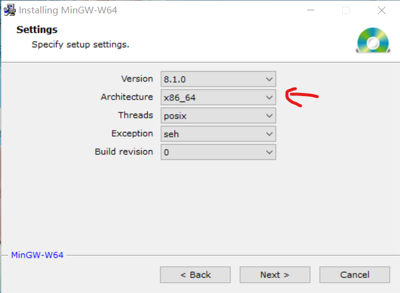
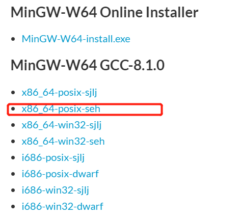
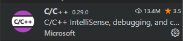
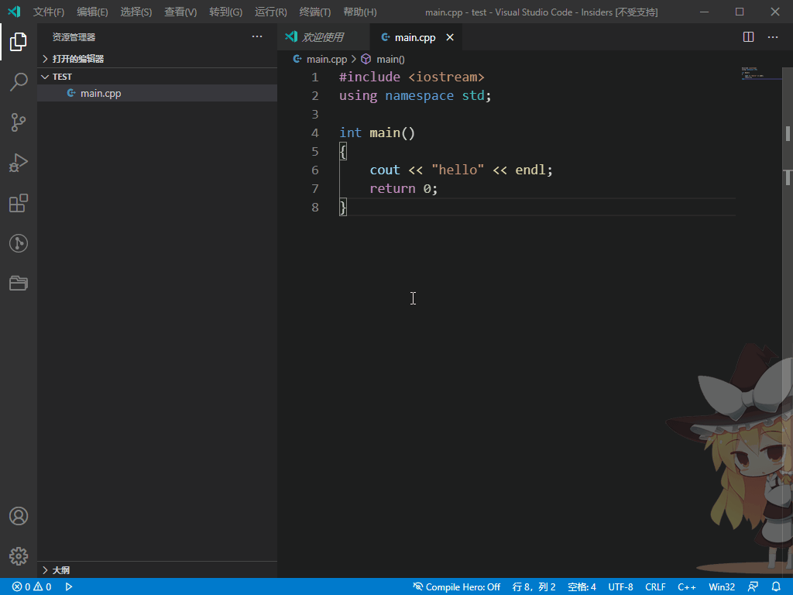

# 1. C++ 环境配置

## 1. MinGW & Clion

1. 安装好[Clion](https://www.jetbrains.com/clion/)
2. 在Clion设置菜单`Toolchains`
3. Environment下面选择MinGW，可以点击右上角的download直接进入MinGW下载页面
    

4. 在线安装mingw
   1. 从网站中下载[MinGW](http://mingw-w64.org/doku.php/download/mingw-builds)安装包
        

   2. 这个是在线安装的安装包，根据设备选择架构，i686表示32位，x86_64是64位架构，要记住安装目录
        

   3. 在Clion设置选择MinGW的安装路径即可
5. 网络不好时可以选择离线安装
   1. [下载地址](https://sourceforge.net/projects/mingw-w64/files/mingw-w64/)
   2. 根据系统选择版本，Windows建议x86_64-posix-seh
        
   3. 解压下载的压缩文件即可

## 2. VSCode 配置

1. 安装 C/C++ 插件

    

2. 配置方法，这里以C++为例，C的配置方法相同，只不过生成的配置文件略有区别
   1. 先创建一个测试的cpp文件，比如

        ```cpp
        #include <iostream>
        using namespace std;

        int main()
        {
            cout << "hello" << endl;
            return 0;
        }
        ```

   2. 按 `f5` 依次选择环境 `C++(GDB/LDB)`，选择配置 `g++.exe`，系统就会自动生成配置和编译文件，然后就可以开始调试了
        

3. 也有一种不用配置的方法，下载安装插件：C/C++ Compile Run，只需安装下面的插件即可, `f6`直接运行
        
