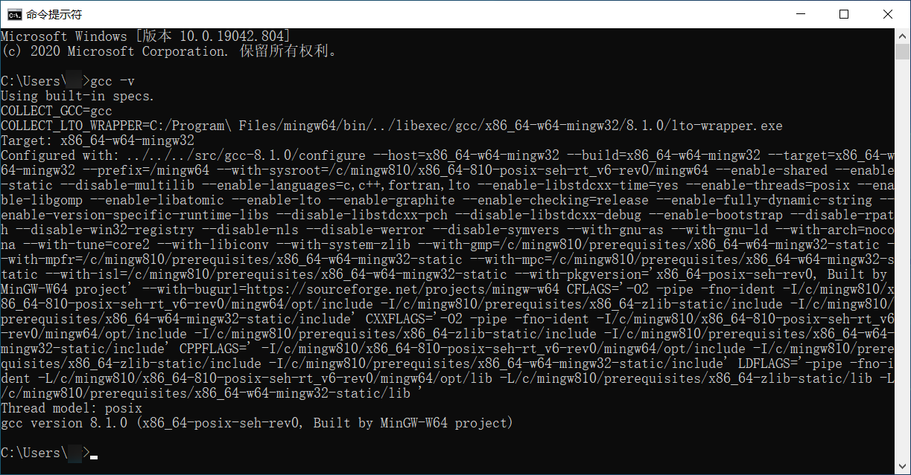

# 1. C++ 环境配置

## 1. MinGW & Clion

1. 安装好 [Clion](https://www.jetbrains.com/clion/)
2. 在 Clion 设置菜单`Toolchains`
3. Environment 下面选择 MinGW，可以点击右上角的 download 直接进入 MinGW 下载页面

    

4. 在线安装 MinGW(Minimalist GNU for Windows)
   1. 从网站中下载 [MinGW](http://mingw-w64.org/doku.php/download/mingw-builds) 安装包

        

   2. 这个是在线安装的安装包，根据设备选择架构，i686 表示 32 位，x86_64 是 64 位架构，要记住安装目录

        

   3. 在 Clion 设置选择 MinGW 的安装路径即可
   4. 查看已安装的版本`gcc -v`

5. 网络不好时可以选择离线安装
   1. [下载地址](https://sourceforge.net/projects/mingw-w64/files/mingw-w64/)
   2. 下载界面往下拉，根据系统选择版本，Windows 建议 x86_64-posix-seh

        

   3. 解压下载的压缩文件即可
6. 根据自己的安装路径配置环境变量，在系统变量中的 path 中添加 mingw 的路径，最好重启一下使环境变量生效
   

7. 在命令行中输入`gcc -v`, 显示出 gcc 版本表示安装成功
   

## 2. VSCode 配置

1. 安装 C/C++ 插件

    

2. 配置方法，这里以 C++为例，C 的配置方法相同，只不过生成的配置文件略有区别，`注意文件路径中不要使用中文，不然会出现找不到文件的错误`
   1. 先创建一个测试的 cpp 文件，比如

        ```cpp
        #include <iostream>
        using namespace std;

        int main()
        {
            cout << "hello" << endl;
            return 0;
        }
        ```

   2. 按 `f5` 依次选择环境 `C++(GDB/LLDB)`，选择配置 `g++.exe`，系统就会自动生成配置和编译文件，然后就可以开始调试了

        

   3. Debug 出现相对路径文件无法读取的问题时，需要修改 launch.json 文件，将`"cwd"`后面的路径修改成`"${fileDirname}"`, 即

        ```json
        "cwd": "${fileDirname}",
        ```

3. 也有不用配置的方法，可以直接运行 c++程序，但是不能调试

    > 下载安装插件 `C/C++ Compile Run`，只需安装下面的插件即可，`f6` 直接运行

    

    > 如果使用多种语言的话，推荐 `Code Runner` 插件

    

## 3. Windows 下命令行编译

1. 编译成。o 文件

    ```bash
    g++ -c test.cpp
    ```

2. 编译成 exe 执行文件

    ```bash
    # 不命名的话会生成 a.exe
    g++ test.cpp -o test
    ```
