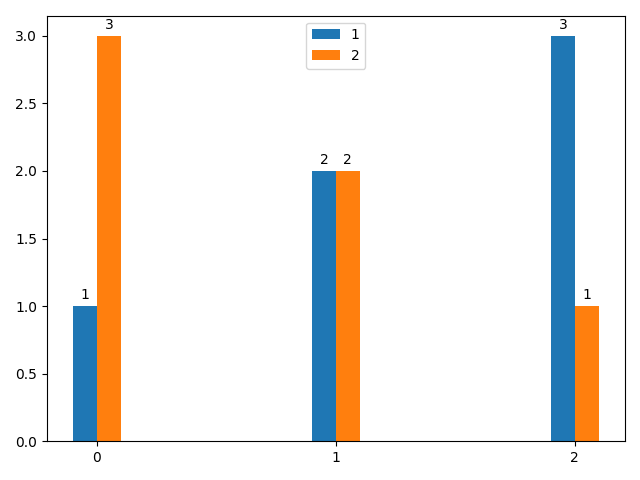
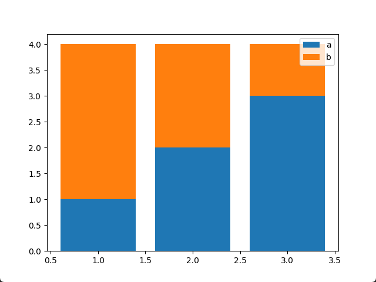
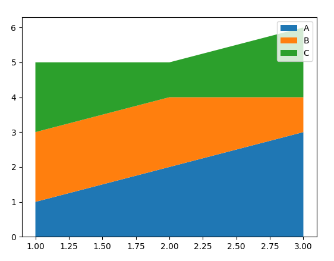
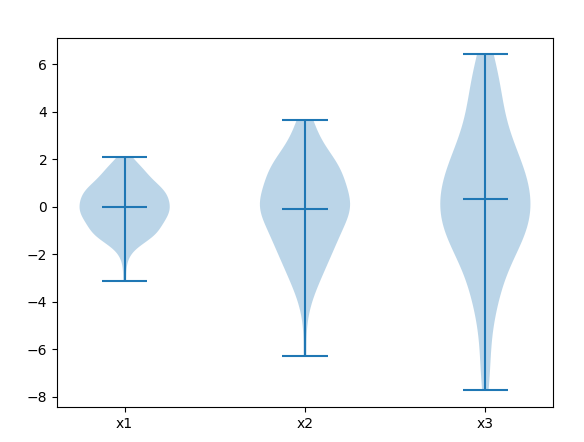
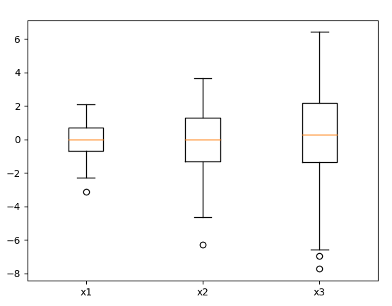
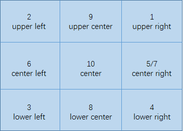
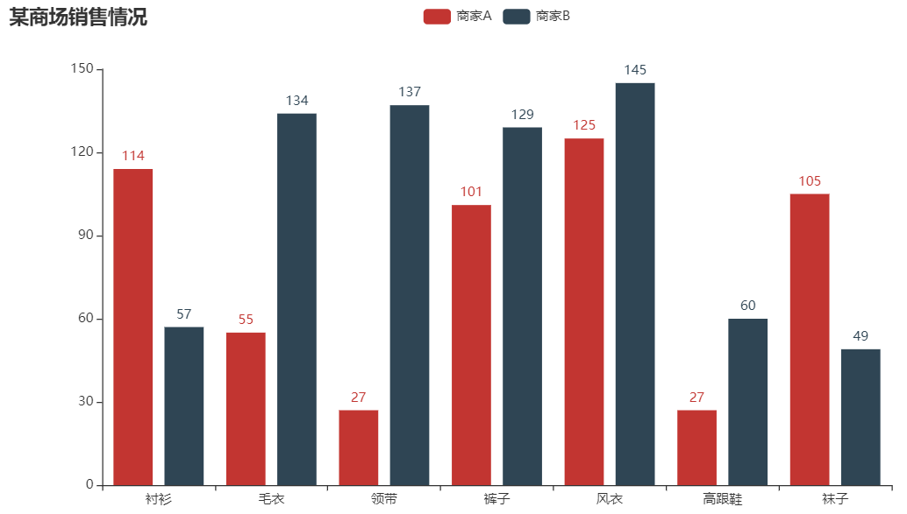
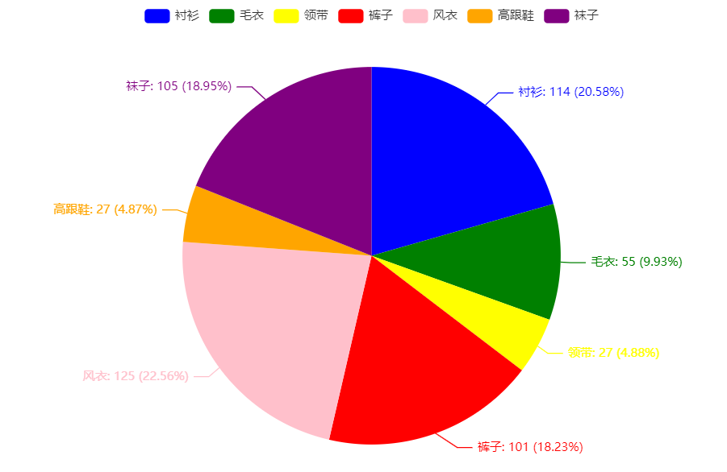

# 6. Matplotlib, Pyecharts 绘图

## 1. 安装

1. 安装 Matplotlib

    ```bash
    pip install matplotlib
    ```

2. 安装 Pyecharts, Pyecharts 绘图会保存成 HTML 文件，需要用浏览器打开

    ```bash
    pip install pyecharts
    ```

## 2. 绘图种类

### 2.1. plot 折线绘图

1. 代码

    ```python
    import matplotlib.pyplot as plt

    plt.figure()
    # 两条曲线 (x1,x2) 和 (x2, y2)
    plt.plot(x1, y1, x2, y2)
    plt.show()
    ```

2. plot 设置，更多设置参考 [官方文档](https://matplotlib.org/3.2.0/api/_as_gen/matplotlib.pyplot.plot.html)

    ```python
    plt.plot([1, 2, 3], [1, 1, 1], 'b-', label='line 1', linewidth=2)  # 蓝色直线
    plt.plot([1, 2, 3], [2, 2, 2], 'g--', label='line 2', linewidth=2)  # 绿色虚线
    plt.plot([1, 2, 3], [3, 3, 3], 'ro-.', label='line 3', linewidth=2)  # 红色带圈点划线
    plt.plot([1, 2, 3], [4, 4, 4], 'cv:', label='line 4', linewidth=2)  # 蓝绿色倒三角点线
    plt.plot([1, 2, 3], [5, 5, 5], 'm^', label='line 5', linewidth=2)  # 紫红色正三角
    plt.plot([1, 2, 3], [6, 6, 6], 'y<', label='line 5', linewidth=2)  # 黄色左三角
    plt.plot([1, 2, 3], [7, 7, 7], 'k>', label='line 5', linewidth=2)  # 黑色右三角
    ```

    

### 2.2. scatter 散点图

1. 带颜色区分的散点图
2. 三维散点图

    ```python
    fig = plt.figure()

    ax = fig.add_subplot(projection='3d')
    ax.scatter(x, y, z, c=y_pred)
    ax.set_xlabel('x')
    ax.set_ylabel('y')
    ax.set_zlabel('z')

    plt.show()
    ```

### 2.3. bar 柱状图

1. 基础柱状图

    ```python
    import matplotlib.pyplot as plt

    x = list('abcd')
    y = [1, 2, 3, 4]

    plt.figure()
    plt.bar(x, y)
    plt.show()
    ```

    

2. 分组柱状图

    ```python
    import matplotlib.pyplot as plt
    import numpy as np

    fig, ax = plt.subplots()
    width = 0.1
    x = np.arange(0, 3)
    y1 = [1, 2, 3]
    y2 = [3, 2, 1]

    # 用偏移量设置多组柱状图
    b1 = ax.bar(np.add(x, -width / 2), y1, width, label='1')
    b2 = ax.bar(np.add(x, width / 2), y2, width, label='2')

    ax.legend() # 显示图例

    ax.bar_label(b1, padding=3) # 柱状图显示数值
    ax.bar_label(b2, padding=3) # 柱状图显示数值
    fig.tight_layout()  # 减小图片边框

    # x 轴间隔设置为 1
    x_locator = plt.MultipleLocator(1)
    ax.xaxis.set_major_locator(x_locator)

    plt.show()
    ```

      

3. 堆叠柱状图

    ```python
    import numpy as np
    from matplotlib import pyplot as plt

    x = [1, 2, 3]
    y1 = [1, 2, 3]
    y2 = [3, 2, 1]

    fig, ax = plt.subplots()
    ax.bar(x, y1, label='a')
    ax.bar(x, y2, bottom=y1, label='b')
    ax.legend()
    plt.show()
    ```

      

4. 参数

    ```python
    bar(x, height, width=0.8, bottom=None, ***, align='center', data=None, **kwargs)
    ```

    | 参数   | 功能                                         |
    | ------ | -------------------------------------------- |
    | x      | x 坐标                                       |
    | height | 高度，即 y 值                                |
    | width  | 柱宽，取值在 0-1 之间，默认 0.8              |
    | bottom | 柱状图的起始位置                             |
    | align  | 柱状图的中心位置，'edge'左边缘，'center'中心 |

5. 动态柱宽

    > 有时需要根据数据设置柱状图列宽和偏移量，下面给出推荐设置

    ```python
    def plot(x, y):
        # 要求是等间距 x 坐标
        delta = x[1] - x[0]

        # 图像向右偏移半个坐标（柱状图位于两个坐标正中）
        # 动态柱宽 0.9 * delta 比较好看，可以根据需求适当调整
        plt.bar(np.array(x) + 0.5 * delta, y, width=0.9 * delta)
    ```

### 2.4. pie 饼图

1. 代码

    ```python
    import matplotlib.pyplot as plt

    labels = 'a', 'b', 'c', 'd'
    sizes = [15, 30, 45, 10]
    explode = (0, 0.1, 0, 0)

    plt.subplots()
    # explode: 每个楔子偏离的距离
    # autopct: 自动显示饼图百分比
    plt.pie(sizes, explode=explode, labels=labels, autopct='%1.1f%%', shadow=True, startangle=90)
    plt.axis('equal')  # Equal aspect ratio ensures that pie is drawn as a circle.

    plt.show()
    ```

    

### 2.5. stackplot 堆叠面积图

1. 堆叠面积曲线

    ```python
    x = [1, 2, 3]
    stacks = {
        'A': [1, 2, 3],
        'B': [2, 2, 1],
        'C': [2, 1, 2]
    }

    fig, ax = plt.subplots()
    ax.stackplot(x, stacks.values(), labels=stacks.keys())
    ax.legend()
    plt.show()
    ```

    

### 2.6. 盒须图/箱形图

1. violinplot 提琴图

    ```python
    import matplotlib.pyplot as plt
    import numpy as np

    # Random test data
    np.random.seed(19680801)
    all_data = [np.random.normal(0, std, size=100) for std in range(1, 4)]  # [100]*3 数组
    labels = ['x1', 'x2', 'x3']

    plt.violinplot(all_data,
                   showmeans=True,  # 显示均值
                   showmedians=False)  # 不显示中位数
    plt.xticks([x + 1 for x in range(len(all_data))], labels=labels)
    plt.show()
    ```

      

2. 盒须图

    ```python
    import matplotlib.pyplot as plt
    import numpy as np

    # Random test data
    np.random.seed(19680801)
    all_data = [np.random.normal(0, std, size=100) for std in range(1, 4)]
    labels = ['x1', 'x2', 'x3']

    plt.boxplot(all_data)
    plt.xticks([x + 1 for x in range(len(all_data))], labels=labels)
    plt.show()
    ```

      

## 3. 图片设置

### 3.1. 坐标轴

1. 坐标轴反向

    ```python
    ax.invert_xaxis()  # x 坐标轴反向
    ```

2. 设置坐标值

    ```python
    # 按照需求设置坐标，坐标一定要有对应的数据
    x_axis = ['2018-09-01', '2018-10-01', '2018-11-01', '2018-12-01', '2018-12-31']
    plt.xticks(x_axis, rotation=15)  # 刻度倾斜
    # 还可以对坐标重命名，并顺时针旋转坐标 15°
    x_axis = ['2018-01-01 00:00:00', '2018-01-02 00:00:00', '2018-01-03 00:00:00']
    plt.xticks(x_axis, ('a', 'b', 'c'), rotation=-15)  # 将横坐标值重命名为 a,b,c
    # 如果是多图的话需要用 set_sticks, 参考本章 2.3 多图设置

    # 按照等间隔数值设置坐标
    plt.xticks(np.arange(0, 25, 4))  # 范围 0-25，分度值 4

    # 不显示坐标
    plt.xticks([])  # 不显示 x 轴坐标
    plt.yticks([])  # 不显示 y 轴坐标
    ```

3. 调整坐标轴间隔

    ```python
    # x 轴间隔设置为 1
    x_locator = plt.MultipleLocator(1)
    ax.xaxis.set_major_locator(x_locator)
    ```

4. 设置坐标限位

    ```python
    # 数值型
    plt.xlim(0, 24)
    plt.ylim(0, 10)

    # 日期型
    plt.xlim(datetime.strptime('2019-05-12', '%Y-%m-%d'), datetime.strptime('2019-05-15', '%Y-%m-%d'))
    ```

5. 设置轴标签

    ```python
    plt.figure()
    plt.xlabel("x")
    plt.ylabel("y")

    # 或
    fig, ax = plt.subplots()
    ax.set_xlabel('x')
    ax.set_ylabel('y')
    ```

6. 坐标轴字体大小

    ```python
    plt.figure()
    plt.tick_params(labelsize=14)

    # 或
    fig, ax = plt.subplots()
    ax.tick_params(labelsize=14)
    ```

7. 坐标轴坐标倾斜

    ```python
    plt.xticks(x_axis, rotation=15)  # 刻度倾斜
    # 或
    ax.set_xticklabels(labels=x, rotation=-45)
    ```

8. 坐标轴偏移

    ```python
    import numpy as np

    # 以柱状图为例，+图像右移，-图像左移
    plt.bar(np.array(x_list) +- 偏移量，y)
    ```

### 3.2. 图例 & 标题

1. plt.legend

    ```python
    # 设置图例
    plt.plot(x1, y1, label='a')
    plt.plot(x2, y2, label='b')
    plt.legend()
    ```

2. 位置 `loc=string or code`

    | 位置 string    | 位置 code | 位置            |
    | -------------- | --------- | --------------- |
    | 'best'         | 0         | 自适应          |
    | 'upper right'  | 1         | 右上↗           |
    | 'upper left'   | 2         | 左上↖           |
    | 'lower left'   | 3         | 左下↙           |
    | 'lower right'  | 4         | 右下↘           |
    | 'right'        | 5         | 右→             |
    | 'center left'  | 6         | 左←             |
    | 'center right' | 7         | 右→（同 rigth） |
    | 'lower center' | 8         | 下↓             |
    | 'upper center' | 9         | 上↑             |
    | 'center'       | 10        | 中心            |

      

3. 设置图例的显示方式

    ```python
    # 图例显示位置 1, 6 列
    plt.legend(loc=1, ncol=6)

    # 图例显示到图外：loc 此时表示定位点，bbox_to_anchor 表示定位点的位置
    # 定位点为图例左上角，偏移位置 x=1.05,y=1.0
    plt.legend(loc=2, bbox_to_anchor=(1.05, 1.0), borderaxespad=0.)
    ```

4. 标题

    ```python
    plt.title('图名', size=16)
    ```

5. legend 参数，更多配置参考 [官方文档](https://matplotlib.org/stable/api/_as_gen/matplotlib.pyplot.legend.html)

### 3.3. 多图设置

1. subplot(nrows, ncols, index, **kwargs)

    ```python
    plt.subplot(2, 2, 1)  # 或 plt.subplot(221)
    plt.plot(x1, y1)
    plt.subplot(2, 2, 2)  # 或 plt.subplot(222)
    plt.plot(x2, y2)
    plt.subplot(2, 2, 3)  # 或 plt.subplot(223)
    plt.plot(x2, y2)
    plt.subplot(2, 2, 4)  # 或 plt.subplot(224)
    plt.plot(x2, y2)
    ```

2. subplots

    ```python
    # 1. 类似 subplot 的分图功能
    # 1xn 类型
    fig, ax = plt.subplots(1, 2)
    ax[0].plot(x1, y1)
    ax[0].set_xticks(x_axis, ('0', '12', '24'))  # 修改坐标轴显示
    ax[0].set_xlabel('x')  # 设置 x 轴标签
    ax[0].set_ylabel('y')  # 设置 y 轴标签
    
    ax[1].plot(x2, y2)  # 其他设置同上

    # 2x2 以上
    fig, ax = plt.subplots(2, 2)
    ax[0, 0].plot(x1, y1)
    ax[1, 0].plot(x2, y2)
    ```

### 3.4. 多坐标轴（副坐标轴）

1. 副坐标轴功能

    ```python
    import matplotlib.pyplot as plt

    x1 = list('abcd')
    x2 = x1
    y1 = [1, 2, 3, 4]
    y2 = [4, 3, 2, 1]

    fig, ax1 = plt.subplots()

    ax1.plot(x1, y1, label='a')
    # 设置 ax2 与 ax1 公用横坐标
    ax2 = ax1.twinx()
    # 第二条线必须指定其他颜色，不然都会和第一条曲线显示相同颜色
    ax2.plot(x2, y2, c='r', label='b')

    plt.title('abc')
    plt.show()
    ```

2. 图例融合

    > 使用多坐标轴画图时有个问题是`不同坐标轴间的图例会覆盖`，因此需要图例融合，将不同图例合并到一起

    ```python
    import matplotlib.pyplot as plt

    x1 = list('abcd')
    x2 = x1
    y1 = [1, 2, 3, 4]
    y2 = [4, 3, 2, 1]

    fig, ax1 = plt.subplots()

    # 设置 ax2 与 ax1 公用横坐标
    l1 = ax1.plot(x1, y1, label='a')
    ax2 = ax1.twinx()
    l2 = ax2.plot(x2, y2, c='r', label='b')

    # 图例融合
    lns = l1 + l2
    labs = [ln.get_label() for ln in lns]
    ax1.legend(lns, labs, loc=9)

    plt.title('abc')
    plt.show()
    ```

    

3. 还有一种方法是不同位置分别显示

### 3.5. 辅助线

1. 水平线

    ```python
    # 水平虚线，高度为 y，从 (xmin,y) 到 (xmax,y)
    plt.hlines(y, xmin, xmax, linestyle=':')
    ```

2. 竖直线

    ```python
    # 垂直虚线，从 (x,ymin) 到 (x,ymax)
    plt.vlines(x, ymin, ymax, linestyle=':')
    ```

3. 图片方格

    ```python
    plt.grid(True)  # 开启方格
    ```

### 3.6. 注释

1. plt.text() 使用

    ```python
    # 
    plt.text()
    ```

2. plt.annotate()

### 3.7. 图片显示/输出设置

1. 中文编码问题

    ```python
    plt.rcParams['font.sans-serif'] = ['SimHei']  # 解决 plt 中文乱码
    plt.rcParams['axes.unicode_minus'] = False  # 用来正常显示坐标轴负号
    ```

2. 图片大小设置

    ```python
    plt.rcParams['figure.figsize'] = (12, 8)
    ```

3. 图片保存

    ```python
    # 要放在 plt.show() 前面，不然会变成空白
    plt.savefig("Picture.png")
    # 批量保存图片为防止大量图片占用内存，需要关闭图片
    plt.close()
    ```

4. 图片边框修改

    ```python
    plt.tight_layout()  # 缩小边框空白
    ```

## 4. 动态图

1. Animation

    ```python
    import matplotlib.animation as ani

    ```

## 5. Pyecharts

### 5.1. Bar 柱状图

```python
from pyecharts.charts import Bar
from pyecharts import options as opts

bar = (
    Bar()
    .add_xaxis(["衬衫", "毛衣", "领带", "裤子", "风衣", "高跟鞋", "袜子"])
    .add_yaxis("商家 A", [114, 55, 27, 101, 125, 27, 105])
    .add_yaxis("商家 B", [57, 134, 137, 129, 145, 60, 49])
    .set_global_opts(title_opts=opts.TitleOpts(title="某商场销售情况"))
    .render('render.html')
)
```

  

### 5.2. Pie 饼图

```python
from pyecharts.charts import Pie
from pyecharts import options as opts

x = ["衬衫", "毛衣", "领带", "裤子", "风衣", "高跟鞋", "袜子"]
y = [114, 55, 27, 101, 125, 27, 105]
pie = (
    Pie()
    .add("", [list(x) for x in zip(x, y)])
    .set_colors(["blue", "green", "yellow", "red", "pink", "orange", "purple"])
    .set_series_opts(label_opts=opts.LabelOpts(formatter="{b}: {c} ({d}%)"))
    .render('render.html')
)
```

  
