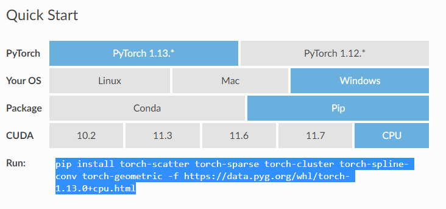
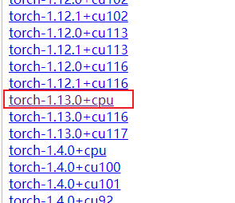

# 13. PyTorch 笔记

## 1. 安装

1. 安装包比较大，建议先配置清华源，参考第一章 [Python 环境🔗](Python-01-环境。md)
2. 进入 Pytorch 官网的 [安装页面🔗](https://pytorch.org/get-started/locally/), 根据需要选择环境和安装版本

      

3. 根据生成的命令再本地执行安装

   > 比如根据上图选择的通过 pip 安装的适用于 python 的 cpu 版本 Pytorch

    ```bash
    pip3 install torch torchvision torchaudio
    ```

4. 使用 gpu 进行训练需要配置 cuda 环境，参考 [CUDA 安装🔗](Py-01-环境_Env.md##-5.-CUDA-安装)

    - Tips1: gpu 版本需要先 NVIDIA 显卡并安装 CUDA，最好先根据列出的版本安装对应的 CUDA 版本，比如上图要安装 CUDA11.1，然后复制对应的指令安装相应版本的 torch
    - Tips2: 安装包比较大，可以通过 pip 指令列出的地址下载好安装包后，从本地安装

    ```python
    import torch

    print(torch.cuda.is_available())    # True 表示可用
    # 显示显卡数量
    print(torch.cuda.device_count())    # 1 表示只有一块显卡
    # 显示当前
    print(torch.cuda.current_device())  # 0 表示当前在第一块显卡上
    # 显示显卡名
    print(torch.cuda.get_device_name(0))    # NVIDIA GeForce MX150

    # 实际使用 GPU 进行训练的方法
    device = torch.device("cuda:0" if torch.cuda.is_available() else "cpu")  # 有 GPU 就用 GPU, 否则用 CPU
    
    model.to(device)  # 移动模型到 GPU
    x_data = x_data.to(device) # 将训练数据放入 GPU
    y_data = y_data.to(device) # 将训练数据放入 GPU
    out = model(x_data)    # 进行训练
    ```

## 2. 基础使用方法

### 2.1. 数据处理

1. 数据转换

    ```python
    # torch 转 numpy
    torch_data.numpy()

    # numpy 转 torch
    torch_data = torch.FloatTensor(np_data).to(device)
    # 或
    torch_data = torch.tensor(np_data, dtype=torch.float32, device=device)
    ```

2. 降维

    ```python
    torch.squeeze(input, dim=None, out=None)
    ```

3. numpy 转 tensor

    ```python
    x = torch.from_numpy(x)  # numpy 转 tensor
    ```

4. DataLoader 用法

    ```python
    import torch.utils.data as Data

    # x, y 分别为数据集的输入和输出
    x = torch.from_numpy(x.astype(np.float32))  # numpy 转 tensor.float32
    y = torch.from_numpy(y.astype(np.float32))  # numpy 转 tensor.float32
    
    torch_dataset = Data.TensorDataset(x, y)  # 转换成 Torch 能识别的 Dataset
    loader = Data.DataLoader(
        dataset=torch_dataset,
        batch_size=batch_size,
        shuffle=True,  # 是否打乱数据
        num_workers=2,  # 多线程读取数据
    )
    ```

### 2.2. 创建模型（以全链接为例）

1. 创建模型方法 1：神经网络层与其他层分开写

    ```python
    class MLP(nn.Module):  # 模型
        def __init__(self):
            super(MLP, self).__init__()  # 继承 nn.Module.__init__()
            # super().__init__()  # 与上面一句等效
            self.nn1 = nn.Linear(10, 100)  # 第一层线性层，输入 10 维，输出 100 维
            self.nn2 = nn.Linear(100, 100)  # 第二层线性层
            self.nn3 = nn.Linear(100, 10)  # 第三层线性层

        def forward(self, x):
            # 第一层
            x = self.nn1(x)  # 线性
            x = torch.relu(x)  # 激活函数
            x = F.dropout(x, p=0.1, training=self.training)  # dropout
            # 第二层
            x = torch.relu(self.nn2(x))  # 另一种写法：线性+激活函数
            x = torch.dropout(x, p=0.1, train=self.training)  # dropout
            # 第三层
            x = torch.dropout(torch.tanh(self.nn3(x)), p=0.1, train=self.training)  # 线性+激活+dropout

            return x

    model = MLP()
    print(model)
    """
    MLP(
    (nn1): Linear(in_features=10, out_features=100, bias=True)
    (nn2): Linear(in_features=100, out_features=100, bias=True)
    (nn3): Linear(in_features=100, out_features=10, bias=True)
    )
    """
    ```

2. 创建模型方法 2：神经网络层与其他层写到一起

    ```python
    import torch.nn as nn

    class MLP(nn.Module):  # 模型
        def __init__(self):
            super(MLP, self).__init__()  # 继承 nn.Module.__init__()
            # super().__init__()  # 与上面一句等效

            self.model = nn.Sequential(  # 序列
                nn.Linear(10, 100),  # 第一层线性层，输入 10 维，输出 100 维
                nn.ReLU(),  # 激活函数
                nn.Dropout(0.1),
                nn.Linear(100, 100),  # 第二层线性层
                nn.ReLU(),  # 激活函数
                nn.Dropout(0.1),
                nn.Linear(100, 10),  # 第三层线性层
                nn.ReLU(),  # 激活函数
                nn.Dropout(0.1),
            )

        def forward(self, x):
            x = self.model(x)

            return x

    model = MLP()   # 创建模型
    print(model)    # 打印模型结构，结果如下：

    """
    MLP(
    (model): Sequential(
        (0): Linear(in_features=10, out_features=100, bias=True)
        (1): ReLU()
        (2): Dropout(p=0.1, inplace=False)
        (3): Linear(in_features=100, out_features=100, bias=True)
        (4): ReLU()
        (5): Dropout(p=0.1, inplace=False)
        (6): Linear(in_features=100, out_features=10, bias=True)
        (7): ReLU()
        (8): Dropout(p=0.1, inplace=False)
    )
    """

    ```

### 2.3. 模型保存与加载

1. 保存模型

    ```python
    # 只保存模型参数，体积小，速度快
    torch.save(net.state_dict(), 'model_para')

    # 保存完整的模型
    torch.save(net, 'model_name')
    ```

2. 加载模型

    > map_location 不设置的话，模型会加载到保存模型的设备

    ```python
    # 加载模型参数
    model = xxxNet()  # 先创建模型
    static_dict = torch.load('model_para', map_location='cuda:0')  # 加载模型参数文件
    model.load_state_dict(static_dict)  # 将模型参数加载到模型中

    # 加载整个模型
    model = torch.load('model_name')
    model = torch.load('model_name', map_location=torch.device('cpu'))   # 加载模型到 cpu
    ```

## 3. Torch 模型

1. [官方文档🔗](https://pytorch.org/docs/stable/nn.html)

### 3.1. 卷积层 Convolution Layers

1. 卷积层：conv2d 二维卷积，[卷积动画🔗](https://github.com/vdumoulin/conv_arithmetic/blob/master/README.md)

    ```python
    import torch nn as nn
    import torch.nn.functional as F

    nn.Conv2d(in_channels, out_channels, kernel_size, stride=1, padding=0, dilation=1, groups=1, bias=True, padding_mode='zeros', device=None, dtype=None)
    # in_channels: 输入维度
    # out_channels: 输出维度
    # kernel_size: 内核维度
    # stride: 偏移量
    # padding: 填充（矩阵边缘填充的维度）

    F.conv2d(input, weight, bias=None, stride=1, padding=0)
    # input: 输入
    # weight: 卷积核
    # bias: 偏置（相当于加一个常量）
    # stride: 偏移量
    # padding: 填充（矩阵边缘填充的维度）

    ```

### 3.2. 池化层 Pooling Layers

1. 池化层：maxpool2d 二维最大池化，减小数据维数，加快训练速度

    ```python
    nn.MaxPool2d(kernel_size, stride=None, padding=0, dilation=1, return_indices=False, ceil_mode=False)
    # kernel_size: 池化维度
    # stride: 偏移量，默认值=kernel_size
    # padding: 填充
    # dilation: 空洞卷积
    # ceil_mode: True=ceil 模式，false=floor 模式
    ```

### 3.3. 线性层 Liner Layers

1. 线性层（全链接）

    ```python
    # in_features: 输入维数
    # out_features: 输出维数
    # bias: 是否学习偏置量
    nn.Linear(in_features, out_features, bias=True, device=None, dtype=None)
    ```

### 3.4. 激活函数 Non-liner Activations

1. 非线性激活

    ```python
    nn.ReLU(inplace=False)   # 0 if x < 0 else x
    nn.Sigmoid()
    nn.Tanh()
    ```

      

### 3.5. 早停法 EarlyStopping

1. 早停类定义

    ```python
    class EarlyStopping:
        """
        Early stopping to stop the training when the loss does not improve after
        certain epochs.
        """

        def __init__(self, patience=5, min_delta=0):
            """
            :param patience: how many epochs to wait before stopping when loss is
                not improving
            :param min_delta: minimum difference between new loss and old loss for
                new loss to be considered as an improvement
            """
            self.patience = patience
            self.min_delta = min_delta
            self.counter = 0
            self.best_loss = None
            self.early_stop = False

        def __call__(self, val_loss):
            if self.best_loss is None:
                self.best_loss = val_loss
            elif self.best_loss - val_loss > self.min_delta:
                self.best_loss = val_loss
                # reset counter if validation loss improves
                self.counter = 0
            elif self.best_loss - val_loss < self.min_delta:
                self.counter += 1
                print(f"INFO: Early stopping counter {self.counter} of {self.patience}")
                if self.counter >= self.patience:
                    print('INFO: Early stopping')
                    self.early_stop = True
    ```

2. 使用

    ```python
    # 首先在外部定义早停类
    early_stopping = EarlyStopping()

    # 在 epoch 训练的循环内根据 loss 进行早停，也可以将 loss 换成其他观测值
    early_stopping(train_loss)
    if early_stopping.early_stop:
        break
    ```

## 4. 实例

### 4.1. 全链接神经网络

1. 基础 MLP

    ```python
    import torch
    import torch.nn as nn
    # import torch.nn.functional as F
    import torch.utils.data as Data
    import pandas as pd
    import numpy as np
    from sklearn import preprocessing

    class MLP(nn.Module):  # 创建 MLP 模型

        def __init__(self):
            super(MLP, self).__init__()  # 继承 nn.Module.__init__()

            self.model = nn.Sequential(  # 序列
                nn.Linear(60, 1000),  # 第一层线性层，输入 60 维，输出 100 维
                nn.ReLU(),  # 激活函数
                nn.Dropout(0.2),
                nn.Linear(1000, 2000),  # 第二层线性层
                nn.ReLU(),  # 激活函数
                nn.Dropout(0.2),
                nn.Linear(2000, 1000),  # 第三层线性层
                nn.ReLU(),  # 激活函数
                nn.Dropout(0.1),
                nn.Linear(1000, 500),  # 第四层线性层
                nn.Tanh(),  # 激活函数
                nn.Linear(500, 60)  # 第五层输出层
            )

        def forward(self, x):
            output = self.model(x)

            return output

    def train():
        m_model = MLP()
        m_model.to(device)  # 移动模型到 GPU
        print(m_model)
        lossfunc = nn.MSELoss()  # 损失函数
        optimizer = torch.optim.Adam(m_model.parameters(), learning_rate)  # 优化器

        x, y, y_o = get_data()
        x = torch.from_numpy(x.astype(np.float32))  # numpy 转 tensor
        y = torch.from_numpy(y.astype(np.float32))  # numpy 转 tensor
        torch_dataset = Data.TensorDataset(x, y)  # 转换成 Torch 能识别的 Dataset
        loader = Data.DataLoader(
            dataset=torch_dataset,
            batch_size=batch_size,
            shuffle=True,  # 是否打乱数据
            num_workers=2,  # 多线程读取数据
        )

        for epoch in range(epochs):
            train_loss = 0
            for i, (batch_x, batch_y) in enumerate(loader):
                train_x = batch_x.cuda()
                train_y = batch_y.cuda()
                # print(batch_x.size())
                optimizer.zero_grad()  # 清空上一步的残余更新参数值
                out = m_model(train_x)
                loss = lossfunc(out, train_y)  # 计算误差
                loss.backward()  # 误差反向传播，计算参数更新值
                optimizer.step()  # 将参数更新值施加到 net 的 parameters 上
                train_loss += loss.data

            train_loss = train_loss / len(loader)
            print(f"Epoch {epoch + 1} : Train_loss = {train_loss:.6f}")
    ```

## 5. 图神经网络 GNN

### 5.1. 图神经网络基础

1. 图神经网络概述

    > 图卷积网络 (Graph Convolutional Networks) 作为最近几年兴起的一种基于图结构的广义神经网络，因为其独特的计算能力，受到了学术界和工业界的关注与研究。传统深度学习模型如 LSTM 和 CNN 在欧式空间中表现不俗，却无法直接应用在非欧式数据上。为此，研究者们通过引入图论中抽象意义上的“图”来表示非欧式空间中的结构化数据，并通过图卷积网络来提取（graph）的拓扑结构，以挖掘蕴藏在图结构数据中的深层次信息。

2. 图神经网络（Graph Neural Network）是一种专门处理图结构数据的神经网络，目前被广泛应用于推荐系统、金融风控、生物计算中。图神经网络的经典问题主要有三种，包括节点分类、连接预测和图分类三种。[🔗](https://aistudio.baidu.com/aistudio/projectdetail/1462003?channelType=0&channel=0)

3. 常见图神经网络

    | 网络 | 名称         | 备注                     |
    | ---- | ------------ | ------------------------ |
    | GCN  | 图卷积网络   | 适用于无向图，不带边信息 |
    | GAT  | 图注意力网络 |

### 5.2. 图种类

1. 无向图
2. 异构图
3. 带边信息的图
4. 动态图
5. 多维图

### 5.3. PyTorch 构建 GNN

1. GCN

    ```python
    import torch 
    from torch import nn 
    
    class GCN(nn.Module):
        def __init__(self, *sizes):
            super().__init__() 
            self.layers = nn.ModuleList([ nn.Linear(x, y) for x, y in zip(sizes[:-1], sizes[1:]) ]) 
        def forward(self, vertices, edges): 
            # ----- 构建邻接矩阵 ----- 
            # 从自我连接开始 
            adj = torch.eye(len(vertices)) 
            # 边包含连接的定点：[vertex_0, vertex_1] 
            adj[edges[:, 0], edges[:, 1]] = 1 
            adj[edges[:, 1], edges[:, 0]] = 1 
            # ----- 前向数据传递 ----- 
            for layer in self.layers: 
                vertices = torch.sigmoid(layer(adj @ vertices)) 
                return vertices
    ```

### 5.4. 图神经网络库 torch_geometric 安装

1. 打开 [torch_geometric 官网🔗](https://pytorch-geometric.readthedocs.io/en/latest/)
2. 简易方法 [推荐]，根据 `Quick Start` 选择相应的版本和系统，复制下面的 pip 指令安装即可，如果没有列出合适的版本，也可以自行修改 pip 指令中的版本号进行安装
     

3. 如果在 `Quick Start` 没有找到对应版本可以用如下方法
    1. 找到 Installation 界面，点击图片中的`here`
      
    2. 根据自己的 torch 版本和系统选择相应的文件夹，比如要安装 CPU 版本，torch=1.13.0, 就点击相应的 `torch-1.13.0+cpu` 版本
      
    3. 根据 python 版本下载相应的 whl 文件，比如`Windows 平台，python=3.9`要找到 `cp39-win_amd64.whl` 后缀的文件，需要安装的文件有 4 个：`torch_cluster`, `torch_scatter`, `torch_sparse`, `torch_spline_conv`, 不过缺少`torch-geometric`包，还是需要通过一方法的 pip 安装
    4. 下载完成后，在要安装的 python 环境中用 pip 指令安装

### 5.5. torch_geometric 使用

1. 数据示例

    ```python
    from torch_geometric.datasets import KarateClub # 引入数据集 

    dataset = KarateClub()
    data = dataset[0]

    # x = [样本，每个样本的特征维度], edge_index=[样本关系，关系个数], y=[标签], train_mask=[有无标签]
    # 即 [点数，点的特征], [边，边数]
    print(data) # Data(x=[34, 34], edge_index=[2, 156], y=[34], train_mask=[34])
    ```

2. 论文分类实例（可直接运行，需要下载数据集，数据集无法下载时可手动下载然后放入对应目录）

    ```python
    import torch
    import torch.nn as nn
    import torch.nn.functional as F
    import torch_geometric.nn as gnn
    from torch_geometric.datasets import Planetoid
    from torch_geometric.transforms import NormalizeFeatures

    class GCN(nn.Module):  # 模型
        def __init__(self, hidden):
            super().__init__()
            # 第一层 GCNConv(1433, 16)：每个点的特征维度，隐藏层
            self.conv1 = gnn.GCNConv(dataset.num_features, hidden)
            # 第二层 GCNConv(16, 7)：隐藏层，输出维度（分类数）
            self.conv2 = gnn.GCNConv(hidden, dataset.num_classes)

        def forward(self, x, edge_index):
            x = self.conv1(x, edge_index)
            x = x.relu()
            x = F.dropout(x, p=0.5, training=self.training)
            x = self.conv2(x, edge_index)

            return x

    def train():  # 训练
        model.train()
        optimizer.zero_grad()
        out = model(data.x, data.edge_index)
        loss = criterion(out[data.train_mask], data.y[data.train_mask])
        loss.backward()
        optimizer.step()

        return loss

    def test():  # 测试
        model.eval()
        out = model(data.x, data.edge_index)
        pred = out.argmax(dim=1)
        test_correct = pred[data.test_mask] == data.y[data.test_mask]
        test_acc = int(test_correct.sum()) / int(data.test_mask.sum())
        return test_acc

    if __name__ == '__main__':
        # 数据集：2708 个节点，每个节点 1433 个特征，10556 条边
        dataset = Planetoid(root='../data/Planetoid', name='Cora', transform=NormalizeFeatures())
        # Data(x=[2708, 1433], edge_index=[2, 10556], y=[2708], train_mask=[2708], val_mask=[2708], test_mask=[2708])
        data = dataset.data
        print(f"data_x shape = {data.x.shape}")  # torch.Size([2708, 1433])
        print(f"edge_index shape = {data.edge_index.shape}")  # torch.Size([2, 10556])

        model = GCN(hidden=16)
        print(model)

        optimizer = torch.optim.Adam(model.parameters(), lr=0.01, weight_decay=5e-4)
        criterion = torch.nn.CrossEntropyLoss()

        for epoch in range(100):
            los = train()
            print(f"Epoch {epoch}, Loss={los:.4f}")

        test_out = test()
        print(f"Test out accuracy: {test_out:.4f}")
    ```

### 5.6. torch_geometric 数据集

1. 数据集结构
    - data.x: 节点属性矩阵，特征 [节点数，节点特征维度]
    - data.edge_index：边信息 [2, 边数量]

2. 创建数据集

    ```python
    from torch_geometric.data import Data

    # 创建数据集
    data = Data(x=torch.from_numpy(feat.astype(np.float32)), edge_index=torch.tensor(edges, dtype=torch.long))
    # 给数据集增加新的附加数据，这里增加了训练集的序号和标签，也可自行添加其他数据，名字随意
    data.train_index = train[:, 0]
    data.train_label = train[:, 1]
    ```

## 6. 强化学习 ReinforcementLearning

### 6.1. DQN（Deep Q Network）
