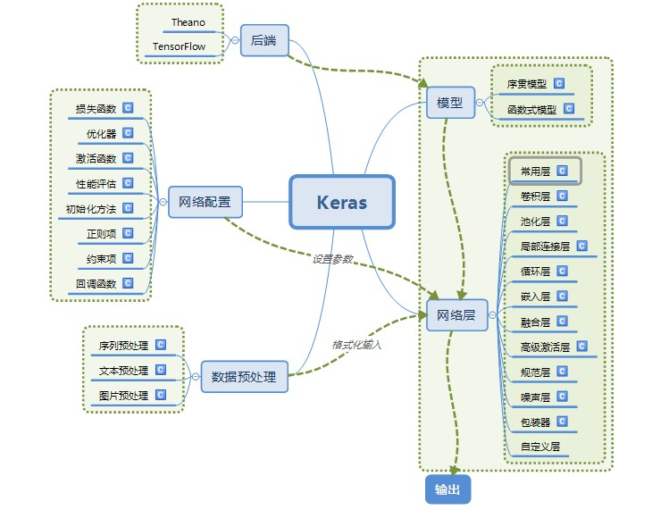
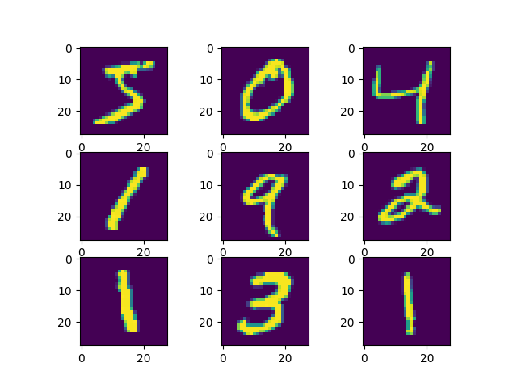

# 14. Keras 学习笔记

## 1. 安装

1. pip 安装

    ```bash
    # 安装 cpu 版的 tensorflow, 最新版本的 python 不一定支持，不建议 python 版本太新
    pip install tensorflow
    # 或者安装 gpu 版的 tensorflow（需要 CUDA 支持）
    pip install tensorflow-gpu

    # 安装 keras
    pip install keras
    ```

2. 使用 gpu 进行训练需要配置 cuda 环境，参考 [CUDA 安装](Python-01-环境_Env.md##-5.-CUDA-安装)

3. 使用 gpu 进行训练

    ```python
    # 在代码开头加入如下设置

    import os
    os.environ["CUDA_VISIBLE_DEVICES"] = '0'    # 使用 0 号 gpu
    ```

4. keras 结构

    

## 2. keras 层

### 2.1. 核心层

1. 全连接层：神经网络中最常用的，实现对神经网络里的神经元激活

    ```python
    # units：全连接层输出的维度，即下一层神经元的个数
    # activation：激活函数，默认使用 Relu
    # use_bias：是否使用 bias 偏置
    Dense(units, activation='relu', use_base=True)

    # 作为输入层：输入为 60*1 维数据，激活函数 relu
    model.add(Dense(200, input_shape=(60,), activation='relu'))

    # 作为中间层（隐含层）
    model.add(Dense(200, activation='relu'))

    # 作为输出层，units = 输出维数
    model.add(Dense(60))
    ```

   [全连接层用法](https://blog.csdn.net/weixin_44551646/article/details/112911215)

2. 激活层：对上一层的

   ```python
   # 激活函数，relu、tanh、sigmoid 等
   Activation(activation)
   ```

     

3. Dropout 层：对上一层的神经元随机选取一定比例的失活，不更新，但是权重仍然保留，防止过拟合

   ```python
   # rate：失活比例，0-1 浮点数
   Droupout(rate)
   ```

4. Flatten 层：将一个维度大于或等于 3 的高维矩阵，“压扁”为一个二维矩阵。即保留第一个维度（如：batch 的个数），然后将剩下维度的值相乘作为“压扁”矩阵的第二个维度

   ```python
   Flatten()
   ```

5. Reshape 层：将输入的维度重构成特定的 shape

   ```python
   # target_shape：目标矩阵的维度，不包含 batch 样本数
   Reshape(target_shape)
   ```

6. 卷积层：卷积操作分为一维、二维、三维，分别为 Conv1D、Conv2D、Conv3D。一维卷积主要应用于以时间序列数据或文本数据，二维卷积通常应用于图像数据。由于这三种的使用和参数都基本相同，所以主要以处理图像数据的 Conv2D 进行说明

   ```python
   # filters：卷积核的个数
   # kernel_size：卷积核的大小
   # strides：步长，二维中默认为 (1,1)，一维中默认为 1
   # Padding：补“0”策略，‘valid’指卷积后的大小与原来的大小可以不同，‘same’指卷积后的大小与原来大小一致
   Conv2D(filters, kernel_size, strides=(1,1), padding='valid')
   ```

7. 池化层：与卷积层一样，最大统计量池化和平均统计量池化也有三种，分别为 MaxPooling1D、MaxPooling2D、MaxPooling3D 和 AveragePooling1D、AveragePooling2D、AveragePooling3D，由于使用和参数基本相同，所以主要以 MaxPooling2D 进行说明

   ```python
   # poll_size：长度为 2 的整数 tuple，表示在横向和纵向的下采样因子，一维则为纵向下采样因子
   MaxPolling(poll_size=(2,2), strides=None, padding='valid')
   # 上面的代码表示
   ```

8. 循环层：循环神经网络中的 RNN、LSTM 和 GRU 都继承本层，所以该父类的参数同样使用于对应的子类 SimpleRNN、LSTM 和 GRU

   ```python
   # retrun_sequences：控制返回类型，‘False’返回输出序列的最后一个输出，‘True’则返回整个序列
   Recurrent(return_sequences=False)
   ```

9. 嵌入层：该层只能用在模型的第一层，是将所有索引标号的稀疏矩阵映射到致密的低维矩阵。如我们对文本数据进行处理时，我们对每个词编号后，我们希望将词编号变成词向量就可以使用嵌入层

   ```python
   # input_dim：大或等于 0 的整数，字典长度，即输入数据最大下标+1
   # output_dim：大于 0 的则行数，代表全连接嵌入的维度
   # input_length：当输入序列的长度固定时，该值为其长度。如果要在该层后接 Flatten 层，然后接 Dense 层，则必须指定该参数，否则 Dense 层的输出维度无法自动推断
   Embedding(input_dim, output_dim, input_length)
   ```

10. [视频教程](https://www.bilibili.com/video/BV1hE411t7RN?p=18)

### 2.2. 求解 compile

1. 创建求解

    ```python
    model.compile(loss='mean_squared_error',  # 损失函数
                  optimizer='adam',  # 优化器
                  metrics=['accuracy'])  # 准确率标准
    ```

2. 损失函数 loss

    | 函数                           | 中文名                   |
    | ------------------------------ | ------------------------ |
    | mean_squared_error             | 均方误差                 |
    | mean_absolute_error            | 平均绝对误差             |
    | mean_absolute_percentage_error | 平均绝对百分比误差       |
    | mean_squared_logarithmic_error | 均方对数误差             |
    | squared_hinge                  | 平方合页（铰链）         |
    | hinge                          | 合页（铰链）             |
    | categorical_hinge              | 分类合页（铰链）         |
    | logcosh                        | 预测误差的双曲余弦的对数 |
    | categorical_crossentropy       | 分类交叉熵               |

3. 优化器 optimizer

    | 函数     | 备注                                                                                       |
    | -------- | ------------------------------------------------------------------------------------------ |
    | SGD      | 随机梯度下降                                                                               |
    | RMSprop  | RMSProp 优化器，MSProp 优化算法是 AdaGrad 算法的一种改进。将梯度除以最近幅度的移动平均值。 |
    | Adagrad  | Adagrad 是一种具有特定参数学习率的优化器，它根据参数在训练期间的更新频率进行自适应调整。   |
    | Adadelta | Adadelta 是 Adagrad 的一个具有更强鲁棒性的的扩展版本                                       |
    | Adam     | Adam 本质上是 RMSProp 与动量 momentum 的结合                                               |
    | Adamax   | Adam 算法基于无穷范数（infinity norm）的变种                                               |
    | Nadam    | Nesterov 版本 Adam 优化器                                                                  |

4. 评价函数 metrics：同损失函数相似，但是评价函数不会用于训练

5. 参考链接
    1. [compile 参数详解](https://www.jianshu.com/p/f9c6f7c94533)

### 2.3. 训练 fit

1. 创建训练

    ```python
    # 模型训练
    # x_train: 训练集输入
    # y_train: 训练集输出
    # validation_split: 交叉验证
    # batch_size: 每组训练 32 个数据，60000 数据就要训练 60000/32=1875 组
    # epochs: 训练 5 回合
    # verbose: 1-训练过程可视；0-训练结果不可视
    model.fit(x_train, y_train, validation_split=0.5, batch_size=100, epochs=100, verbose=1)
    # 如果有专门的验证集
    # x_test: 验证集输入
    # y_test: 验证集输出
    model.fit(x_train, y_train, validation_data=[x_test, y_test], batch_size=100, epochs=100, verbose=1)
    ```

2. 参数设置

    | 参数             | 配置        | 备注                                                               |
    | ---------------- | ----------- | ------------------------------------------------------------------ |
    | validation_split | 0~1         | 默认不进行交叉验证，交叉验证比例：0.1 表示每次保留 10%数据进行验证 |
    | batch_size       | 整数        | 表示每次进行训练的数据个数，数字越大内存（或显存）占用越大         |
    | epochs           | 整数        | 最大训练回合数，如果没有设置提前截至条件则就是训练回合数           |
    | verbose          | 0/1，默认 0 | 1-训练过程可视；0-训练结果不可视                                   |

3. 参数关系

    $$ 每个 epoch 训练的组数 = \frac{x\_train.size() * (1-validation\_split)}{batch\_size} $$

## 3. 模型搭建

### 3.1. 手写数字识别，[原文链接](https://cloud.tencent.com/developer/article/1829972)

1. 加载数据，第一次运行会联网下载数据

    ```python
    from keras.datasets import mnist
    import matplotlib.pyplot as plt

    # （训练集输入，训练集输出）, （测试集输入，测试集输出） = 从 mnist 中加载数据集
    (trainX, trainY), (testX, testY) = mnist.load_data()
    # 训练集 60000 个 28*28 像素个手写数字图片
    print('Train: X=%s, Y=%s' % (trainX.shape, trainY.shape))   # Train: X=(60000, 28, 28), Y=(60000,)
    # 测试集 10000 个 28*28 像素个手写数字图片
    print('Test: X=%s, Y=%s' % (testX.shape, testY.shape))      # Test: X=(10000, 28, 28), Y=(10000,)
    # 画出一些图
    for i in range(9):
        plt.subplot(330 + 1 + i)
        plt.imshow(trainX[i])
    plt.show()
    ```

      

2. 神经网络模型创建 & 训练

    ```python
    from keras.datasets import mnist
    from keras import Sequential
    from keras.layers import Dense, Dropout, Activation, Flatten  # 常用层
    from keras.layers import Conv2D, MaxPool2D  # 卷积层，池化层
    from keras.utils import np_utils

    # （训练集输入，训练集输出）, （测试集输入，测试集输出） = 从 mnist 中加载数据集
    (trainX, trainY), (testX, testY) = mnist.load_data()

    # 数据集从形状（n，宽度，高度）转换为（n，宽度，高度，深度）
    X_train = trainX.reshape(trainX.shape[0], 28, 28, 1)
    X_test = testX.reshape(testX.shape[0], 28, 28, 1)
    print(X_train.shape)  # (60000, 28, 28, 1)

    # 将 1 维类数组转换为 10 维类矩阵
    Y_train = np_utils.to_categorical(trainY, 10)
    Y_test = np_utils.to_categorical(testY, 10)
    print(Y_train.shape)  # (60000, 10), 除了对应位是 1 以外都是 0

    # 模型结构
    model = Sequential()  # 创建一个序列
    # 卷积层：32 个卷积核，卷积核 3*3, 激活函数 relu, 模型输入 (28, 28, 1)
    model.add(Conv2D(32, kernel_size=(3, 3), activation='relu', input_shape=(28, 28, 1)))
    model.add(Conv2D(32, kernel_size=(3, 3), activation='relu'))  # 第二层卷积层
    model.add(MaxPool2D(pool_size=(2, 2)))  # 池化层
    model.add(Dropout(0.25))  # Dropout 层
    model.add(Flatten())  # Flatten 层：将高位矩阵压缩成 2 维矩阵
    model.add(Dense(128, activation='relu'))  # 中间层：全链接，输出维度 (128)
    model.add(Dropout(0.5))  # Dropout 层
    model.add(Dense(10, activation='softmax'))  # 输出层：全链接，输出维度 (10)

    model.summary()  # 打印模型信息

    model.compile(loss='categorical_crossentropy',
                  optimizer='adam',
                  metrics=['accuracy'])

    # 模型训练
    # X_train: 训练集输入
    # Y_train: 训练集输出
    # batch_size: 每组训练 32 个数据，60000 数据就要训练 60000/32=1875 组
    # epochs: 训练 5 回合
    # verbose: 1-训练过程可视；0-训练结果不可视
    model.fit(X_train, Y_train, batch_size=32, epochs=5, verbose=1)

    # 模型评估
    # X_test: 测试集输入
    # Y_test: 测试集输出
    # batch_size: 默认 32
    score = model.evaluate(X_test, Y_test, verbose=0)
    print(score)
    ```

3. 模型信息，model.summary() 打印结果

    ```bash
    Model: "sequential"
    _________________________________________________________________
    # 层                        输出维度                   参数个数
    Layer (type)                 Output Shape              Param #    
    =================================================================
    conv2d (Conv2D)              (None, 26, 26, 32)        320       
    _________________________________________________________________
    conv2d_1 (Conv2D)            (None, 24, 24, 32)        9248      
    _________________________________________________________________
    max_pooling2d (MaxPooling2D) (None, 12, 12, 32)        0         
    _________________________________________________________________
    dropout (Dropout)            (None, 12, 12, 32)        0         
    _________________________________________________________________
    flatten (Flatten)            (None, 4608)              0         
    _________________________________________________________________
    dense (Dense)                (None, 128)               589952    
    _________________________________________________________________
    dropout_1 (Dropout)          (None, 128)               0         
    _________________________________________________________________
    dense_1 (Dense)              (None, 10)                1290      
    =================================================================

    Total params: 600,810       # 总参数个数
    Trainable params: 600,810   # 可训练参数
    Non-trainable params: 0     # 不可训练参数
    _________________________________________________________________
    ```

4. 模型训练信息

    ```bash
    Epoch 1/5   # 第 1 回合
    # 训练集 60000, 32 个数据为一组训练，训练 60000/32=1875 组；回合耗时，每组耗时；损失；精度
    1875/1875 [==============================] - 55s 29ms/step - loss: 0.4725 - accuracy: 0.8922
    Epoch 2/5   # 第 2 回合
    1875/1875 [==============================] - 64s 34ms/step - loss: 0.1421 - accuracy: 0.9591
    Epoch 3/5   # 第 3 回合
    1875/1875 [==============================] - 62s 33ms/step - loss: 0.1103 - accuracy: 0.9685
    Epoch 4/5   # 第 4 回合
    1875/1875 [==============================] - 65s 35ms/step - loss: 0.0964 - accuracy: 0.9719
    Epoch 5/5   # 第 5 回合
    1875/1875 [==============================] - 61s 33ms/step - loss: 0.0841 - accuracy: 0.9749
    ```

### 3.2. LSTM

1. 单层 lstm 预测模型

    ```python
    # x_train 训练集输入
    # x_train.shape[0] 表示 x_train 有多少条
    # x_train.shape[1] 表示 x_train 每条数据有几个值
    x_train = np.reshape(x_train, (x_train.shape[0], x_train.shape[1], 1))
    # x_test 测试集输入
    x_test = np.reshape(x_test, (x_test.shape[0], x_test.shape[1], 1))
    print(x_train.shape)
    
    # 模型结构
    model = Sequential()
    # 定义 LSTM 模型，第一个隐藏层含有 100 个神经元
    model.add(LSTM(100, input_shape=(x_train.shape[1], x_train.shape[2])))
    model.add(Dropout(0.25))  # 暂时从网络中移除神经网络中的单元
    model.add(Dense(1))  # 输出维数
    model.add(Activation('relu'))   # 激活函数

    # 使用均方差损失函数，优化器 Adam，评估标准
    model.compile(loss=losses.mean_squared_error,  # 损失函数
                optimizer='adam',  # 优化器
                metrics=['mae'])  # 评估标准

    # 模型将会进行 30 个 epochs（回合）的训练，每个回合将数据分成 batch=100 的组进行训练
    # 比如有 1000 条训练数据，batch_size=100 表示将 1000 条数据分成 10 组，每组 100 条数据，重复进行 epochs 次训练
    history = model.fit(x_train, y_train, epochs=30, batch_size=100,
                        validation_data=(x_test, y_test),   # 验证集
                        callbacks=[EarlyStopping(monitor='val_loss', patience=10)], # 当被检测值不再提升，提前结束训练
                        verbose=1,  # 日志显示（默认 1): 0-不在标准输出流输出日志信息；1-输出进度条记录；2-每个 epoch 输出一行记录
                        shuffle=True)   # shuffle=False 不打乱数据顺序，一般设置为 True 训练结果会好一些
    model.summary() # 打印模型信息

    # 做出预测
    test_predict = model.predict(x_test)
    # 预测值求逆
    test_predict = scaler.inverse_transform(test_predict)
    # 真实值求逆
    y_test = scaler.inverse_transform(y_test)
    ```

2. 多层 lstm 预测模型

    ```python
    # 创建神经网络
    def build_model(x_train, y_train):
        # 模型结构
        model = Sequential()
        # 定义 LSTM 模型
        model.add(LSTM(100, input_shape=(x_train.shape[1], x_train.shape[2]), return_sequences=True))  # 第一层 lstm
        model.add(LSTM(60, return_sequences=False))  # 第二层 lstm
        model.add(Dropout(0.2))  # 暂时从网络中移除神经网络中的单元
        model.add(Dense(1))  # 输出维数
        model.add(Activation('relu'))

        # 使用均方差损失函数，优化器 Adam，评估标准
        model.compile(loss=losses.mean_squared_error,  # 损失函数
                    optimizer='adam',  # 优化器
                    metrics=['mae'])  # 评估标准

        model.summary()

        return model
    ```

3. attention-lstm

    ```bash
    # 安装 attention 包
    pip install attention
    ```

    ```python
    # 创建神经网络
    def build_model(x_train):
        # 模型结构
        model = Sequential()
        # 定义 LSTM 模型
        model.add(LSTM(100, input_shape=(x_train.shape[1], x_train.shape[2]), return_sequences=True))  # 第一层 lstm
        model.add(LSTM(100, return_sequences=True))  # 第二层 lstm
        model.add(Attention())  # attention 层
        model.add(Dropout(0.1))  # 暂时从网络中移除神经网络中的单元
        model.add(Dense(1))  # 输出维数
        model.add(Activation('relu'))  # 激活函数

        # 使用均方差损失函数，优化器 Adam，评估标准
        model.compile(loss=losses.mean_squared_error,  # 损失函数
                    optimizer='adam',  # 优化器
                    metrics=['mae'])  # 评估标准

        model.summary()  # 显示模型信息

        return model
    ```

4. 训练结果

    | history  | 备注                             |
    | -------- | -------------------------------- |
    | loss     | 训练集损失（根据设置的损失函数） |
    | mae      | 训练集平均绝对误差               |
    | acc      | 训练集准确率（用于分类问题）     |
    | val_loss | 验证集损失（根据设置的损失函数） |
    | val_mae  | 验证集平均绝对误差               |
    | val_acc  | 验证集准确率（用于分类问题）     |

    - [keras 中 LSTM 能用 accuracy 进行评价么？](https://www.zhihu.com/question/432212136)

## 4. 模型保存与加载

1. 保存模型

    ```python
    model.save('./model/model_name.h5')
    ```

2. 加载模型

    ```python
    from keras.models import load_model

    model = load_model('./model/model_name.h5')

    # 还可以继续训练，参数与训练时的参数相同
    model.fit(x_train, y_train, ...)
    ```

3. 模型使用

    ```python
    # 模型输出
    y_pre = model.predict(x_input)
    ```

## 5. 备注

- [Keras 入门](http://www.tensorflownews.com/2018/03/15/%e4%bd%bf%e7%94%a8keras%e8%bf%9b%e8%a1%8c%e6%b7%b1%e5%ba%a6%e5%ad%a6%e4%b9%a0%ef%bc%9a%ef%bc%88%e4%b8%80%ef%bc%89keras-%e5%85%a5%e9%97%a8/)
- [Keras 中文文档](https://keras.io/zh/)
