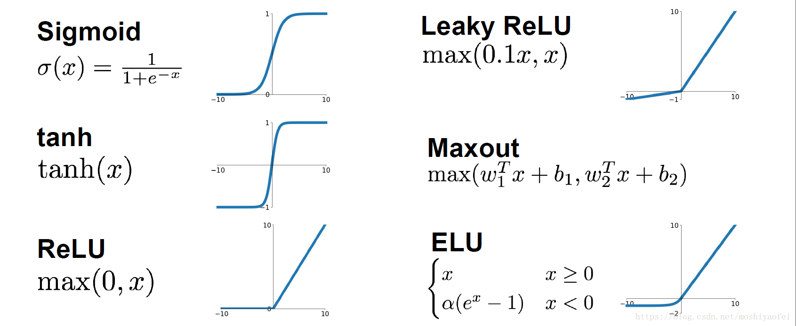

# 机器学习 MachineLearning

## 1. 基础

### 1.1. 数据标准化（归一化）normalization

1. Z-Score
    1. Z-Score 通过 (x-μ)/σ 将两组或多组数据转化为无单位的 Z-Score 分值，使得数据标准统一化，提高了数据可比性，削弱了数据解释性。[参考链接](https://blog.csdn.net/Orange_Spotty_Cat/article/details/80312154)
    2. 计算公式：x-观测值，μ-总体平均值，σ-总体标准差

        $$ z = \frac{(x-μ)}{σ} $$

    3. 代码

        ```python
        from sklearn import preprocessing

        scaled_x = preprocessing.scale(x)
        ```

    4. 优点：
        - 计算简单，使用起来比较方便；
        - 当数据分布非常凌乱，无法进行最大、最小值的判断时，用 Z-score 可以实现数据的规范化处理。
    5. 缺点：
        - 总体平均值与方差不一定可知
        - 对于数据分布有要求
        - 结果没有实际意义，只能用于比较

2. min-max
    1. 也称为离差标准化，是对原始数据的线性变换，使结果值映射到 [0 - 1] 之间

        $$ x = \frac{x-x_{min}}{x_{max}-x_{min}} $$

    2. 代码

        ```python
        # min-max 归一化，输入为 np 格式
        def normalization(data):
            _range = np.max(data) - np.min(data)
            return (data - np.min(data)) / _range
        ```

    3. sklearn 的用法参考 [SKlearn 归一化](./Py-15-Sklearn.md###-2.1.-归一化)

3. 小数定标法
    1. 小数定标规范化就是通过移动小数点的位置来进行规范化。小数点移动多少位取决于属性 A 的取值中的最大绝对值。
    2. 举个例子，比如属性 A 的取值范围是 -999 到 88，那么最大绝对值为 999，小数点就会移动 3 位，即新数值 = 原数值 /1000。那么 A 的取值范围就被规范化为 -0.999 到 0.088。
    3. 代码

        ```python
        import numpy as np
        # 初始化数据
        x = np.array([[ 0., -3.,  1.],
                    [ 3.,  1.,  2.],
                    [ 0.,  1., -1.]])
        # 小数定标规范化
        j = np.ceil(np.log10(np.max(abs(x)))) # 获取小数点移动位数
        scaled_x = x/(10**j)
        ```

4. 参考链接
    1. [常用的三种数据规范化的方法及 python 实现](https://joshuaqyh.github.io/2019/02/24/常用的三种数据规范化的方法法/)

### 1.2. 激活函数 Activation

  

## 2. 监督学习

### 2.1. K 近邻算法 K-Means

1. 算法流程
    1. 计算已知类别数据集中的点与当前点的距离
    2. 按照距离依次排序
    3. 选取与当前点距离最小的 K 个点
    4. 确定前 K 个点所在类别的出现概率
    5. 返回前 K 个点出现频率最高的类别作为当前点预测分类

## 3. 神经网络 NeuralNetwork

### 3.1. 神经网络种类

1. 神经网络种类图，[原图链接](https://www.asimovinstitute.org/neural-network-zoo/)

    

    | 模型  | 全名                                        | 中文名             |
    | ----- | ------------------------------------------- | ------------------ |
    | P     | Perceptron                                  | 感知机             |
    | FF    | Feed Forward                                | 前馈神经网络       |
    | RBF   | Radial basis function                       | 径向基神经网络     |
    | DFF   | Deep Feed Forward                           | 深度前馈神经网络   |
    | RNN   | Recurrent Neural Network                    | 循环神经网络       |
    | LSTM  | Long/Short Term Network                     | 长/短期记忆        |
    | GRU   | Gated Recurrent Unit                        | 门循环单元         |
    | AE    | Auto Encoder                                | 自编码机           |
    | VAE   | Variational Auto Encoder                    | 变分自编码机       |
    | DAE   | Denoising Auto Encoder                      | 去噪自编码机       |
    | SAE   | Sparse Auto Encoder                         | 稀疏自编码机       |
    | MC    | Markov Chain                                | 马尔科夫链         |
    | HN    | Hopfield Network                            | 霍普菲尔网络       |
    | BM    | Boltzmann Machine                           | 玻尔兹曼机         |
    | RBM   | Restricted BM                               | 受限玻尔兹曼机     |
    | DBN   | Deep Belief Network                         | 深度信念网络       |
    | DCN   | Deep Convolutional Network                  | 深度卷积网络       |
    | DN    | Deconvolutional Network                     | 解卷积网络         |
    | DCIGN | Deep Convolutional Inverse Graphics Network | 深度卷积逆向图网络 |
    | GAN   | Generative Adversarial Network              | 生成式对抗网络     |
    | LSM   | Liquid State Machine                        | 液态机             |
    | ELM   | Extreme Learning Machine                    | 极限学习机         |
    | ESN   | Echo State Network                          | 回声状态网络       |
    | DRN   | Deep Residual Network                       | 深度残差网络       |
    | DNC   | Differentiable Neural Computer              | 可微神经计算机     |
    | NTM   | Neural Turing Machine                       | 神经图灵机         |
    | CN    | Capsule Network                             | 胶囊网络           |
    | KN    | Kohonen Network                             | Kohonen 网络       |
    | AN    | Attention Network                           | 注意力网络         |

    - [一文看懂 25 个神经网络模型](https://blog.csdn.net/qq_35082030/article/details/73368962)

2. 深度前馈网络 (deep feedforward network)，也叫做前馈神经网络 (feedforward neurnal network) 或者多层感知机 (multilayer perceptron, MLP)。
3. 前向传播：将上一层的输出作为下一层的输入，并计算下一层的输出，一直到运算到输出层为止。
4. 反向传播（back propagation, BP）算法是 "误差反向传播" 的简称，也称为 backprop，允许来自代价函数的信息通过网络向后流动，以便计算梯度。反向传播是一种与最优化方法（如梯度下降法）结合使用的，用来训练人工神经网络的常见方法。该方法对网络中所有权重计算损失函数的梯度。这个梯度会反馈给最优化方法，用来更新权值以最小化损失函数。

### 3.2. 全连接神经网络 Fully Connected Neural Network

1. 全连接网络（FC）、前馈神经网络（BP）、多层感知机（MLP）三种称呼实质是一样的。以全连接网络为例讲解训练过程。全连接网络实际上可以看作由多个隐藏层 (dense) 组成的网络模型，隐藏层的每个节点都与上一层所有节点相连，所以叫全连接。

### 3.3. 卷积神经网络 CNN

### 3.4. 循环神经网络 RNN

## 4. 图神经网络 GNN

1. 图神经网络（Graph Neural Network）: 包括图卷积网络 (Graph Convolution Network, GCN), 图注意力神经网络 (Graph Attention Network, GAN), 图自编码器 (Graph Autoencoders), 图生成网络 (Graph Generative Network), 图时空网络 (Graph Spatial-temporal Network)
2. 优点
    1. 半监督学习
    2. 不需要全部标签
    3. 用少量标签也能训练
    4. 计算损失时也只有有标签的

### 4.1. 图卷积网络 GCN

### 4.2. 图注意力神经网络 GAT

## 5. 强化学习

## 6. 模型评估

1. **模型泛化能力**：泛化能力指的是训练得到的模型对未知数据的预测能力。建模的目的是让模型不仅对已知数据，而且对未知数据都能有较好的预测能力。

2. **过拟合与欠拟合**：当模型对训练集学习的太好的时候，基于训练集误差很小，而基于测试集误差会很大，这种情况我们称之为过拟合，反之则称为欠拟合。

3. **模型准确性**：通过偏差方差衡量模型本身的拟合能力与波动性。同时，结合分类与回归问题对应的评估指标对预测误差进行量化的衡量与比较。

4. **模型稳定性**：训练完模型后，假使模型在训练集、测试集上表现都很优异，也不能说在真实业务场景下可以放心的使用它，由于业务背景与人群构成随时间会发生变化，因此需要考察模型的特征是否稳定能够运用在实际中。
