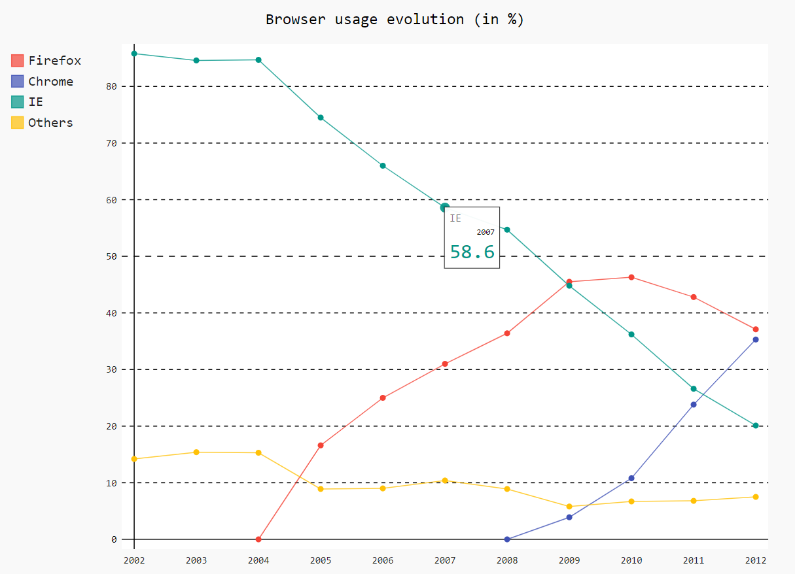

# Pygal

## 1. 简介

1. pygal 是一款动态图表绘制库

## 2. 使用方法

### 2.1. 安装

```python
pip install pygal
```

### 2.2. line

1. demo

    ```python
    # 官方示例
    import pygal

    line_chart = pygal.Line()
    line_chart.title = 'Browser usage evolution (in %)'
    line_chart.x_labels = map(str, range(2002, 2013))
    line_chart.add('Firefox', [None, None, 0, 16.6, 25, 31, 36.4, 45.5, 46.3, 42.8, 37.1])
    line_chart.add('Chrome', [None, None, None, None, None, None, 0, 3.9, 10.8, 23.8, 35.3])
    line_chart.add('IE', [85.8, 84.6, 84.7, 74.5, 66, 58.6, 54.7, 44.8, 36.2, 26.6, 20.1])
    line_chart.add('Others', [14.2, 15.4, 15.3, 8.9, 9, 10.4, 8.9, 5.8, 6.7, 6.8, 7.5])
    line_chart.render_to_file('line.svg')
    ```

2. 结果：输出的图片用浏览器打开

      

## 3. 备注

-[官方文档](https://www.pygal.org/en/stable/documentation/index.html)
