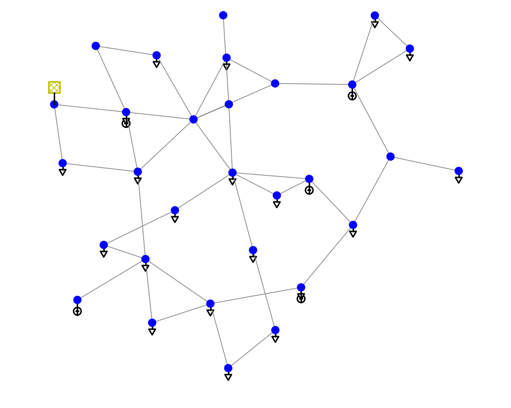

# 19. PandaPower

## 1. 简介

1. PandaPower 可以类比于 matlab 的 matpower 包，用于进行潮流计算。
2. Pandapower 结合了数据分析库 PANDAS 和 Power Flow 求解器 Pypower，以创建一个易于使用的网络计算程序，该程序旨在自动化电源系统中的分析和优化。
3. 安装方法

    ```bash
    pip install pandapower
    ```

4. [官方文档🔗](http://www.pandapower.org/start/)

## 2. 使用方法

1. 测试用例（case30 算例）

    ```python
    import pandapower as pp
    import pandapower.networks as nw
    import pandapower.plotting as plt

    net = nw.case30()   # 对等 matpower case30
    plt.simple_plot(net,  plot_loads=True, plot_gens=True)  # 绘制节点图
    # print(net.bus)
    # print(net.load)
    # print(net.line)

    pp.runpp(net)   # 计算潮流
    # bus = net.res_bus
    # gen = net.res_gen
    ```

      

## 3. 数据说明

### 3.1. 输入参数

1. bus 母线 [文档🔗](https://pandapower.readthedocs.io/en/v2.2.0/elements/bus.html)

    | 参数       | 说明         | 参数类型 | 参数设置               |
    | ---------- | ------------ | -------- | ---------------------- |
    | in_service | 是否正在使用 | boolean  | True/False             |
    | max_vm_pu  | 电压上限     | float    | >0                     |
    | min_vm_pu  | 电压下限     | float    | >0                     |
    | name       | 节点号       | string   |
    | type       | 节点类型     | string   | n-node,b-busbar,m-muff |
    | vn_kv      | 基准电压     | float    | >0                     |
    | zone       | 区域         | string   |

2. gen 发电机

    | 参数       | 说明           | 参数类型 | 参数设置   |
    | ---------- | -------------- | -------- | ---------- |
    | name       | 名称           | string   |
    | type       | 发电机类型     | string   |sync-同步发电机;async-异步发电机
    | bus        | 母线           | int      |
    | p_mw       | 发电机有功     | float    |
    | vm_pu      | 电压设定       | float    |
    | sn_mva     | 发电机标称功率 | float    |
    | scaling    | 缩放系数       | float    |
    | max_p_mw   | 有功上限       | float    |
    | min_p_mw   | 有功下限       | float    |
    | max_q_mvar | 无功上限       | float    |
    | min_q_mvar | 无功下限       | float    |
    | vn_kv      | 额定电压       | float    |
    | xdss_pu    | 单位电抗       | float    |
    | rdss_pu    | 单位电阻       | float    |
    | cos_phi    | 发电机攻角     | float    |
    | in_service | 是否正在使用   | boolean  | True/False |

3. line 线路 [文档🔗](https://pandapower.readthedocs.io/en/v2.2.0/elements/line.html)

    | 参数                | 说明         | 参数类型 | 参数设置               |
    | ------------------- | ------------ | -------- | ---------------------- |
    | name                | 线路名       | string   |
    | std_type            | 标准类型     | string   |
    | from_bus            | 起始节点     | int      |
    | to_bus              | 终止节点     | int      |
    | length_km           | 线路长度     | float    | >=0                    |
    | r_ohm_per_km        | 线路单位电阻 | float    | >=0                    |
    | x_ohm_per_km        | 线路单位电感 | float    | >=0                    |
    | c_nf_per_km         | 线路单位电容 | float    | >=0                    |
    | g_us_per_km         | 线路单位电导 | float    | >=0                    |
    | max_i_ka            | 最大电流     | float    | >=0                    |
    | parallel            | 并行线路数量 | int      |
    | df                  | 衍生因子     | float    | >=0                    |
    | type                | 线路类型     | string   | ol-架空线；cs-地下电缆 |
    | max_loading_percent | 最大负荷     | float    |
    | endtemp_degree      | 短路端温度   | float    | >=0                    |
    | in_service          | 是否正在使用 | boolean  | True/False             |

4. load 负荷 [文档🔗](https://pandapower.readthedocs.io/en/v2.2.0/elements/load.html)

    | 参数            | 说明             | 参数类型 | 参数设置   |
    | --------------- | ---------------- | -------- | ---------- |
    | name            | 负荷名           |
    | bus             | 母线             |
    | p_mw            | 有功负荷         |
    | q_mvar          | 无功负荷         |
    | const_z_percent |                  | float    | [0,100]    |
    | const_i_percent |                  | float    | [0,100]    |
    | sn_mva          | 负载额定功率     | float    | ≥0         |
    | scaling         | 有功无功缩放系数 | float    | ≥0         |
    | in_service      | 是否正在使用     | boolean  | True/False |
    | controllable    | 是否为柔性负荷   | float    |
    | max_p_mw        | 最大有功负荷     | float    |
    | min_p_mw        | 最小有功负荷     | float    |
    | max_q_mvar      | 最大无功负荷     | float    |
    | min_q_mvar      | 最小无功负荷     | float    |

### 3.2. 输出参数

1. res_bus

    | 参数      | 说明 | 参数类型 | 参数设置 |
    | --------- | ---- | -------- | -------- |
    | vm_pu     | 电压 | float    |
    | va_degree | 相角 | float    |
    | p_mw      | 有功 | float    |
    | q_mvar    | 无功 | float    |

2. res_line

    | 参数            | 说明       | 参数类型 |
    | --------------- | ---------- | -------- |
    | p_from_mw       | 起始端 P   | float    |
    | q_from_mvar     | 起始端 Q   | float    |
    | p_to_mw         | 终止端 P   | float    |
    | q_to_mvar       | 终止端 Q   | float    |
    | pl_mw           | 有功损耗   | float    |
    | ql_mvar         | 无功损耗   | float    |
    | i_from_ka       | 起始端电流 | float    |
    | i_to_ka         | 终止端电流 | float    |
    | i_ka            | 最大电流   | float    |
    | loading_percent | 线路负载率 | float    |

3. res_load

    | 参数   | 说明  | 参数类型 |
    | ------ | ----- | -------- |
    | p_mw   | float | 有功负荷 |
    | q_mvar | float | 无功负荷 |
