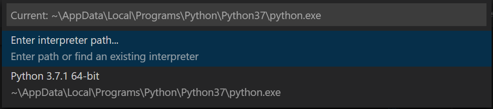
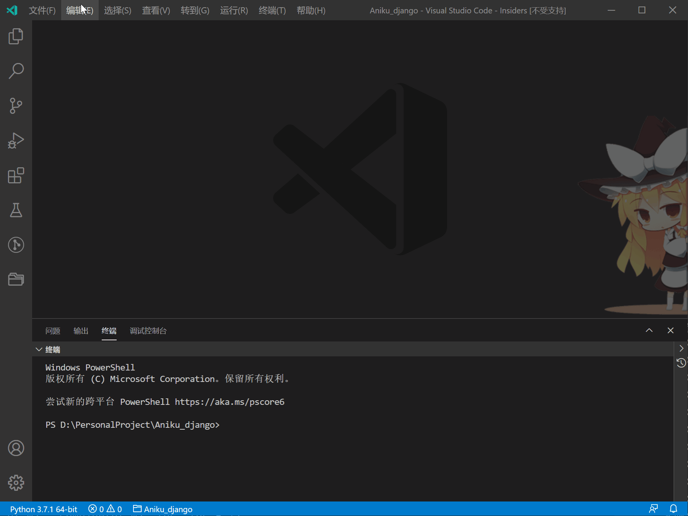

# 1. Python 环境

## 1. Python 使用

### 1.1. 下载及安装

1. 官网下载 Python 安装包，[Python 官方网站](https://www.python.org/), linux 下建议使用 anaconda 或 miniconda
2. Python 默认源在国外，下载速度慢且不稳定，建议更换清华源，在命令行输入以下指令添加清华源

    ```bash
    pip config set global.index-url https://pypi.tuna.tsinghua.edu.cn/simple
    ```

    其他常用国内源

   - 清华源：<https://pypi.tuna.tsinghua.edu.cn/simple>
   - 豆瓣源：<https://pypi.doubanio.com/simple/>
   - 阿里源：<https://mirrors.aliyun.com/pypi/simple/>

### 1.2. 使用库

1. 安装库，常使用 pip 指令

    ```bash
    # 查看 pip 版本
    pip -V      # 或 pip --version

    # 查看已经安装的库
    pip list

    # 在线安装库，pip 会自动安装库的依赖
    pip install xxx     # xxx 为要安装的库
    ```

2. 升级库

    ```bash
    pip list --outdate          # 显示可升级库
    pip install --upgrade xxx   # 升级库
    ```

3. 下载离线库

    ```bash
    # 在目标路径下进入 cmd
    # 会连同下载所有依赖包
    pip download [options] [pakage]
    # 比如下载 linux 版本 numpy
    pip download --only-binary=:all: --platform manylinux1_x86_64 --python-version 37 numpy

    # 离线安装
    pip install --no-index --find-links=file: 路径 包名
    ```

    | 参数                         | 功能           |
    | ---------------------------- | -------------- |
    | --only-binary=:all:          | 不适用二进制包 |
    | --platform manylinux1_x86_64 | linux 64 位    |
    | --python-version 37          | python3.7      |

4. [whl 离线库网站](https://www.lfd.uci.edu/~gohlke/pythonlibs/)

### 1.3. 虚拟环境

1. 创建虚拟环境
   1. 安装 virtualenv 库 `pip install virtualenv`
   2. cd 到目标文件夹下
   3. `virtualenv 虚拟环境名` 创建虚拟环境
   4. 在 `虚拟环境名/Scripts` 下执行 `activate` 开启虚拟环境
   5. 退出虚拟环境 `deactivate`

## 2. Anaconda / Miniconda 使用

### 2.1. 安装

1. Miniconda 是 Anaconda 的精简版本，只包含 Python 和一些最基本的库，使用方法与 Anaconda 相同
2. 从清华源下载安装 [Miniconda](https://mirrors.tuna.tsinghua.edu.cn/anaconda/miniconda/)
3. Linux 安装，将安装文件考入 linux, 然后执行以下命令，根据提示安装即可

    ```bash
    bash miniconda3_xxx.sh
    ```

   1. 配置环境变量，默认不需要配置

        ```bash
        # 打开配置文件
        ~/miniconda3/bin$ sudo gedit ~/.bashrc
        # 在末尾添加
        export PATH=~/anaconda3/bin:$PATH
        # 生效
        source ~/.bashrc
        # 验证
        conda --version    # 或 -V
        pip --version
        ```

4. Windows 安装，默认下一步即可（默认不添加环境变量）, 可在安装过程中选择配置环境变量，也可以自行配置环境变量。根据安装路径添加环境变量，重启生效
   

5. 避免一开始就激活 base 环境，可以设置

    ```bash
    # 关闭 base 自动激活
    conda config --set auto_activate_base false
    # 打开 base 自动激活
    conda config --set auto_activate_base true
    ```

6. 检测安装是否成功：配置完环境变量可在任意路径执行下列命令；未配置需要进入安装目录下 (Windows：`C:\ProgramData\Miniconda3\Scripts` Linux：`\miniconda3\bin`) 执行指令

    ```bash
    conda list          # 查看已安装的包
    conda --version     # 查看版本，或-V
    ```

7. 若出现 `conda:command not found` 问题

    ```bash
    # 编辑。bashrc 文件
    vi ~/.bashrc

    # 再文件末尾加入一下内容，根据需要改变路径
    export PATH=$PATH:/home/username/anaconda3/bin
    ```

### 2.2. 配置 [清华源](https://mirror.tuna.tsinghua.edu.cn/help/anaconda/)

1. linux

    ```bash
    # 清华源
    # 任意目录下编辑。condarc 文件
    vi ~/.condarc
    ```

2. windows

    ```bash
    # 先创建。condarc 文件
    # 文件一般在 C:\Users\username 目录下
    conda config --set show_channel_urls yes
    ```

3. 在`.condarc`中写入以下内容，具体以 [清华源](https://mirror.tuna.tsinghua.edu.cn/help/anaconda/) 为准

    ```bash
    channels:
    - defaults
    show_channel_urls: true
    default_channels:
    - https://mirrors.tuna.tsinghua.edu.cn/anaconda/pkgs/main
    - https://mirrors.tuna.tsinghua.edu.cn/anaconda/pkgs/r
    - https://mirrors.tuna.tsinghua.edu.cn/anaconda/pkgs/msys2
    custom_channels:
    conda-forge: https://mirrors.tuna.tsinghua.edu.cn/anaconda/cloud
    msys2: https://mirrors.tuna.tsinghua.edu.cn/anaconda/cloud
    bioconda: https://mirrors.tuna.tsinghua.edu.cn/anaconda/cloud
    menpo: https://mirrors.tuna.tsinghua.edu.cn/anaconda/cloud
    pytorch: https://mirrors.tuna.tsinghua.edu.cn/anaconda/cloud
    simpleitk: https://mirrors.tuna.tsinghua.edu.cn/anaconda/cloud
    ```

### 2.3. conda 虚拟环境

1. 环境配置

    ```bash
    # 创建一个 python3.7 的环境
    conda create --name 环境名 python=3.7
    # 或
    conda create -n 环境名 python=3.7
    
    # 克隆现有环境
    conda create -n 环境名 --clone 现有环境名

    # 激活环境
    conda activate 环境名
    # windows bat 脚本激活 conda
    call activate 环境名

    # 退出环境
    conda deactivate

    # 删除环境
    conda remove -n 环境名 --all
    ```

   > 创建虚拟环境失败，出现`an unexpected error has occurred`问题，可能是源文件出现问题，需要删除`.condarc`文件

2. 列出所有环境

    ```bash
    conda info --envs   # 或 -e
    ```

3. 安装 python 包

    ```bash
    conda install package-name
    pip install package-name
    ```

## 3. 离线安装库文件

1. 下载离线包并创建需要安装的库文件列表 `requirements.txt`

     > 最好把基础依赖包放在前面，避免某些包因缺少依赖包导致安装失败，`#`注释掉不需要安装的包

     ```txt
     six-1.15.0-py2.py3-none-any.whl
     numpy-1.19.1-cp37-cp37m-manylinux1_x86_64.whl
     scipy-1.5.2-cp37-cp37m-manylinux1_x86_64.whl
     certifi-2020.6.20-py2.py3-none-any.whl
     cycler-0.10.0-py2.py3-none-any.whl
     pyparsing-2.4.7-py2.py3-none-any.whl
     pytz-2020.1-py2.py3-none-any.whl
     python_dateutil-2.8.1-py2.py3-none-any.whl
     pandas-1.1.1-cp37-cp37m-manylinux1_x86_64.whl

     # Pillow-7.2.0-cp37-cp37m-manylinux1_x86_64.whl
     # kiwisolver-1.2.0-cp37-cp37m-manylinux1_x86_64.whl
     # matplotlib-3.3.1-cp37-cp37m-manylinux1_x86_64.whl

     pyDOE-0.3.8.zip
     pwlf-2.0.4.tar.gz
     ```

2. 批量安装库

     ```bash
     # 批量安装
     pip install -r requirements.txt
     # 忽略目录批量安装
     pip install --no-index -r requirements.txt
     ```

3. 生成 requirements.txt 文件

     ```bash
     pip3 freeze >requirements.txt
     ```

## 4. VSCode 配置 Python 环境

1. 安装 Python 插件

   

2. 创建虚拟环境（用全局环境可以跳过）
3. 为项目添加环境
   1. 打开一个 Python 项目
   2. `Ctrl+Shift+P` 打开命令面板
   3. 选择 `Python：选择解释器`(`Python: Select Interpreter`)

        

   4. 用全局环境可以选择已经列出的环境，否则选择`Enter interpreter path`，然后选`find`在弹出的窗口中选择已创建的虚拟环境

        
        

4. 添加配置：可以根据自己的项目配置 Python、Django 等

    

5. 然后就可以开始调试运行了

## 5. 备注

1. 常用库

    | 库          | 功能                           |
    | ----------- | ------------------------------ |
    | altair      | 数据可视化工具                 |
    | django      | django 网站框架                |
    | jaydebeapi  | 通过 java 的 jdbc 来连接数据库 |
    | matplotlib  | 绘图                           |
    | nuitka      | python 程序打包                |
    | pandas      | 数据分析工具                   |
    | paramiko    | ssh 工具                       |
    | pillow->PIL | 图片处理                       |
    | psutil      | 电脑监控信息读取               |
    | pyserial    | 串口                           |
    | pymysql     | MySQL 数据库                   |
    | pulp        | 线性求解                       |
    | pwlf        | 分段线性拟合                   |
    | pyecharts   | python + echarts               |
    | scipy       | 科学计算库                     |
    | sympy       | 科学（符号）计算库             |
    | virtualenv  | 虚拟环境                       |
