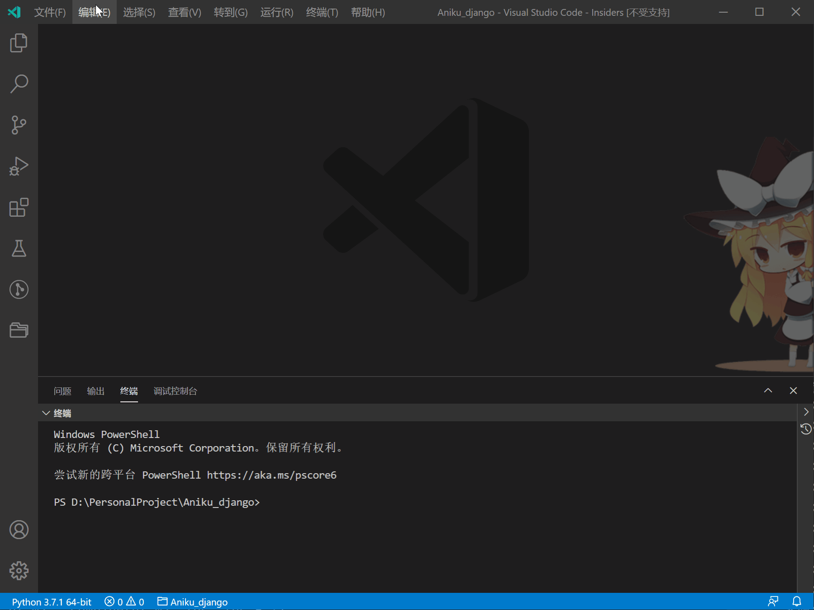

# 1. Python 环境

## 1. Python 使用

### 1.1. 下载及安装

1. Python下载
   [Python官方网站](https://www.python.org/)
2. 更换清华源, 在命令行

    ```bash
    pip config set global.index-url https://pypi.tuna.tsinghua.edu.cn/simple
    ```

    国内常用源

   - 清华源：<https://pypi.tuna.tsinghua.edu.cn/simple>
   - 豆瓣源：<https://pypi.doubanio.com/simple/>
   - 阿里源：<https://mirrors.aliyun.com/pypi/simple/>

### 1.2. 使用库

1. 常用库

    | 库          | 功能                       |
    | ----------- | -------------------------- |
    | psutil      | 电脑监控信息读取           |
    | matplotlib  | 绘图                       |
    | pillow->PIL | 图片处理                   |
    | pyserial    | 串口                       |
    | scipy       | 科学计算库                 |
    | sympy       | 科学（符号）计算库         |
    | pymysql     | MySQL数据库                |
    | django      | django网站框架             |
    | pandas      | 数据分析工具               |
    | virtualenv  | 虚拟环境                   |
    | paramiko    | ssh工具                    |
    | jaydebeapi  | 通过java的jdbc来连接数据库 |
    | pulp        | 线性求解                   |
    | pwlf        | 分段线性拟合               |
    | pyecharts   | python + echarts           |
    | altair      | 数据可视化工具             |

2. 升级库

    ```bash
    pip list --outdate  // 显示可升级库
    pip install --upgrade xxx  // 升级库
    ```

3. 下载离线库

    ```bash
    # 在目标路径下进入cmd
    # 会连同下载所有依赖包
    pip download [options] [pakage]
    # 比如下载linux版本numpy
    pip download --only-binary=:all: --platform manylinux1_x86_64 --python-version 37 numpy

    # 离线安装
    pip install --no-index --find-links=file:路径 包名
    ```

    | 参数                         | 功能           |
    | ---------------------------- | -------------- |
    | --only-binary=:all:          | 不适用二进制包 |
    | --platform manylinux1_x86_64 | linux 64位     |
    | --python-version 37          | python3.7      |

4. [whl离线库网站](https://www.lfd.uci.edu/~gohlke/pythonlibs/)

### 1.3. 虚拟环境

1. 创建虚拟环境
   1. 安装virtualenv库 `pip install virtualenv`
   2. cd到目标文件夹下
   3. `virtualenv 虚拟环境名` 创建虚拟环境
   4. 在 `虚拟环境名/Scripts` 下执行 `activate` 开启虚拟环境
   5. 退出虚拟环境 `deactivate`

2. 虚拟环境管理

## 2. Miniconda 使用

### 2.1. 安装

1. 从清华源下载安装[miniconda](https://mirrors.tuna.tsinghua.edu.cn/anaconda/miniconda/)
2. Linux安装

    ```bash
    bash miniconda3_xxx.sh
    ```

3. 配置环境变量，默认不需要配置

     ```bash
     # 打开配置文件
     ~/miniconda3/bin$ sudo gedit ~/.bashrc
     # 在末尾添加
     export PATH=~/anaconda3/bin:$PATH
     # 生效
     source ~/.bashrc
     # 验证
     conda --version    # 或 -V
     pip --version
     ```

4. 避免一开始就激活base环境，可以设置

    ```bash
    # 关闭base自动激活
    conda config --set auto_activate_base false
    # 打开base自动激活
    conda config --set auto_activate_base true
    ```

5. 进入安装目录下 Windows：`C:\ProgramData\Miniconda3\Scripts` Linux：`\miniconda3\bin`执行指令

    ```bash
    conda list  # 查看已安装的包
    conda --version  # 查看版本
    conda -V  # 同上
    ```

6. Miniconda [换清华源](https://mirror.tuna.tsinghua.edu.cn/help/anaconda/)

    ```bash
    # 清华源
    # 任意目录下编辑.condarc文件
    vi ~/.condarc
    # 添加清华源，参考清华源官网
    # 显示源
    conda config --show-sources
    ```

7. 出现 `conda:command not found` 问题

    ```bash
    # 编辑.bashrc文件
    vi ~/.bashrc

    # 再文件末尾加入一下内容，根据需要改变路径
    export PATH=$PATH:/home/username/anaconda3/bin
    ```

### 2.2. conda 创建虚拟环境

1. 环境配置

    ```bash
    # 安装 python3.7 并命名为该环境为 python37
    conda create --name python37 python=3.7
    # 或
    conda create -n python37 python=3.7
    # 克隆现有环境
    conda create -n env --clone base

    # 激活环境
    conda activate python37
    # 退出环境
    conda deactivate

    # 删除环境
    conda remove -n python37 --all
    ```

   > 创建虚拟环境失败，出现`an unexpected error has occurred`问题，可能是源文件出现问题，需要删除`.condarc`文件

2. 列出所有环境

    ```bash
    conda info --envs
    # 或者
    conda info -e
    ```

3. 安装 python 包

    ```bash
    conda install package-name
    pip install package-name
    ```

4. 离线安装库文件
   1. 下载离线包并创建需要安装的库文件列表 `requirements.txt`

        > 最好把基础依赖包放在前面，避免某些包因缺少依赖包导致安装失败，`#`注释掉不需要安装的包

        ```txt
        six-1.15.0-py2.py3-none-any.whl
        numpy-1.19.1-cp37-cp37m-manylinux1_x86_64.whl
        scipy-1.5.2-cp37-cp37m-manylinux1_x86_64.whl
        certifi-2020.6.20-py2.py3-none-any.whl
        cycler-0.10.0-py2.py3-none-any.whl
        pyparsing-2.4.7-py2.py3-none-any.whl
        pytz-2020.1-py2.py3-none-any.whl
        python_dateutil-2.8.1-py2.py3-none-any.whl
        pandas-1.1.1-cp37-cp37m-manylinux1_x86_64.whl

        # Pillow-7.2.0-cp37-cp37m-manylinux1_x86_64.whl
        # kiwisolver-1.2.0-cp37-cp37m-manylinux1_x86_64.whl
        # matplotlib-3.3.1-cp37-cp37m-manylinux1_x86_64.whl

        pyDOE-0.3.8.zip
        pwlf-2.0.4.tar.gz
        ```

   2. 批量安装库

        ```bash
        # 批量安装
        pip install -r requirements.txt
        # 忽略目录批量安装
        pip install --no-index -r requirements.txt
        ```

## 3. VSCode 配置 Python 环境

1. 安装 Python 插件

   

2. 创建虚拟环境（用全局环境可以跳过）
3. 为项目添加环境
   1. 打开一个 Python 项目
   2. `Ctrl+Shift+P` 打开命令面板
   3. 选择 `Python：选择解释器`(`Python: Select Interpreter`)

        

   4. 用全局环境可以选择已经列出的环境，否则选择`Enter interpreter path`，然后选`find`在弹出的窗口中选择已创建的虚拟环境

        
        

4. 添加配置：可以根据自己的项目配置Python、Django等

    

5. 然后就可以开始调试运行了
