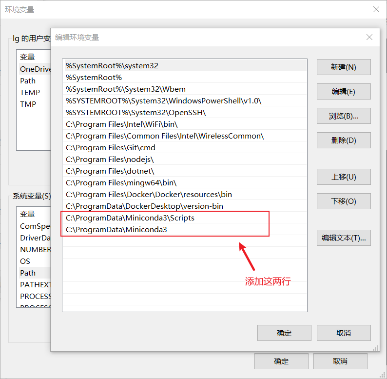
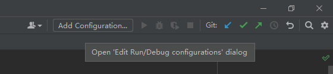

# 1. Python 环境

## 1. Python 使用

### 1.1. 下载及安装

1. 官网下载 Python 安装包，[Python 官方网站](https://www.python.org/), linux 下建议使用 anaconda 或 miniconda
2. Python 默认源在国外，下载速度慢且不稳定，建议更换清华源，在命令行输入以下指令添加清华源

    ```bash
    pip config set global.index-url https://pypi.tuna.tsinghua.edu.cn/simple
    ```

    其他常用国内源

   - 清华源：<https://pypi.tuna.tsinghua.edu.cn/simple>
   - 豆瓣源：<https://pypi.doubanio.com/simple/>
   - 阿里源：<https://mirrors.aliyun.com/pypi/simple/>

### 1.2. 使用库

1. 安装库，常使用 pip 指令

    ```bash
    # 查看 pip 版本
    pip -V      # 或 pip --version

    # 查看已经安装的库
    pip list

    # 在线安装库，pip 会自动安装库的依赖
    pip install xxx     # xxx 为要安装的库
    ```

2. 升级库

    ```bash
    pip list --outdate          # 显示可升级库
    pip install --upgrade xxx   # 升级库
    ```

3. 下载离线库

    ```bash
    # 在目标路径下进入 cmd
    # 会连同下载所有依赖包
    pip download [options] [pakage]
    # 比如下载 linux 版本 numpy
    pip download --only-binary=:all: --platform manylinux1_x86_64 --python-version 37 numpy

    # 离线安装
    pip install --no-index --find-links=file: 路径 包名
    ```

    | 参数                         | 功能           |
    | ---------------------------- | -------------- |
    | --only-binary=:all:          | 不适用二进制包 |
    | --platform manylinux1_x86_64 | linux 64 位    |
    | --python-version 37          | python3.7      |

4. [whl 离线库网站](https://www.lfd.uci.edu/~gohlke/pythonlibs/)

### 1.3. 虚拟环境

1. 创建虚拟环境
   1. 安装 virtualenv 库 `pip install virtualenv`
   2. cd 到目标文件夹下
   3. `virtualenv 虚拟环境名` 创建虚拟环境
   4. 在 `虚拟环境名/Scripts` 下执行 `activate` 开启虚拟环境
   5. 退出虚拟环境 `deactivate`

## 2. Anaconda / Miniconda 使用

### 2.1. 安装

1. Miniconda 是 Anaconda 的精简版本，只包含 Python 和一些最基本的库，使用方法与 Anaconda 相同
2. 从清华源下载安装 [Miniconda](https://mirrors.tuna.tsinghua.edu.cn/anaconda/miniconda/)
3. Linux 安装，将安装文件考入 linux, 然后执行以下命令，根据提示安装即可

    ```bash
    bash miniconda3_xxx.sh
    ```

4. 配置环境变量，默认不需要配置

     ```bash
     # 打开配置文件
     ~/miniconda3/bin$ sudo gedit ~/.bashrc
     # 在末尾添加
     export PATH=~/anaconda3/bin:$PATH
     # 生效
     source ~/.bashrc
     # 验证
     conda --version    # 或 -V
     pip --version
     ```

5. Windows 安装，默认下一步即可（默认不添加环境变量）, 可在安装过程中选择配置环境变量，也可以自行配置环境变量。根据安装路径添加环境变量，重启生效

   

6. 避免一开始就激活 base 环境，可以设置

    ```bash
    # 关闭 base 自动激活
    conda config --set auto_activate_base false
    # 打开 base 自动激活
    conda config --set auto_activate_base true
    ```

7. 检测安装是否成功：配置完环境变量可在任意路径执行下列命令；未配置需要进入安装目录下 (Windows：`C:\ProgramData\Miniconda3\Scripts` Linux：`\miniconda3\bin`) 执行指令

    ```bash
    conda list          # 查看已安装的包
    conda --version     # 查看版本，或-V
    ```

8. 若出现 `conda:command not found` 问题

    ```bash
    # 编辑'.bashrc'文件
    vi ~/.bashrc

    # 再文件末尾加入一下内容，根据需要改变路径
    export PATH=$PATH:/home/username/anaconda3/bin
    ```

### 2.2. 配置 [清华源](https://mirror.tuna.tsinghua.edu.cn/help/anaconda/)

1. linux

    ```bash
    # 清华源
    # 任意目录下编辑'.condarc'文件
    vi ~/.condarc
    ```

2. windows

    ```bash
    # 先创建'.condarc'文件
    # 文件一般在 C:\Users\username 目录下
    conda config --set show_channel_urls yes
    ```

3. 在`.condarc`中写入以下内容，具体以 [清华源](https://mirror.tuna.tsinghua.edu.cn/help/anaconda/) 为准

    ```bash
    channels:
    - defaults
    show_channel_urls: true
    default_channels:
    - https://mirrors.tuna.tsinghua.edu.cn/anaconda/pkgs/main
    - https://mirrors.tuna.tsinghua.edu.cn/anaconda/pkgs/r
    - https://mirrors.tuna.tsinghua.edu.cn/anaconda/pkgs/msys2
    custom_channels:
    conda-forge: https://mirrors.tuna.tsinghua.edu.cn/anaconda/cloud
    msys2: https://mirrors.tuna.tsinghua.edu.cn/anaconda/cloud
    bioconda: https://mirrors.tuna.tsinghua.edu.cn/anaconda/cloud
    menpo: https://mirrors.tuna.tsinghua.edu.cn/anaconda/cloud
    pytorch: https://mirrors.tuna.tsinghua.edu.cn/anaconda/cloud
    simpleitk: https://mirrors.tuna.tsinghua.edu.cn/anaconda/cloud
    ```

### 2.3. conda 虚拟环境

1. 环境配置

    ```bash
    # 创建一个 python3.7 的环境
    conda create --name 环境名 python=3.7
    # 或
    conda create -n 环境名 python=3.7
    
    # 克隆现有环境
    conda create -n 环境名 --clone 现有环境名

    # 激活环境
    conda activate 环境名
    # windows bat 脚本激活 conda
    call activate 环境名

    # 退出环境
    conda deactivate

    # 删除环境
    conda remove -n 环境名 --all

    # 修改环境名：修改虚拟环境文件夹即可
    ```

   > 创建虚拟环境失败，出现`an unexpected error has occurred`问题，可能是源文件出现问题，需要删除`.condarc`文件

2. 列出所有环境

    ```bash
    conda info --envs   # 或 -e
    ```

3. 安装 python 包

    ```bash
    conda install package-name
    pip install package-name
    ```

## 3. 离线安装库文件

### 3.1. 安装 requirements

1. 下载离线包并创建需要安装的库文件列表 `requirements.txt`

    > 最好把基础依赖包放在前面，避免某些包因缺少依赖包导致安装失败，`#`注释掉不需要安装的包

    ```python
    six-1.15.0-py2.py3-none-any.whl
    numpy-1.19.1-cp37-cp37m-manylinux1_x86_64.whl
    scipy-1.5.2-cp37-cp37m-manylinux1_x86_64.whl
    certifi-2020.6.20-py2.py3-none-any.whl
    cycler-0.10.0-py2.py3-none-any.whl
    pyparsing-2.4.7-py2.py3-none-any.whl
    pytz-2020.1-py2.py3-none-any.whl
    python_dateutil-2.8.1-py2.py3-none-any.whl
    pandas-1.1.1-cp37-cp37m-manylinux1_x86_64.whl

    # Pillow-7.2.0-cp37-cp37m-manylinux1_x86_64.whl
    # kiwisolver-1.2.0-cp37-cp37m-manylinux1_x86_64.whl
    # matplotlib-3.3.1-cp37-cp37m-manylinux1_x86_64.whl

    pyDOE-0.3.8.zip
    pwlf-2.0.4.tar.gz
    ```

2. 批量安装库

    ```bash
    # 批量安装
    pip install -r requirements.txt
    # 忽略目录批量安装
    pip install --no-index -r requirements.txt
    ```

### 3.2. 生成 requirements

1. 方法 1: 生成 requirements.txt 文件

    ```bash
    # 这个方法会包含当前环境下所有库，更推荐方法 2
    pip3 freeze >requirements.txt
    ```

2. 方法 2: 只根据当前项目生成 requirements 文件

    ```bash
    # 安装库
    pip install pipreqs

    # 在项目根目录执行，生成 requirements 文件
    pipreqs . --encoding=utf8 --force
    ```

## 4. VSCode 配置 Python 环境

1. 安装 Python 插件

   

2. 创建虚拟环境（用全局环境可以跳过）
3. 为项目添加环境
   1. 打开一个 Python 项目
   2. `Ctrl+Shift+P` 打开命令面板
   3. 选择 `Python：选择解释器`(`Python: Select Interpreter`)

        

   4. 用全局环境可以选择已经列出的环境，否则选择`Enter interpreter path`，然后选`find`在弹出的窗口中选择已创建的虚拟环境

        
        

4. 添加配置：可以根据自己的项目配置 Python、Django 等

    

5. 然后就可以开始调试运行了

## 5. CUDA 安装

1. 如果需要安装 pytorch, 建议根据 pytorch 的版本选择安装对应的 CUDA 版本，教程当前时间 pytorch 最高支持 cuda 11.3, 因此本文以 11.3 版本为例
2. 检查显卡驱动版本是否兼容 [CUDA 版本列表](https://docs.nvidia.com/cuda/cuda-toolkit-release-notes/index.html), 一般自动更新的驱动都可以兼容（过于老旧的 Nvidia 卡和所有的 AMD 显卡不支持）
3. 在网上搜索对应版本的 cuda 下载地址（官网不好找版本，直接搜索更方便），比如 [CUDA 11.3](https://developer.nvidia.com/cuda-11.3.0-download-archive)
4. 安装 CUDA
   1. 执行完安装程序后，在 `Path` 环境变量中添加以下几条，根据自己的版本和位置修改，如果已经有了就不用添加

        ```bash
        C:\Program Files\NVIDIA GPU Computing Toolkit\CUDA\v11.3\bin
        C:\Program Files\NVIDIA GPU Computing Toolkit\CUDA\v11.3\lib
        C:\Program Files\NVIDIA GPU Computing Toolkit\CUDA\v11.3\libnvvp
        ```

   2. 测试 cuda, 在 cmd 中输入`nvcc -V`指令，出现类似下图内容表示安装成功

          

   3. 测试带宽

          

5. 下载安装 [cudnn](https://developer.nvidia.cn/rdp/cudnn-archive), 注意要跟 cuda 版本匹配，CUDA11.3 对应 cudnn8.2.1，需要 nvidia 账号。将解压后的文件放入 cuda 的安装目录 (`\CUDA\v11.3\`) 即可
6. 安装测试 tensorflow
   1. python 安装 tensorflow-gpu

        ```bash
        pip install tensorflow-gpu
        ```

   2. 测试

        ```python
        # 测试 GPU 配置是否成功
        import tensorflow as tf

        # 显示 1 及以上数字说明配置成功
        print("Num GPUs Available: ", len(tf.config.experimental.list_physical_devices('GPU')))
        ```

        ```bash
        # 表示有 1 块 gpu 可以使用
        Num GPUs Available:  1
        ```

7. [参考教程](https://blog.csdn.net/XunCiy/article/details/89070315)

## 6. Pycharm 使用技巧

### 6.1. 模板

1. 打开 File->Settings->Editor->File and Code Templates
2. 选择 Python Script，输入模板

   

3. 常用模板设置

    ```python
    #!/usr/bin/python3
    # -*- coding:utf-8 -*-

    # ------------------
    # Project: ${PROJECT_NAME}
    # Tittle: ${FILE_NAME}
    # Version: python3.7
    # DateTime: ${DATE}
    # Function:
    # ------------------

    ```

4. 系统变量

    | 变量名                    | 内容       |
    | ------------------------- | ---------- |
    | ${PROJECT_NAME}           | 项目名称   |
    | ${PRODUCT_NAME}           | IDE 名称   |
    | ${FILE_NAME}              | 文件名     |
    | ${DATE}                   | 日期       |
    | ${USER}                   | 用户名     |
    | \${YEAR} \${MONTH} ${DAY} | 年、月、日 |
    | \${HOUR} ${MINUTE}        | 时、分     |

### 6.2. 补全

1. 打开 File->Settings->Editor->Live Templates

2. 打开需要创建的程序下拉菜单，然后点击右侧“+”号并选择 Live Template

3. 编辑自动补全：
    1. 把 \<abbreviation> 修改为触发词
    2. Description 为解释内容
    3. 最下面红字，点击后面的 Define 选择适用语言
    4. 右侧 option 选择触发按键

4. 点击 apply 就完成设置。比如下图的设置，在 HTML 文件里输入`<!`，然后按 Tab 键就会补全称为`<!-- -->`

    

### 6.3. 运行配置

1. 以 Django 为例 (Pycharm 专业版会自动配置）
2. 点击右上角的`Add Configurations`

    

3. 点击`+`号，选择 Python

      

4. 根据下图进行配置

    

5. 接下来就可以用 Pycharm 右上角的快捷键运行 Django 项目
6. 也可以利用此方法添加 makemigratiosn 和 migrate

## 7. 备注

1. 常用库

    | 库            | 功能                           |
    | ------------- | ------------------------------ |
    | altair        | 数据可视化工具                 |
    | django        | django 网站框架                |
    | jaydebeapi    | 通过 java 的 jdbc 来连接数据库 |
    | matplotlib    | 绘图                           |
    | nuitka        | python 程序打包                |
    | pandas        | 数据分析工具                   |
    | paramiko      | ssh 工具                       |
    | pillow->PIL   | 图片处理                       |
    | pretty_errors | python 优化错误显示            |
    | psutil        | 电脑监控信息读取               |
    | pulp          | 线性求解                       |
    | pwlf          | 分段线性拟合                   |
    | pyecharts     | python + echarts               |
    | pymysql       | MySQL 数据库                   |
    | pyserial      | 串口                           |
    | scipy         | 科学计算库                     |
    | sympy         | 科学（符号）计算库             |
    | virtualenv    | 虚拟环境                       |
