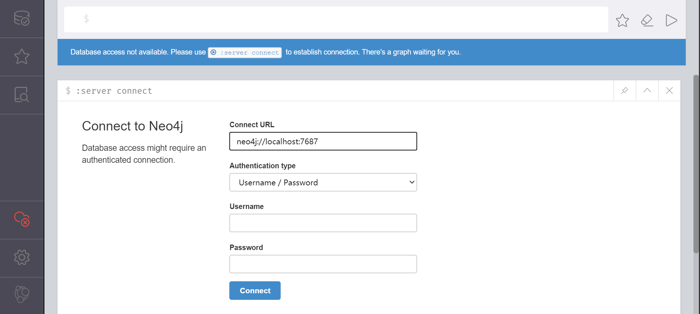
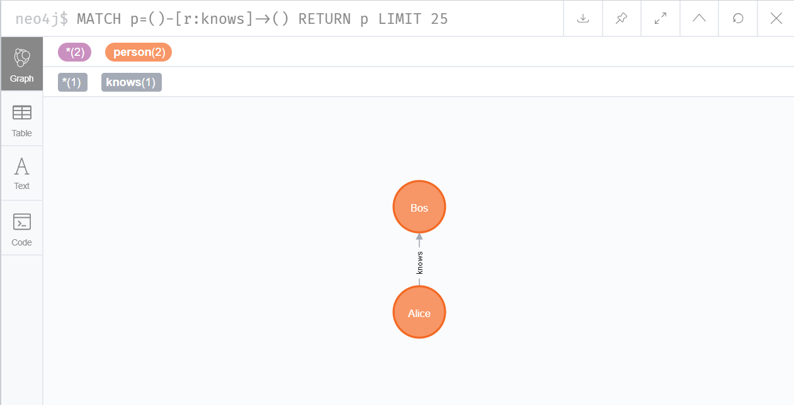

# 10. Neo4j 图数据库

## 1. 安装配置

1. 从[neo4j官网](https://neo4j.com/)下载安装包
2. 配置JDK环境，比如 neo4j v4.0.3 需要jdk11
3. 离线安装包解压即可
4. 启动数据库
   1. 在`../neo4j-community-4.0.3/bin`安装目录下打开命令行

        ```bash
        neo4j console
        ```

   2. 正常数据库打开效果

        ```bash
        D:\neo4j-community-4.0.3\bin>neo4j console
        2020-07-02 06:57:01.863+0000 INFO  ======== Neo4j 4.0.3 ========
        2020-07-02 06:57:01.868+0000 INFO  Starting...
        2020-07-02 06:57:10.438+0000 INFO  Bolt enabled on localhost:7687.
        2020-07-02 06:57:10.439+0000 INFO  Started.
        2020-07-02 06:57:11.376+0000 INFO  Remote interface available at http://localhost:7474/
        ```

   3. 在浏览器中打开 `http://localhost:7474/` 即可访问数据库

        

   4. 默认用户名`neo4j`，密码`neo4j`，首次登录会要求修改密码

        

## 2. py2neo 安装

1. 安装`py2neo`库

    ```bash
    pip install py2neo
    ```

2. 连接数据库

    ```python
    from py2neo import Graph, Node, Relationship

    # 连接数据库
    neo_graph = Graph(
    'http://localhost:7474',
    username='neo4j',
    password='123456'
    )

    # 简写1
    neo = Graph('localhost', auth=('neo4j', '123456'))

    # 简写2
    neo = Graph('localhost', password='123456')
    ```

3. demo

    ```python
    from py2neo import Graph, Node, Relationship

    # 连接数据库
    neo_graph = Graph(
    'http://localhost:7474',
    username='neo4j',
    password='123456'
    )
    test = neo_graph.begin()

    # 建立节点
    a = Node('person', name='Alice')
    b = Node('person', name='Bos')
    # 创建关系
    ab = Relationship(a, 'knows', b)
    # 写入数据库
    test.create(ab)
    test.commit()

    print(ab)
    ```

    > (Alice)-[:knows {}]->(Bos)

    

## 3. 增

1. 创建节点与属性
    1. py2neo写法

        ```python
        # 建立节点
        a = Node('person', name='Alice')
        b = Node('person', name='Bob')
        ab = Relationship(a, 'knows', b)
        # 添加属性
        a['age'] = 20
        b['age'] = 21
        ab['time'] = '2020-07-03'

        print(a)
        print(b)
        print(ab)
        ```

        > (:person {age: 20, name: 'Alice'})
        > (:person {age: 21, name: 'Bos'})
        > (Alice)-[:knows {time: '2020-07-03'}]->(Bos)

    2. cypher写法

        ```python
        neo.run('create(p:person{name:"Alice", age:16})')
        neo.begin().commit()
        ```

2. 设置默认属性 setdefault

    ```python
    a.setdefault('location', 'beijing')
    print(a)
    ```

    > (:person {age: 20, location: 'beijing', name: 'Alice'})

3. 属性批量更新 update

    ```python
    data = {
    'name': 'amy',
    'age': 21
    }

    a.update(data)

    print(a)
    ```

    > (:person {age: 21, location: 'beijing', name: 'amy'})

## 4. 删

1. 删除节点

    ```python
    # 删除节点2
    neo.delete(neo.nodes[2])
    neo.begin().commit()
    ```

2. 删库

    ```python
    from py2neo import Graph, Node, Relationship, walk

    neo = Graph(
    'http://localhost:7474',
    username='neo4j',
    password='123456'
    )

    neo.delete_all()
    ```

## 5. 改

## 6. 查

1. 查询节点

   1. 通过nodes的id查询

        ```python
        from py2neo import Graph

        neo = Graph(
            'http://localhost:7474',
            username='neo4j',
            password='123456'
        )

        print(neo.nodes[1])
        print(neo.nodes.get(1))
        ```

        > (_1:person {age: 21, name: 'Bob'})
        > (_1:person {age: 21, name: 'Bob'})

   2. 通过Cypher语言查询

        ```python
        n = neo.run("MATCH (a:person) RETURN a.name,a.age LIMIT 4").data()
        for i in n:
            print(i)
        ```

        > {'a.name': 'amy', 'a.age': 21}
        > {'a.name': 'Bob', 'a.age': 21}

   3. 通过NodeMatcher查询

        ```python
        matcher = NodeMatcher(neo)
        find = matcher.match('person').where('_.name="Bob"').first()
        print(find)
        ```

        > (_1:person {age: 21, name: 'Bob'})

2. 查询
