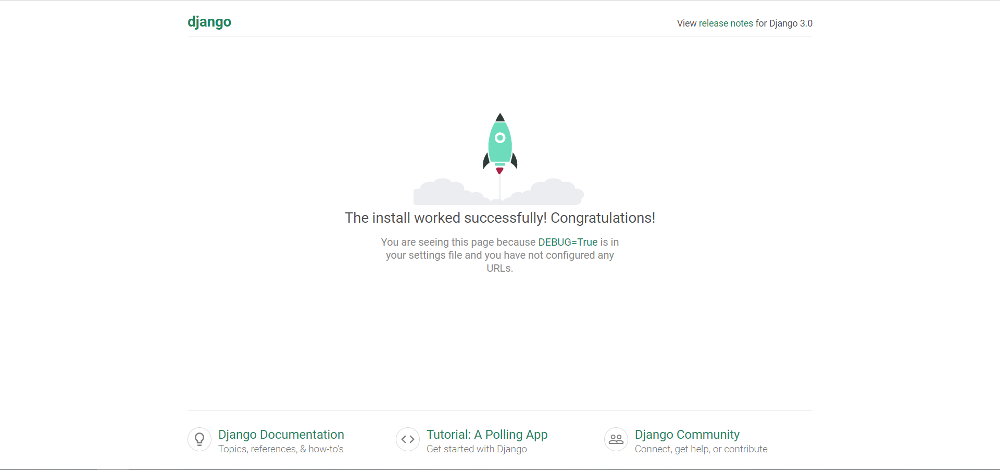

# 11. Django

## 1. 创建项目

1. 安装 Django 包

    ```bash
    pip install django
    ```

2. 创建 django 项目

    ```bash
    django-admin start mysite
    ```

3. 项目目录，之后的路径默认在项目路径第一个`mysite/`之下

    ```dir
    mysite/
        |_ mysite/
            |_ __init__.py      一个空文件，告诉 Python 这个目录应该被认为是一个 Python 包。
            |_ asgi.py          ASGI 兼容的 web 服务器上的入口
            |_ settings.py      设置
            |_ urls.py          url 路由
            |_ wagi.py          WAGI 兼容的 web 服务器上的入口
        |_ templates/           存放 html 文件
        |_ manage.py            管理 django 的工具
    ```

4. 启动项目，默认地址和端口为 127.0.0.1:8000, 在浏览器输入地址后看到下面的页面说明项目启动成功

    ```bash
    python manage.py runserver
    ```

    

## 2. 创建应用

1. 创建应用

    ```python
    python manage.py startapp myapp
    ```

2. 目录

    ```dir
    mysite/
        |_ mysite/
        |_ templates/
        |_ manage.py
        |_ myapp/
            |_ migrations/
                |_ __init__.py
            |_ __init__.py
            |_ admin.py
            |_ apps.py
            |_ models.py
            |_ tests.py
            |_ views.py
    ```

3. 设置中文和时区

   > 在 settings.py 文件内的 INSTALLED_APPS 中添加创建的 app 名称，将 LANGUAGE_CODE 中的内容改为 zh-hans，即设置中文，时区也可以一块设置好

    ```python
    # 语言
    LANGUAGE_CODE = 'zh-hans'
    # 时区
    TIME_ZONE = 'Asia/Shanghai'
    # 避免 django DateTimeField 字段写入 datetime 格式日期时的未添加时区警告
    USE_TZ = False
    ```

4. 设置 url 路径
   1. 先创建一个 html 文件，比如创建`templates/html/index.html`

        ```html
        <!DOCTYPE html>
        <html lang="en">
        <head>
            <meta charset="UTF-8">
            <title>首页</title>
        </head>
        <body>
        <div>
            Hello World!
        </div>
        </body>
        </html>
        ```

   2. 再创建一个返回函数，在 myapp/views.py 内添加以下内容

        ```python
        from django.shortcuts import render

        # Create your views here.
        def index(request):
            return render(request, '../templates/html/index.html')
        ```

   3. 然后在 app 中添加路由，在`myapp/urls.py`中

        ```python
        from django.urls import path
        from . import views

        urlpatterns = [
            path('', views.index, name='index')
        ]
        ```

   4. 最后在项目路由`mysite/urls.py`中引入 app 路由

        ```python
        from django.contrib import admin
        from django.urls import path, include

        urlpatterns = [
            path('admin/', admin.site.urls),
            path('', include('anime.urls'))
        ]
        ```

   5. 启动项目后就可以在首页看到`Hello World!`

## 3. 创建 HTML 模板

1. 这里模板的意思是创建一个基础的 HTML 文件，将一些所有页面都需要的内容，比如 js 库、css 库、页面顶栏、侧边栏等内容，其余页面内容作为模块嵌入其中
2. 在 templates 目录下创建模板 HTML 文件，假设命名为 base.html
3. 完善 base.html 文件，将网页的公共部分完善
4. 在网页有区别的地方用如下代码锁定，其中 xxx 相当于这个锁定模块的 id，当其他页面调用此模板时就是通过 xxx 来识别位置的

    ```html
    
    ```

5. 其他文件使用模板方法

    ```html
    
    .....
    ```

6. 其效果相当于用。.... 处的内容替换部分

## 4. 配置静态文件路径

1. 在项目根目录创建静态文件夹

    ```dir
    mysite/
        |_ mysite/
        |_ templates/
        |_ manage.py
        |_ myapp/
        |_ static/
            |_ css/
            |_ js/
            |_ img/
    ```

2. 添加路径：在`settings.py`最底部添加

    ```python
    STATIC_URL = '/static/'
    STATIC_ROOT = os.path.join(BASE_DIR, 'static').replace('\\', '/')
    STATICFILES_DIRS = (
        ('css', os.path.join(STATIC_ROOT, 'css').replace('\\', '/')),
        ('img', os.path.join(STATIC_ROOT, 'img').replace('\\', '/')),
        ('fonts', os.path.join(STATIC_ROOT, 'fonts').replace('\\', '/')),
        ('js', os.path.join(STATIC_ROOT, 'js').replace('\\', '/')),
    )
    ```

3. 修改 HTML 文件里面的路径

    ```html
    <!-- 导入 css -->
    <link href="/static/css/bootstrap.css" rel="stylesheet" type="text/css" media="all" />
    <link href="/static/css/style.css" rel="stylesheet" type="text/css" media="all" />

    <!-- 导入 js -->
    <script src="/static/js/jquery-1.11.1.min.js"></script>

    <!-- 插图 -->
    
    <!-- 或 -->
    
    
    ```

## 5. 模型使用

### 5.1. 创建模型

1. 创建方法
   1. 静态创建方法：在`myapp/models.py`中

        ```python
        from django.db import models

        # Create your models here.
        class Model1(models.Model):  # 模型名：Model1
            # 字段名 = 字符型（最大长度为 200，默认为空）
            fields1 = models.CharField(max_length=200, default='')

        ```

   2. 动态创建方法：使用`update_or_create`, 若字段不存在就创建，存在就更新。在 views 函数中

        ```python
        # 假设给模型 Model1 中增加字段
        Model1.objects.update_or_create(
            name='fields1',
            defaults={value=None, 'types': 'basic'}
        )
        ```

2. 注册模型：在`myapp/admin.py`中

    ```python
    from django.contrib import admin
    from .models import *  # 从 models.py 引入所有模型

    # Register your models here.
    class Model1Admin(admin.ModelAdmin):
        list_display = ('fields1')

    admin.site.register(Model1)
    ```

3. 激活模型：在`mysite/settings.py`中的`INSTALLED_APPS`字段添加 app

    ```python
    INSTALLED_APPS = [
        'django.contrib.admin',
        'django.contrib.auth',
        'django.contrib.contenttypes',
        'django.contrib.sessions',
        'django.contrib.messages',
        'django.contrib.staticfiles',
        'myapp',  # 把 app 添加到这里
    ]
    ```

4. 写入数据库
   1. makemigrations 会在当前目录下生成一个 migrations 文件夹，该文件夹的内容就是数据库要执行的内容

        ```bash
        # 在命令行输入下面的指令，让 Django 知道我们在我们的模型有一些变更
        python manage.py makemigrations
        ```

        > 正常会出现如下内容
        `Migrations for 'myapp':`
        `myapp\migrations\0001_initial.py`
        `- Create model Model1`

   2. migrate 就是执行之前生成的 migrations 文件，这一步才是操作数据库的一步

        ```bash
        # 在命令行输入下面的指令，创建表结构
        python manage.py migrate
        ```

        > 正常会出现如下内容
        `Operations to perform:`
        `Apply all migrations: admin, myapp, auth, contenttypes, sessions`
        `Running migrations:`
        `Applying myapp.0001_initial... OK`

   3. 备注：Django 每次更新模型都需要执行以上两步，需要注意的是 Django 模型增加内容需要设定变量的初始值，否则会在第一步出现问题

5. 创建超级用户，在命令行输入下面的指令，根据提示进行账号密码等设置即可

    ```bash
    python manage.py createsuperuser
    ```

6. 常用字段类型，[参考](https://blog.csdn.net/Ka_Ka314/article/details/80828309)

    | 字段             | 类型                          |
    | ---------------- | ----------------------------- |
    | AutoField        | 自增 ID                       |
    | BooleanField     | bool 变量                     |
    | NullBooleanField | 支持 null、true、false 三种值 |
    | TextField        | 大段文字                      |
    | CharField        | 字符串                        |
    | FloatField       | 浮点                          |
    | IntegerField     | 整数                          |
    | DateTimeField    | 日期时间                      |
    | TimeField        | 时间                          |
    | DateField        | 日期                          |
    | FileField        | 一个上传文件的字段            |

7. 字段设置

    | 设置           | 功能                                   |
    | -------------- | -------------------------------------- |
    | max_length=100 | 最大长度为 100                         |
    | default=''     | 默认值                                 |
    | blank=True     | 允许空白，默认 False                   |
    | null=True      | 将空值以 NULL 存储到数据库，默认 False |
    | unique=True    | 字段在表中拥有唯一值                   |

### 5.2. makemigrations 和 migrate

1. makemigrations 会在当前目录下生成一个 migrations 文件夹，该文件夹的内容就是数据库要执行的内容

    ```bash
    python manage.py makemigrations
    ```

2. migrate 就是执行之前生成的 migrations 文件，这一步才是操作数据库的一步

    ```bash
    python manage.py migrate
    ```

3. 备注：Django 每次更新模型都需要执行以上两步，需要注意的是 Django 模型增加内容需要设定变量的初始值，否则会在第一步出现问题

### 5.3. 用户模型扩展

1. 前言：Django 模型本身自带 User 模型，可以完成基本的用户功能，不过由于其自带属性较少（用户名，密码，姓，名，邮箱，权限），有时难以满足使用，因此需要涉及用户模型扩展。
    > 本方法思路是创建一个普通模型，使其与 Django 自带用户模型形成一一对应关系
   - 优点：创建使用比较简单，并对原先模型影响较小；
   - 缺点：与用户模型联系不够紧密，无论是模型还是数据库，两部分内容都是分离的，仅仅是有对应关系。

2. 创建用户模型扩展模型，在 views.py 文件内

    ```python
    from django.contrib.auth.models import User

    # 用户模型扩展
    class Profile(models.Model):
        user = models.OneToOneField(User)  # 与 Django 自带用户模型建立对应关系
        company = models.CharField(max_length=40, default="")  # 公司
        location = models.CharField(max_length=80, default="")  # 地址
    ```

3. 在 admin.py 文件内注册模型

    ```python
    from .models import *  # 从 models.py 引入所有模型

    class ProfileAdmin(admin.ModelAdmin):
    list_display = ("user", "company", "location")

    admin.site.register(Profile, ProfileAdmin)
    ```

4. 模型的使用，在网页内

   ```html
   <!-- Django 自带模型 -->
   <p>{{ user.email }}</p>

   <!-- 扩展模型 -->
   <p>{{ user.profile.company }}</p>
   ```

5. 参考文档

   - [django 用户认证系统——拓展 User 模型 2](https://www.cnblogs.com/AmilyWilly/p/8469851.html)
   - [Django-Model 操作数据库（增删改查、连表结构）](https://www.cnblogs.com/yangmv/p/5327477.html)

### 5.4. 模型使用

1. 模型搜索，假设模型名为 Mod, 其下有 id, name, type 等几个字段

    ```python
    from .models import Mod

    # 获取模型中的所有条目
    mod = Mod.objects.all()

    # 根据条件筛选
    mod = Mod.objects.filter(id=3)
    ```

2. 模型创建条目

    ```python
    # 创建一条新的数据记录
    mod = Mod.objects.create(
        id = 1,
        name = 'tom',
        type = 0
    )
    mod.save()
    ```

3. 模型更新数据

    ```python
    # 方法 1: 适合批量修改数据
    Mod.objects.filter(id=10).update(type=1)

    # 方法 2: 适合修改个别数据
    mod = Mod.objects.get(id=10)
    mod.type = 1
    mod.save()
    ```

## 6. 用户验证

1. 创建登陆页面，与普通 HTML 页面创建方法相同，比如下面这个最基本的登陆页面

    ```html
    <!DOCTYPE html>
    <html lang="en">
    <head>
        <meta charset="UTF-8">
        <title>登陆</title>
    </head>
    <body>
        <form action="" method="POST">
            
            <label>
                <input type="text" name="username">
            </label>
            <label>
                <input type="password" name="password">
            </label>
            <input type="submit" value="登陆">
        </form>
        <p>{{ message }}</p>
    </body>
    </html>
    ```

2. 写登录页函数，以便于在其他页面使用跳转到登录页。在 views.py 文件下增加

    ```python
    def login(request):
        return render(request, "login.html", {"message": "请输入用户名和密码！"})
    ```

    别忘了添加到 urls.py 文件

    ```python
    path('login/', views.login, name="login"),
    ```

    跳转方法

    ```html
    <a href=""></a>
    ```

3. 用户登陆与验证，在 views.py 文件内创建登陆验证函数。若账号密码通过，则登陆并返回；否则留在登录页并显示 "登录名或密码错误！"字样

    ```python
    from django.contrib import auth
    from django.shortcuts import render, redirect

    def login_check(request):
        username = request.POST.get("username", "")
        password = request.POST.get("password", "")
        user = auth.authenticate(request, username=username, password=password)
        if user is not None:
            auth.login(request, user)
            return redirect("/dashboard/")
        else:
            return render(request, "login.html", {"message": "登录名或密码错误！"})
    ```

    同样不要忘记将函数写入 urls.py 文件

    ```python
    path('login_check', views.login_check, name="login_check"),
    ```

4. 未登录用户强制跳转，防止未登录用户看到数据，在需要设置访问限制的网页加入以下函数，比如 table，判断用户登陆状况，若用户已登录，则允许跳转到 table 页面，否则强制跳转到登录页面

    ```python
    def table(request):
        # 判断登录情况，未登录强制跳转
        if request.user.is_authenticated:
            return render(request, "table.html")
        else:
            return render(request, "login.html", {"message": "请输入用户名和密码！"})
    ```

5. 备注

   - CSRF（Cross-site request forgery）跨站请求伪造。Django 为了防止 CSRF 攻击有一些保护措施，因此我们在使用 POST 时会出现 django csrf token missing or incorrect 的错误，因此需要在 POST 表单中加入 ，原理部分此时先不做深究，因为我也没有研究这方面
   - 关于 render 的一些问题，因为 render 本身自带一个 request 参数，这个参数其实包含有很多信息，其中就有用户信息，因此在使用 render 时，即便我们没有向网页传递任何参数，网页依然可以访问到用户信息，比如使用{{user}}就可以显示用户名，这就是 request 起到的作用

## 7. 前后端数据交互

### 7.1. 表单提交 GET&POST

1. GET&POST 都是 AJAX 函数的简写
   比如在 jQuery 使用 POST 时，POST 函数语法如下

    ```js
    jQuery.post(url,data,success(data, textStatus, jqXHR),dataType)
    ```

    原 AJAX 函数如下

    ```js
    $.ajax({
      type: 'POST',
      url: url,
      data: data,
      success: success,
      dataType: dataType
    });
    ```

    同理，GET 函数语法如下

    ```js
    $(selector).get(url,data,success(response,status,xhr),dataType)
    ```

    原 AJAX 函数如下

    ```js
    $.ajax({
      url: url,
      data: data,
      success: success,
      dataType: dataType
    });
    ```

    可以看到 GET 和 POST 函数差别其实不大，但是之前在用 PHP 的时候，GET 是明文传递参数，在用户登陆的情况下传递用户名和密码显然是不太合适的，具体区别参考 [HTTP 方法：GET 对比 POST](http://www.runoob.com/tags/html-httpmethods.html)

2. Django 表单提交的方法，views.py 文件内

    ```python
    def xxx(request):
        if request.method == 'get':
            motor_name = request.GET.get("data1", "")
    ```

    通过上面的程序就可以读取到前端页面发送的名为 data1 变量内的值
    经过测试增加了

    ```python
    if request.method == 'get':
    ```

    这句后程序更加稳定。使用 POST 方法相同，只需把上面程序 GET 改成 POST 即可，但是需要注意 csrf 问题。

### 7.2. 前端获取数据

1. 后端传递全部变量到前端
   1. 在`views.py`文件中使用`locals()`

        ```python
        def index(request):
            x = 1
            y = 2
            return render(request, 'index.html', locals())
        ```

   2. html 中使用变量

        ```html
        <!-- 在文件头部引入 -->
        

        <!-- 在文件中就可以通过双大括号使用 -->
        <div>x = {{ x }}</div>
        <div>y = {{ y }}</div>
        ```

   3. 若要在 js 中使用，则需要用 safe 过滤器

        ```js
        let x = {{ x|safe }};
        let y = {{ y|safe }};
        ```

2. 通过 json 传递数据到前端
   1. 后端`views.py`中返回 json 数据

       ```python
       from django.http.response import JsonResponse

       def get_data(request):
           return JsonResponse({'x': 1, 'y': 2})
       ```

   2. 前端中需要用 ajax 获取数据

## 8. CSRF 认证的几种方法

1. 在登陆表单中添加 CSRF 方法：

    ```html
    <form action="" method="POST">
        
        <label>
            <input type="text" name="username" placeholder="用户名">
        </label>
        <label>
            <input type="password" name="password" placeholder="密码">
        </label>
        <h4 style="color: white;">{{ message }}</h4><br>
        <input type="submit" value="登陆">
    </form>
    ```

2. 在 HTML 与 JS 分离的网页中的方法：

    ```html
    <script>
    // POST csrf_token
    $.ajaxSetup({
        data: {csrfmiddlewaretoken: '{{ csrf_token }}' }
    });
    </script>
    <script src="xxx.js"></script>
    ```

3. 在 HTML 与 JS 在同一文件中时可以使用 2 中的方法，但是当 js 中既有 POST 又有 GET 时，该方法会出现错误（当然全部使用 POST 也是可以的）。因此还有一种方法只对 POST 产生作用，不过这种方法对 HTML 与 js 分离的网页中无效：

    ```js
    $.post("/data_search/",{
            data1: a,
            data2: b,
            csrfmiddlewaretoken: '{{ csrf_token }}'  // csrf 认证
        } , function () {
            // 要执行的函数
        }
    )
    ```

## 9. 部署相关

### 9.1. 启动脚本

1. Windows 启动脚本

    ```sh
    # 激活 conda 环境
    call activate 环境名
    # 启动服务
    python.exe manage.py runserver 127.0.0.1:8000 &
    ```

2. Linux 启动脚本

    ```sh
    # 虚拟环境 python 路径/python manage.py runerver IP:Port &
    python manage.py runserver 127.0.0.1:8000 &
    ```
