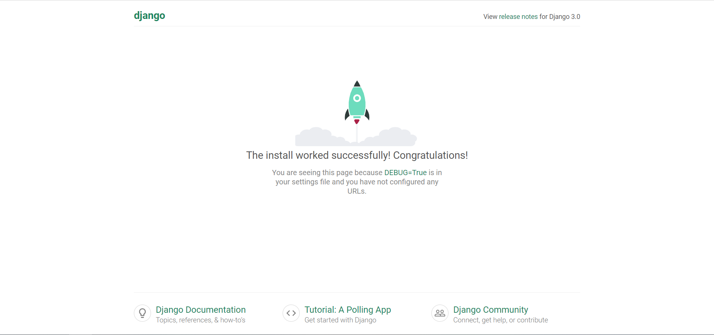

# 11. Django3

## 1. 创建项目

1. 创建django项目

    ```bash
    django-admin start mysite
    ```

2. 项目目录，之后的路径默认在项目路径第一个`mysite/`之下

    ```dir
    mysite/
        |_ mysite/
            |_ __init__.py      一个空文件，告诉 Python 这个目录应该被认为是一个 Python 包。
            |_ asgi.py          ASGI兼容的web服务器上的入口
            |_ settings.py      设置
            |_ urls.py          url 路由
            |_ wagi.py          WAGI兼容的web服务器上的入口
        |_ templates/           存放html文件
        |_ manage.py            管理django的工具
    ```

3. 启动项目

    ```python
    python manage.py runserver
    ```

    

## 2. 创建应用

1. 创建应用

    ```python
    python manage.py startapp myapp
    ```

2. 目录

    ```dir
    mysite/
        |_ mysite/
        |_ templates/
        |_ manage.py
        |_ myapp/
            |_ migrations/
                |_ __init__.py
            |_ __init__.py
            |_ admin.py
            |_ apps.py
            |_ models.py
            |_ tests.py
            |_ views.py
    ```

3. 设置中文：在settings.py 文件内的INSTALLED_APPS 中添加创建的app名称，将LANGUAGE_CODE 中的内容改为zh-hans，即设置中文，时区也可以一块设置好

    ```python
    # 语言
    LANGUAGE_CODE = 'zh-hans'
    # 时区
    TIME_ZONE = 'Asia/Shanghai'
    ```

4. 设置url路径
   1. 先创建一个html文件，比如创建`templates/html/index.html`

        ```html
        <!DOCTYPE html>
        <html lang="en">
        <head>
            <meta charset="UTF-8">
            <title>首页</title>
        </head>
        <body>
        <div>
            Hello World!
        </div>
        </body>
        </html>
        ```

   2. 再创建一个返回函数，在myapp/views.py内添加以下内容

        ```python
        from django.shortcuts import render


        # Create your views here.
        def index(request):
            return render(request, '../templates/html/index.html')
        ```

   3. 然后在app中添加路由，在`myapp/urls.py`中

        ```python
        from django.urls import path
        from . import views

        urlpatterns = [
            path('', views.index, name='index')
        ]
        ```

   4. 最后在项目路由`mysite/urls.py`中引入app路由

        ```python
        from django.contrib import admin
        from django.urls import path, include

        urlpatterns = [
            path('admin/', admin.site.urls),
            path('', include('anime.urls'))
        ]
        ```

   5. 启动项目后就可以在首页看到`Hello World!`

## 3. 创建HTML模板

1. 这里模板的意思是创建一个基础的 HTML 文件，将一些所有页面都需要的内容，比如js库、css库、页面顶栏、侧边栏等内容，其余页面内容作为模块嵌入其中
2. 在 templates 目录下创建模板 HTML 文件，假设命名为base.html
3. 完善base.html文件，将网页的公共部分完善
4. 在网页有区别的地方用如下代码锁定，其中xxx 相当于这个锁定模块的id，当其他页面调用此模板时就是通过xxx来识别位置的

    ```html
    
    ```

5. 其他文件使用模板方法

    ```html
    
    .....
    ```

6. 其效果相当于用.....处的内容替换部分

## 4. 配置静态文件路径

1. 在项目根目录创建静态文件夹

    ```dir
    mysite/
        |_ mysite/
        |_ templates/
        |_ manage.py
        |_ myapp/
        |_ static/
            |_ css/
            |_ js/
            |_ img/
    ```

2. 添加路径：在`settings.py`最底部添加

    ```python
    STATIC_URL = '/static/'
    STATIC_ROOT = os.path.join(BASE_DIR, 'static').replace('\\', '/')
    STATICFILES_DIRS = (
        ('css', os.path.join(STATIC_ROOT, 'css').replace('\\', '/')),
        ('img', os.path.join(STATIC_ROOT, 'img').replace('\\', '/')),
        ('fonts', os.path.join(STATIC_ROOT, 'fonts').replace('\\', '/')),
        ('js', os.path.join(STATIC_ROOT, 'js').replace('\\', '/')),
    )
    ```

3. 修改HTML文件里面的路径

    ```html
    <!-- 导入css -->
    <link href="/static/css/bootstrap.css" rel="stylesheet" type="text/css" media="all" />
    <link href="/static/css/style.css" rel="stylesheet" type="text/css" media="all" />

    <!-- 导入js -->
    <script src="/static/js/jquery-1.11.1.min.js"></script>

    <!-- 插图 -->
    
    <!-- 或 -->
    
    
    ```

## 5. 模型创建与扩展

### 5.1. 创建模型

1. 创建方法：在`myapp/models.py`中

    ```python
    from django.db import models

    # Create your models here.
    class Model1(models.Model):  # 模型名:Model1
        # 字段名 = 字符型（最大长度为200，默认为空）
        fields1 = models.CharField(max_length=200, default='')

    ```

2. 注册模型：在`myapp/admin.py`中

    ```python
    from django.contrib import admin
    from .models import *  # 从models.py引入所有模型


    # Register your models here.
    class Model1Admin(admin.ModelAdmin):
        list_display = ('fields1')


    admin.site.register(Model1)

    ```

3. 激活模型：在`mysite/settings.py`中的`INSTALLED_APPS`字段添加app

    ```python
    INSTALLED_APPS = [
        'django.contrib.admin',
        'django.contrib.auth',
        'django.contrib.contenttypes',
        'django.contrib.sessions',
        'django.contrib.messages',
        'django.contrib.staticfiles',
        'myapp',  # 把app添加到这里
    ]
    ```

4. 写入数据库
   1. makemigrations会在当前目录下生成一个migrations文件夹，该文件夹的内容就是数据库要执行的内容

        ```bash
        python manage.py makemigrations  # 让 Django 知道我们在我们的模型有一些变更
        ```

        > 正常会出现如下内容
        `Migrations for 'myapp':`
        `myapp\migrations\0001_initial.py`
        `- Create model Model1`

   2. migrate就是执行之前生成的migrations文件，这一步才是操作数据库的一步

        ```bash
        python manage.py migrate   # 创建表结构
        ```

        > 正常会出现如下内容
        `Operations to perform:`
        `Apply all migrations: admin, myapp, auth, contenttypes, sessions`
        `Running migrations:`
        `Applying myapp.0001_initial... OK`

   3. 备注：Django每次更新模型都需要执行以上两步，需要注意的是Django模型增加内容需要设定变量的初始值，否则会在第一步出现问题

5. 创建超级用户

    ```bash
    python manage.py createsuperuser
    ```

6. 常用字段类型，[参考](https://blog.csdn.net/Ka_Ka314/article/details/80828309)

    | 字段             | 类型                        |
    | ---------------- | --------------------------- |
    | AutoField        | 自增ID                      |
    | BooleanField     | bool变量                    |
    | NullBooleanField | 支持null、true、false三种值 |
    | TextField        | 大段文字                    |
    | CharField        | 字符串                      |
    | FloatField       | 浮点                        |
    | IntegerField     | 整数                        |
    | DateTimeField    | 日期时间                    |
    | TimeField        | 时间                        |
    | DateField        | 日期                        |
    | FileField        | 一个上传文件的字段          |

### 5.2. makemigrations和migrate

1. makemigrations会在当前目录下生成一个migrations文件夹，该文件夹的内容就是数据库要执行的内容

    ```bash
    python manage.py makemigrations
    ```

2. migrate就是执行之前生成的migrations文件，这一步才是操作数据库的一步

    ```bash
    python manage.py migrate
    ```

3. 备注：Django每次更新模型都需要执行以上两步，需要注意的是Django模型增加内容需要设定变量的初始值，否则会在第一步出现问题

### 5.3. 用户模型扩展

1. 前言：Django 模型本身自带User模型，可以完成基本的用户功能，不过由于其自带属性较少（用户名，密码，姓，名，邮箱，权限），有时难以满足使用，因此需要涉及用户模型扩展。
    > 本方法思路是创建一个普通模型，使其与Django自带用户模型形成一一对应关系
   - 优点：创建使用比较简单，并对原先模型影响较小；
   - 缺点：与用户模型联系不够紧密，无论是模型还是数据库，两部分内容都是分离的，仅仅是有对应关系。

2. 创建用户模型扩展模型，在views.py文件内

    ```python
    from django.contrib.auth.models import User

    # 用户模型扩展
    class Profile(models.Model):
        user = models.OneToOneField(User)  # 与Django自带用户模型建立对应关系
        company = models.CharField(max_length=40, default="")  # 公司
        location = models.CharField(max_length=80, default="")  # 地址
    ```

3. 在admin.py文件内注册模型

    ```python
    from .models import *  # 从models.py引入所有模型

    class ProfileAdmin(admin.ModelAdmin):
    list_display = ("user", "company", "location")

    admin.site.register(Profile, ProfileAdmin)
    ```

4. 模型的使用，在网页内

   ```html
   <!-- Django自带模型 -->
   <p>{{ user.email }}</p>

   <!-- 扩展模型 -->
   <p>{{ user.profile.company }}</p>
   ```

5. 参考文档

   - [django用户认证系统——拓展 User 模型2](https://www.cnblogs.com/AmilyWilly/p/8469851.html)
   - [Django-Model操作数据库(增删改查、连表结构）](https://www.cnblogs.com/yangmv/p/5327477.html)

## 6. 用户验证

1. 创建登陆页面，与普通HTML页面创建方法相同，比如下面这个最基本的登陆页面

    ```html
    <!DOCTYPE html>
    <html lang="en">
    <head>
        <meta charset="UTF-8">
        <title>登陆</title>
    </head>
    <body>
        <form action="" method="POST">
            
            <label>
                <input type="text" name="username">
            </label>
            <label>
                <input type="password" name="password">
            </label>
            <input type="submit" value="登陆">
        </form>
        <p>{{ message }}</p>
    </body>
    </html>
    ```

2. 写登录页函数，以便于在其他页面使用跳转到登录页。在views.py文件下增加

    ```python
    def login(request):
        return render(request, "login.html", {"message": "请输入用户名和密码！"})
    ```

    别忘了添加到urls.py文件

    ```python
    path('login/', views.login, name="login"),
    ```

    跳转方法

    ```html
    <a href=""></a>
    ```

3. 用户登陆与验证，在views.py文件内创建登陆验证函数。若账号密码通过，则登陆并返回；否则留在登录页并显示 "登录名或密码错误！"字样

    ```python
    from django.contrib import auth
    from django.shortcuts import render, redirect

    def login_check(request):
        username = request.POST.get("username", "")
        password = request.POST.get("password", "")
        user = auth.authenticate(request, username=username, password=password)
        if user is not None:
            auth.login(request, user)
            return redirect("/dashboard/")
        else:
            return render(request, "login.html", {"message": "登录名或密码错误！"})
    ```

    同样不要忘记将函数写入urls.py文件

    ```python
    path('login_check', views.login_check, name="login_check"),
    ```

4. 未登录用户强制跳转，防止未登录用户看到数据，在需要设置访问限制的网页加入以下函数，比如table，判断用户登陆状况，若用户已登录，则允许跳转到table页面，否则强制跳转到登录页面

    ```python
    def table(request):
        # 判断登录情况，未登录强制跳转
        if request.user.is_authenticated:
            return render(request, "table.html")
        else:
            return render(request, "login.html", {"message": "请输入用户名和密码！"})
    ```

5. 备注

   - CSRF（Cross-site request forgery）跨站请求伪造。Django 为了防止CSRF 攻击有一些保护措施，因此我们在使用POST 时会出现django csrf token missing or incorrect的错误，因此需要在POST表单中加入 ，原理部分此时先不做深究，因为我也没有研究这方面
   - 关于render的一些问题，因为render 本身自带一个request 参数，这个参数其实包含有很多信息，其中就有用户信息，因此在使用render时，即便我们没有向网页传递任何参数，网页依然可以访问到用户信息，比如使用{{user}}就可以显示用户名，这就是request起到的作用

## 7. 表单提交 GET&POST

1. GET&POST都是AJAX函数的简写
   比如在jQuery使用POST时，POST函数语法如下

    ```js
    jQuery.post(url,data,success(data, textStatus, jqXHR),dataType)
    ```

    原AJAX函数如下

    ```js
    $.ajax({
      type: 'POST',
      url: url,
      data: data,
      success: success,
      dataType: dataType
    });
    ```

    同理，GET函数语法如下

    ```js
    $(selector).get(url,data,success(response,status,xhr),dataType)
    ```

    原AJAX函数如下

    ```js
    $.ajax({
      url: url,
      data: data,
      success: success,
      dataType: dataType
    });
    ```

    可以看到GET和POST函数差别其实不大，但是之前在用PHP的时候，GET是明文传递参数，在用户登陆的情况下传递用户名和密码显然是不太合适的，具体区别参考 [HTTP 方法：GET 对比 POST](http://www.runoob.com/tags/html-httpmethods.html)

2. Django表单提交的方法，views.py文件内

    ```python
    def xxx(request):
        if request.method == 'get':
            motor_name = request.GET.get("data1", "")
    ```

    通过上面的程序就可以读取到前端页面发送的名为data1变量内的值
    经过测试增加了

    ```python
    if request.method == 'get':
    ```

    这句后程序更加稳定。使用POST方法相同，只需把上面程序GET改成POST即可，但是需要注意csrf问题。

## 8. CSRF认证的几种方法

1. 在登陆表单中添加CSRF方法：

    ```html
    <form action="" method="POST">
        
        <label>
            <input type="text" name="username" placeholder="用户名">
        </label>
        <label>
            <input type="password" name="password" placeholder="密码">
        </label>
        <h4 style="color: white;">{{ message }}</h4><br>
        <input type="submit" value="登陆">
    </form>
    ```

2. 在HTML与JS分离的网页中的方法：

    ```html
    <script>
    // POST csrf_token
    $.ajaxSetup({
        data: {csrfmiddlewaretoken: '{{ csrf_token }}' }
    });
    </script>
    <script src="xxx.js"></script>
    ```

3. 在HTML与JS在同一文件中时可以使用2中的方法，但是当js中既有POST又有GET时，该方法会出现错误(当然全部使用POST也是可以的)。因此还有一种方法只对POST产生作用，不过这种方法对HTML与js分离的网页中无效：

    ```js
    $.post("/data_search/",{
            data1: a,
            data2: b,
            csrfmiddlewaretoken: '{{ csrf_token }}'  // csrf认证
        } , function () {
            // 要执行的函数
        }
    )
    ```
