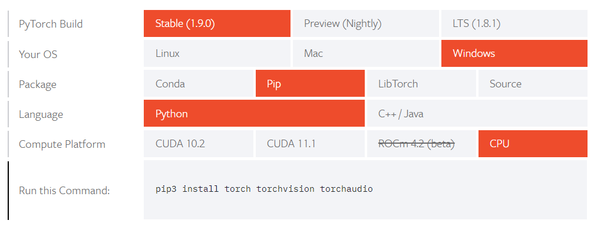

# 13. PyTorch 笔记

## 1. 安装

1. 安装包比较大，建议先配置清华源，参考第一章 [Python 环境](Python-01-环境.md)
2. 进入 Pytorch 官网的 [安装页面](https://pytorch.org/get-started/locally/), 根据需要选择环境和安装版本

      

3. 根据生成的命令再本地执行安装

   > 比如根据上图选择的通过 pip 安装的适用于 python 的 cpu 版本 Pytorch

    ```bash
    pip3 install torch torchvision torchaudio
    ```

4. 使用 gpu 进行训练需要配置 cuda 环境，参考 [CUDA 安装](Python-01-环境.md##-5.-CUDA-安装)

    - Tips1: gpu 版本需要先 NVIDIA 显卡并安装 CUDA，最好先根据列出的版本安装对应的 CUDA 版本，比如上图要安装 CUDA11.1，然后复制对应的指令安装相应版本的 torch
    - Tips2: 安装包比较大，可以通过 pip 指令列出的地址下载好安装包后，从本地安装

    ```python
    import torch

    print(torch.cuda.is_available())    # True 表示可用
    # 显示显卡数量
    print(torch.cuda.device_count())    # 1 表示只有一块显卡
    # 显示当前
    print(torch.cuda.current_device())  # 0 表示当前在第一块显卡上
    # 显示显卡名
    print(torch.cuda.get_device_name(0))    # NVIDIA GeForce MX150
    ```

## 2. 基础使用方法

### 2.1. 数据处理

1. 数据转换

    ```python
    # torch 转 numpy
    torch_data.numpy()

    # numpy 转 torch
    torch_data = torch.FloatTensor(np_data).to(device)
    # 或
    torch_daat = torch.tensor(np_data, dtype=torch.float32, device=device)
    ```

2. 降维

    ```python
    torch.squeeze(input, dim=None, out=None)
    ```

### 2.2. 模型保存与加载

1. 保存模型

    ```python
    # 只保存模型参数，体积小，速度快
    torch.save(net.state_dict(), 'model_para')

    # 保存完整的模型
    torch.save(net, 'model_name')
    ```

2. 加载模型

    > map_location 不设置的话，模型会加载到保存模型的设备

    ```python
    # 加载模型参数
    model = xxxNet()  # 先创建模型
    static_dict = torch.load('model_para', map_location='cuda:0')  # 加载模型参数文件
    model.load_state_dict(static_dict)  # 将模型参数加载到模型中

    # 加载整个模型
    model = torch.load('model_name')
    ```

### 2.3. [Torch 模型](https://pytorch.org/docs/stable/nn.html)

1. 卷积层：conv2d 二维卷积，[卷积动画](https://github.com/vdumoulin/conv_arithmetic/blob/master/README.md)

    ```python
    import torch nn as nn
    import torch.nn.functional as F

    nn.Conv2d(in_channels, out_channels, kernel_size, stride=1, padding=0, dilation=1, groups=1, bias=True, padding_mode='zeros', device=None, dtype=None)
    # in_channels: 输入维度
    # out_channels: 输出维度
    # kernel_size: 内核维度
    # stride: 偏移量
    # padding: 填充（矩阵边缘填充的维度）

    F.conv2d(input, weight, bias=None, stride=1, padding=0)
    # input: 输入
    # weight: 卷积核
    # bias: 偏置（相当于加一个常量）
    # stride: 偏移量
    # padding: 填充（矩阵边缘填充的维度）

    ```

2. 池化层：maxpool2d 二维最大池化，减小数据维数，加快训练速度

    ```python
    nn.MaxPool2d(kernel_size, stride=None, padding=0, dilation=1, return_indices=False, ceil_mode=False)
    # kernel_size: 池化维度
    # stride: 偏移量，默认值=kernel_size
    # padding: 填充
    # dilation: 空洞卷积
    # ceil_mode: True=ceil 模式，false=floor 模式
    ```

3. 非线性激活

    ```python
    nn.ReLU(inplace=False)   # 0 if x < 0 else x
    nn.Sigmoid()
    nn.Tanh()
    ```

4. 线性层

## 3. 并行计算
