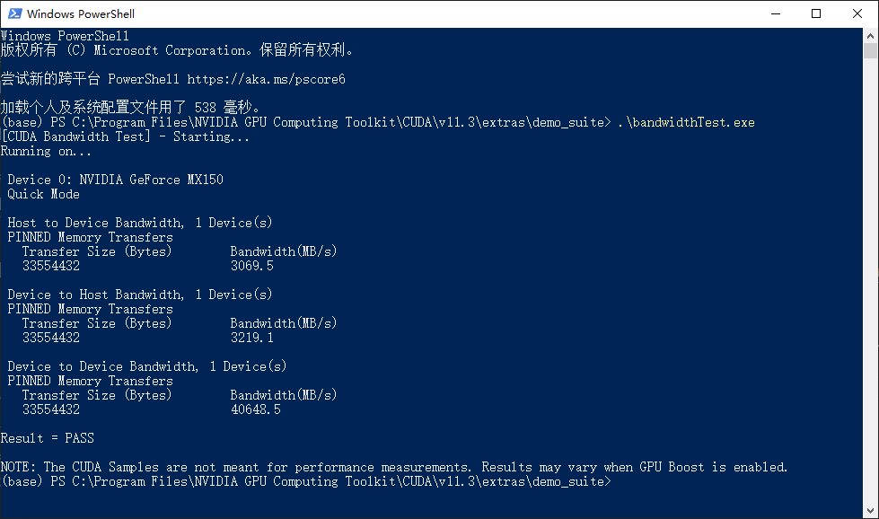

# 14. Keras 学习笔记

## 1. 安装

1. pip 安装

    ```bash
    # 安装 cpu 版的 tensorflow
    pip install tensorflow
    # 或者安装 gpu 版的 tensorflow（需要 CUDA 支持）
    pip install tensorflow-gpu

    # 安装 keras
    pip install keras
    ```

2. 此外还需要安装 cuDnn，参考 [tensorflow GPU 支持](https://www.tensorflow.org/install/gpu#windows_setup)
   1. 配置 cuda 环境变量
   2. 下载 [cudnn](https://developer.nvidia.cn/rdp/cudnn-archive), 需要 nvidia 账号
   3. 测试 cuda，在`C:\Windows\System32\WindowsPowerShell\v1.0\powershell.exe`目录下打开 powershell，运行`.\bandwidthTest.exe`, 显示下面的效果表示配置成功

          

   4. 在代码中测试

        ```python
        # 测试 GPU 配置是否成功
        import tensorflow as tf

        # 显示 1 及以上数字说明配置成功
        print("Num GPUs Available: ", len(tf.config.experimental.list_physical_devices('GPU')))
        ```

3. 使用 gpu 进行训练

    ```python
    # 在代码开头加入如下设置

    import os
    os.environ["CUDA_VISIBLE_DEVICES"] = '0'    # 使用 0 号 gpu
    ```

4. keras 结构

      

## 2. 核心层

1. 全连接层：神经网络中最常用的，实现对神经网络里的神经元激活

   ```python
   # units：全连接层输出的维度，即下一层神经元的个数
   # activation：激活函数，默认使用 Relu
   # use_bias：是否使用 bias 偏置
   Dense(units, activation='relu', use_base=True)
   ```

2. 激活层：对上一层的

   ```python
   # 激活函数，relu、tanh、sigmoid 等
   Activation(activation)
   ```

3. Dropout 层：对上一层的神经元随机选取一定比例的失活，不更新，但是权重仍然保留，防止过拟合

   ```python
   # rate：失活比例，0-1 浮点数
   Droupout(rate)
   ```

4. Flatten 层：将一个维度大于或等于 3 的高维矩阵，“压扁”为一个二维矩阵。即保留第一个维度（如：batch 的个数），然后将剩下维度的值相乘作为“压扁”矩阵的第二个维度

   ```python
   Flatten()
   ```

5. Reshape 层：将输入的维度重构成特定的 shape

   ```python
   # target_shape：目标矩阵的维度，不包含 batch 样本数
   Reshape(target_shape)
   ```

6. 卷积层：卷积操作分为一维、二维、三维，分别为 Conv1D、Conv2D、Conv3D。一维卷积主要应用于以时间序列数据或文本数据，二维卷积通常应用于图像数据。由于这三种的使用和参数都基本相同，所以主要以处理图像数据的 Conv2D 进行说明

   ```python
   # filters：卷积核的个数
   # kernel_size：卷积核的大小
   # strides：步长，二维中默认为 (1,1)，一维中默认为 1
   # Padding：补“0”策略，‘valid’指卷积后的大小与原来的大小可以不同，‘same’指卷积后的大小与原来大小一致
   Conv2D(filters, kernel_size, strides=(1,1), padding='valid')
   ```

7. 池化层：与卷积层一样，最大统计量池化和平均统计量池化也有三种，分别为 MaxPooling1D、MaxPooling2D、MaxPooling3D 和 AveragePooling1D、AveragePooling2D、AveragePooling3D，由于使用和参数基本相同，所以主要以 MaxPooling2D 进行说明

   ```python
   # poll_size：长度为 2 的整数 tuple，表示在横向和纵向的下采样因子，一维则为纵向下采样因子
   MaxPolling(poll_size=(2,2), strides=None, padding='valid')
   ```

8. 循环层：循环神经网络中的 RNN、LSTM 和 GRU 都继承本层，所以该父类的参数同样使用于对应的子类 SimpleRNN、LSTM 和 GRU

   ```python
   # retrun_sequences：控制返回类型，‘False’返回输出序列的最后一个输出，‘True’则返回整个序列
   Recurrent(return_sequences=False)
   ```

9. 嵌入层：该层只能用在模型的第一层，是将所有索引标号的稀疏矩阵映射到致密的低维矩阵。如我们对文本数据进行处理时，我们对每个词编号后，我们希望将词编号变成词向量就可以使用嵌入层

   ```python
   # input_dim：大或等于 0 的整数，字典长度，即输入数据最大下标+1
   # output_dim：大于 0 的则行数，代表全连接嵌入的维度
   # input_length：当输入序列的长度固定时，该值为其长度。如果要在该层后接 Flatten 层，然后接 Dense 层，则必须指定该参数，否则 Dense 层的输出维度无法自动推断
   Embedding(input_dim, output_dim, input_length)
   ```

## 3. 模型搭建

### 3.1. LSTM

1. 单层 lstm 预测模型

    ```python
    # x_train 训练集输入
    # x_train.shape[0] 表示 x_train 有多少条
    # x_train.shape[1] 表示 x_train 每条数据有几个值
    x_train = np.reshape(x_train, (x_train.shape[0], x_train.shape[1], 1))
    # x_test 测试集输入
    x_test = np.reshape(x_test, (x_test.shape[0], x_test.shape[1], 1))
    print(x_train.shape)
    
    # 模型结构
    model = Sequential()
    # 定义 LSTM 模型，第一个隐藏层含有 100 个神经元
    model.add(LSTM(100, input_shape=(x_train.shape[1], x_train.shape[2])))
    model.add(Dropout(0.25))  # 暂时从网络中移除神经网络中的单元
    model.add(Dense(1))  # 输出维数
    model.add(Activation('relu'))   # 激活函数

    # 使用均方差损失函数，优化器 Adam，评估标准
    model.compile(loss=losses.mean_squared_error,  # 损失函数
                optimizer='adam',  # 优化器
                metrics=['mae', 'acc'])  # 评估标准

    # 模型将会进行 30 个 epochs（回合）的训练，每个回合将数据分成 batch=100 的组进行训练
    # 比如有 1000 条训练数据，batch_size=100 表示将 1000 条数据分成 10 组，每组 100 条数据，重复进行 epochs 次训练
    history = model.fit(x_train, y_train, epochs=30, batch_size=100,
                        validation_data=(x_test, y_test),   # 验证集
                        callbacks=[EarlyStopping(monitor='val_loss', patience=10)], # 当被检测值不再提升，提前结束训练
                        verbose=1, shuffle=True)   # shuffle=False 不打乱数据顺序，一般设置为 True 训练结果会好一些
    model.summary() # 打印模型信息

    # 做出预测
    test_predict = model.predict(x_test)
    # 预测值求逆
    test_predict = scaler.inverse_transform(test_predict)
    # 真实值求逆
    y_test = scaler.inverse_transform(y_test)
    ```

2. 多层 lstm 预测模型

    ```python
    # 创建神经网络
    def build_model(x_train, y_train):
        # 模型结构
        model = Sequential()
        # 定义 LSTM 模型
        model.add(LSTM(100, input_shape=(x_train.shape[1], x_train.shape[2]), return_sequences=True))  # 第一层 lstm
        model.add(LSTM(60, return_sequences=False))  # 第二层 lstm
        model.add(Dropout(0.2))  # 暂时从网络中移除神经网络中的单元
        model.add(Dense(1))  # 输出维数
        model.add(Activation('relu'))

        # 使用均方差损失函数，优化器 Adam，评估标准
        model.compile(loss=losses.mean_squared_error,  # 损失函数
                    optimizer='adam',  # 优化器
                    metrics=['mae', 'acc'])  # 评估标准

        model.summary()

        return model
    ```

3. attention-lstm

    ```bash
    pip install attention
    ```

    ```python
    # 创建神经网络
    def build_model(x_train):
        # 模型结构
        model = Sequential()
        # 定义 LSTM 模型
        model.add(LSTM(100, input_shape=(x_train.shape[1], x_train.shape[2]), return_sequences=True))  # 第一层 lstm
        model.add(LSTM(100, return_sequences=True))  # 第二层 lstm
        model.add(Attention())  # attention 层
        model.add(Dropout(0.1))  # 暂时从网络中移除神经网络中的单元
        model.add(Dense(1))  # 输出维数
        model.add(Activation('relu'))  # 激活函数

        # 使用均方差损失函数，优化器 Adam，评估标准
        model.compile(loss=losses.mean_squared_error,  # 损失函数
                    optimizer='adam',  # 优化器
                    metrics=['mae', 'acc'])  # 评估标准

        model.summary()  # 显示模型信息

        return model
    ```

## 4. 模型保存与加载

1. 保存模型

    ```python
    model.save('./model/model_name.h5')
    ```

2. 加载模型

    ```python
    from keras.models import load_model

    model = load_model('./model/model_name.h5')
    ```

## 5. 备注

- [Keras 入门](http://www.tensorflownews.com/2018/03/15/%e4%bd%bf%e7%94%a8keras%e8%bf%9b%e8%a1%8c%e6%b7%b1%e5%ba%a6%e5%ad%a6%e4%b9%a0%ef%bc%9a%ef%bc%88%e4%b8%80%ef%bc%89keras-%e5%85%a5%e9%97%a8/)
