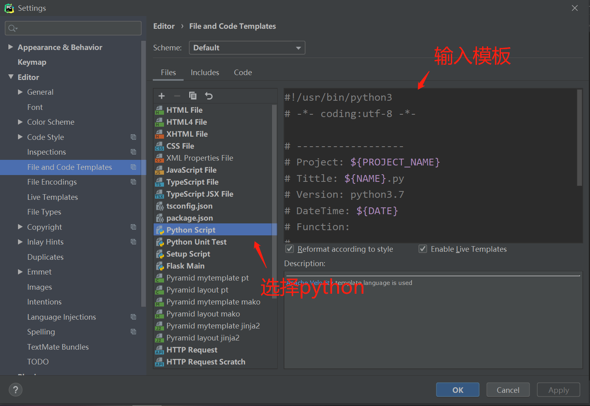
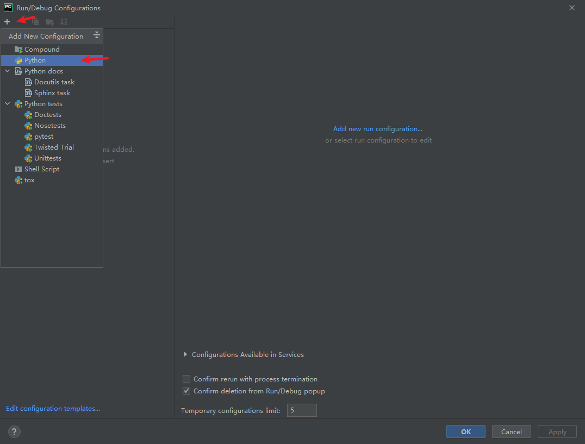
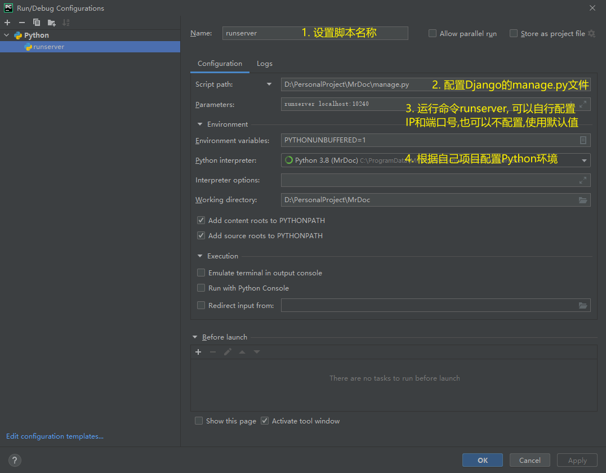

# Pycharm

## 1. 模板

1. 打开 File->Settings->Editor->File and Code Templates
2. 选择 Python Script，输入模板

   

3. 常用模板设置

    ```python
    #!/usr/bin/python3
    # -*- coding:utf-8 -*-

    # ------------------
    # Project: ${PROJECT_NAME}
    # Tittle: ${FILE_NAME}
    # Version: python3.7
    # DateTime: ${DATE}
    # Function:
    # ------------------

    ```

4. 系统变量

    | 变量名                    | 内容       |
    | ------------------------- | ---------- |
    | ${PROJECT_NAME}           | 项目名称   |
    | ${PRODUCT_NAME}           | IDE 名称    |
    | ${FILE_NAME}              | 文件名     |
    | ${DATE}                   | 日期       |
    | ${USER}                   | 用户名     |
    | \${YEAR} \${MONTH} ${DAY} | 年、月、日 |
    | \${HOUR} ${MINUTE}        | 时、分     |

## 2. 补全

1. 打开 File->Settings->Editor->Live Templates

2. 打开需要创建的程序下拉菜单，然后点击右侧“+”号并选择 Live Template

3. 编辑自动补全：
    1. 把 \<abbreviation> 修改为触发词
    2. Description 为解释内容
    3. 最下面红字，点击后面的 Define 选择适用语言
    4. 右侧 option 选择触发按键

4. 点击 apply 就完成设置。比如下图的设置，在 HTML 文件里输入`<!`，然后按 Tab 键就会补全称为`<!-- -->`

    

## 3. 运行配置

1. 以 Django 为例 (Pycharm 专业版会自动配置）
2. 点击右上角的`Add Configurations`

    

3. 点击`+`号，选择 Python

      

4. 根据下图进行配置

    

5. 接下来就可以用 Pycharm 右上角的快捷键运行 Django 项目
6. 也可以利用此方法添加 makemigratiosn 和 migrate
