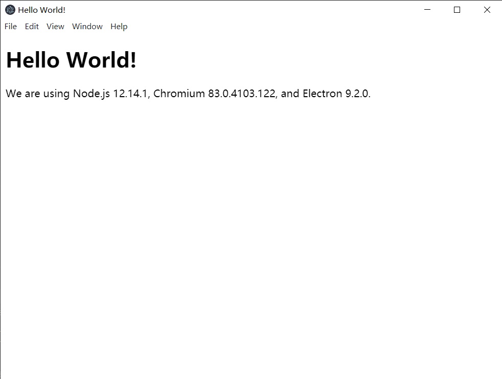

# Electron 笔记

## 创建项目

1. 从github上面克隆最新的项目模板

    ```bash
    // 在目标文件夹下
    git clone https://github.com/electron/electron-quick-start
    ```

2. 安装项目中的依赖项

    ```bash
    npm install
    # 或
    cnpm install
    ```

3. 启动项目

    ```bash
    npm start
    ```

    

## 功能模块

1. 在main.js中增加全局使用nodejs

    ```js
    const mainWindow = new BrowserWindow({
        width: w,
        height: h,
        webPreferences: {
        nodeIntegration: true,  // 增加全局使用node.js
        preload: path.join(__dirname, 'preload.js')
        }
    })
    ```

2. 选择文件/文件夹

    ```html
    <button id="open">open file</button>
    
    ```

    ```js
    const { dialog } = require('electron').remote

    let open = document.getElementById('open');
    open.onclick = function () {
        dialog.showOpenDialog({
            title: '选择文件夹',
            // defaultPath: 'D:/PersonalProject/vue_press/docs/pages/images/',
            filters: [{ name: '图片', extensions: ['jpg', 'png'] }],
            buttonLabel: '选择文件夹',
            // properties: ['openFile', 'openDirectory']
        }).then(result => {
            let img = document.getElementById('img');
            img.setAttribute('src', result.filePaths[0]);
        }).catch(err => {
            console.log(err);
        })
    }
    ```

3. 保存文件

    ```html
    <button id="save">save file</button>
    ```

    ```js
    const fs = require('fs')
    const { dialog } = require('electron').remote

    // 保存文件
    let save = document.getElementById('save');
    save.onclick = function () {
        dialog.showSaveDialog({
            title: '保存文件',
            defaultPath: 'D:/PersonalProject/Aniku_electron/cache/'
        }).then(result => {
            fs.writeFileSync(result.filePath, 'avc');
        }).catch(err => {
            console.log(err);
        })
    }
    ```

4. 消息提示，类似于alert

    ```html
    <button id="message">show message</button>
    ```

    ```js
    const { dialog } = require('electron').remote

    // 消息提示
    let message = document.getElementById('message');
    message.onclick = function () {
        dialog.showMessageBox({
            type: 'warning',  // none, info, error, warning, question
            title: '123',
            message: '456',
            buttons: ['a', 'b']
        }).then(result => {
            console.log(result);
        })
    }
    ```

5. 系统通知：win10通知栏

    ```html
    <button id="notify">notify</button>
    ```

    ```js
    // 系统通知
    let notify = document.getElementById('notify');
    let options = {
        title: 'notify',
        body: '你有一条通知'
    }
    notify.onclick = function () {
        new window.Notification(options.title, options)
    }
    ```

6. 读取Json文件

    ```html
    <button id="get">get info</button>
    <div id="data"></div>
    ```

    ```js
    // 读取json文件
    let input = document.getElementById('get');
    let data1 = document.getElementById('data');
    input.onclick = function () {
        let json = require('D:/PersonalProject/Aniku_electron/cache/test.json');
        data1.innerHTML = json.name
    }
    ```

7. 调用默认应用打开文件

    ```html
    <button id="exe">open exe</button>
    ```

    ```js
    const { shell } = require('electron')

    // 打开文件
    let exe = document.getElementById('exe');
    exe.onclick = function(){
        shell.openPath('D:/PersonalProject/Aniku_electron/test.txt');
    }
    ```

8. 网络状态监听

    ```js
    // 网络状态监听
    window.addEventListener('online', function(){
        options.title = '网络链接';
        options.body = '网络已连接';
        new window.Notification(options.title, options);
    })
    window.addEventListener('offline', function(){
        options.title = '网络链接';
        options.body = '网络已断开';
        new window.Notification(options.title, options);
    })
    ```
