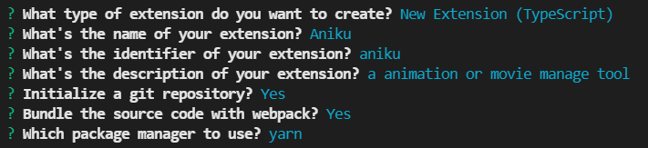

# VSCode 插件开发

## 1. 环境搭建

1. 安装好 npm 之类的环境
2. 安装脚手架

    ```bash
    npm install -g yo generator-code
    ```

3. 初始化项目

    ```bash
    yo code
    ```

    然后按照提示配置，会生成相应的项目目录，示例如下

      

4. 运行测试，按`F5`进入测试，在命令面板 (Ctrl+Shift+P) 中输入 Hello World 命令

   > 右下角会显示 `Hello World from Aniku!` 的提示

## 2. 参考

- [vscode 插件开发指南（一）-理论篇](https://juejin.cn/post/6960626872791072798#heading-0)
- [vocode 插件开发中文文档](https://liiked.github.io/VS-Code-Extension-Doc-ZH/#/get-started/your-first-extension)
- [vscode插件开发及常用API介绍](https://juejin.cn/post/6844903811941679117)
