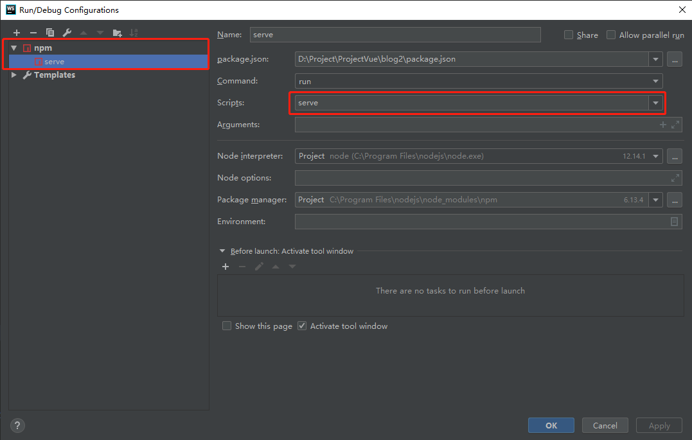

# Vue3 学习笔记

## 1. Vue-cli 配置

1. 安装[Node](https://nodejs.org/zh-cn/)
2. 配置cnpm

    ```bash
    npm install -g cnpm --registry=https://registry.npm.taobao.org
    ```

3. 安装`Vue-cli`

    ```bash
    npm i -g @vue/cli
    ```

4. 创建vue项目

    ```bash
    vue create my_project
    ```

5. 启动项目

    ```bash
    cd my_project
    npm run serve
    ```

6. 启动UI管理界面

    ```bash
    vue ui
    ```

7. WebStorm配置

    
