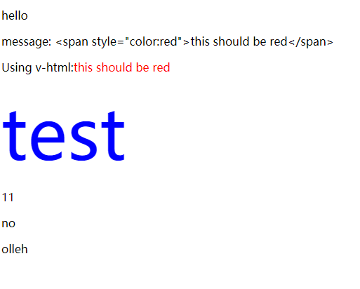

# Vue 学习笔记

## 1. Vue 引入方法

1. 本地安装方法

    安装vue，在项目目录下的cmd

    ```cmd
    npm init -y
    npm i vue
    ```

    在前端页面引入vue

    ```html
    <script src="/node_modules/vue/dist/vue.js"></script>
    ```

2. 在线CDN方法

    ```html
    <script src="https://cdn.jsdelivr.net/npm/vue"></script>
    ```

## 2. Vue 模板语法

### 2.1. 插值

1. 文本：{{}}
2. 原始 HTML：v-html
3. attribution 属性：v-bind
4. JsvaScript 表达式：{{}}
5. 源码

    ``` html
    <!DOCTYPE html>
    <html lang="en">

    <head>
        <meta charset="UTF-8">
        <title>Title</title>
        <script src="vue.js" type="text/javascript"></script>
    </head>

    <body>

    <div id="app">
        <!-- 文本 -->
        <p>{{message}}</p>
        <!-- v-html -->
        <p>message: {{rawHTML}}</p>
        <p>Using v-html:<span v-html="rawHTML"></span></p>
        <!-- v-bind -->
        <div v-bind:class="color">test</div>
        <!-- js -->
        <p>{{number + 1}}</p>
        <p>{{ok ? 'yes':'no'}}</p>
        <p>{{message.split('').reverse().join('')}}</p>
    </div>

    </body>

    <script>
        let app6 = new Vue({
            el: '#app',
            data: {
                message: 'hello',
                rawHTML: '<span style="color:red">this should be red</span>',
                color: 'blue',
                number: 10,
                ok: 0,
            }
        })
    </script>

    <style>
        .red {
            color: red;
        }

        .blue {
            color: blue;
            font-size: 100px;
        }
    </style>

    </html>

    ```

6. 显示结果为：

   

### 2.2. 指令

1. 指令是带有 v- 前缀的特殊 attribute，指令属性的预期值是一个JS表达式。
2. 参数：一些指令能够接收一个“参数”，在指令名称之后以冒号表示

    ``` html
    <a v-bind:href='google'></a>
    ```

3. 动态参数：用方括号括起来的js表达式作为指令参数
4. 修饰符：修饰符 (modifier) 是以半角句号 . 指明的特殊后缀，用于指出一个指令应该以特殊方式绑定
5. 缩写

    ``` html
    <a v-bind:href='google'></a>
    <a :href='google'></a>

    <div v-on:click="click1">click</div>
    <div @click="click1">click</div>
    ```

## 3. 计算属性

1. 计算属性

    ``` HTML
    <!-- 计算属性 -->
    <p>Reverse message: "{{reverseMessage}}"</p>
    ```

    ``` js
    computed: {
        reverseMessage: function () {
            // this 指向 vue 实例
            return this.message.split('').reverse().join('')
        }
    }
    ```

2. 计算属性 vs 方法

    ``` html
    <!-- 方法 -->
    <p>Reverse message: "{{ reverseMessage() }}"</p>
    ```

    ``` js
    methods: {
        reverseMessage: function () {
            return this.message.split('').reverse().join('')
        }
    }
    ```

    输出的结果两者是一样的，区别在于：计算属性是`基于它们的响应式依赖进行缓存的`。意思就是只要message不变，多次访问 reversedMessage 计算属性会立即返回之前的计算结果，而不必再次执行函数。

## 4. 条件渲染 v-if

1. v-if 指令用于条件性地渲染一块内容

    ``` html
    <div id="app">
        <div v-if="type == 1">
            <h1>Vue</h1>
        </div>
        <h1 v-else-if="type == 2">TypeScript</h1>
        <h1 v-else>Nothing</h1>
    </div>
    ```

    ``` js
    let app = new Vue({
        el: '#app',
        data: {
            type: 2
        }
    });
    ```

2. 也可以用来管理可复用元素

    ``` html
    <div id="app">
        <template v-if="type === 1">
            <h1>Vue</h1>
        </template>
        <template v-else>
            <h1>Nothing</h1>
        </template>

        <button @click="doSomething">Toggle login type</button>
    </div>
    ```

    ``` js
    let app = new Vue({
        el: '#app',
        data: {
            type: 1
        },
        methods: {
            doSomething: function () {
                return this.type = this.type === 1 ? 0 : 1
            }
        }
    });
    ```

## 5. 列表渲染 v-for

1. 把一个数组对应为一组元素

    ``` html
    <div id="app">
        <li v-for="item in items">
            {{ item.message }}
        </li>
    </div>
    ```

    ``` js
    let app = new Vue({
        el: '#app',
        data: {
            items:[
                {message: 'foo'},
                {message: 'bar'}
            ]
        }
    });
    app.items.push({message: 'baz'});
    ```

2. 方法
   - push()  在尾部增加
   - pop()  删除并返回最后一个元素
   - shift()  删除并返回第一个元素
   - unshift()  向数组头部添加一个或多个元素，并返回长度
   - splice()  向数组添加或删除项目，返回被删除的项目
   - sort()  排序
   - reverse() 翻转

## 6. 事件处理

### 6.1. 监听事件

``` html
<div id="app">
    <button v-on:click="counter+=1">add 1</button>
    <p>{{ counter }}</p>
</div>
```

``` js
let app = new Vue({
        el: '#app',
        data: {
            counter: 0
        }
    });
```

### 6.2. 事件处理

js代码太长不适宜放在v-on中

``` html
<div id="app">
    <button v-on:click="greet">Greet</button>
</div>
```

``` js
let app = new Vue({
    el: '#app',
    data: {
        name: "Vue.js"
    },
    methods:{
        greet: function () {
            alert('hello' + this.name + '!')
        }
    }
});
```

### 6.3. 内联事件处理

``` html
<div id="app">
    <button v-on:click="say('hi')">Say</button>
</div>
```

``` js
    let app = new Vue({
        el: '#app',
        methods:{
            say:function (message) {
                alert('say' + message)
            }
        }
    });
```

### 6.4. 事件修饰符

- v-on:click.stop  阻止单点时间继续传播
- v-on:submit.prevent  提交事件不在重载页面
- v-on:click.capture  事件捕捉模式，即内部元素触发的事件先在此处理，然后交由内部元素处理
- v-on:click.self
- v-on:click.once  只触发一次
- .passive

### 6.5. 按键修饰符

可以使用按键码

``` html
<div id="app">
    <!-- 在输入框内按下上下键实现数字增减 -->
    <input v-on:keyup.up="counter+=1" v-on:keyup.down="counter-=1">add</input>
    <p>{{ counter }}</p>
</div>
```

``` js
let app = new Vue({
    el: '#app',
    data: {
        counter: 0
    }
});
```

### 6.6. 系统修饰键

1. 只有在按下相应键才出发事件
   - .ctrl
   - .alt
   - .shift
   - .meta  在windows中对应win键，在mac中对应command

    ``` html
    <!-- ctrl+鼠标左键 增加，ctrl+下 减少 -->
    <input @click.ctrl="counter+=1" @keyup.ctrl.down="counter-=1">add</input>
    ```

2. `.ecact` 修饰符：控制系统修饰符组合出发的事件

    ``` html
    <!-- 即使 Alt 或 Shift 被一同按下时也会触发 -->
    <button @click.ctrl="onClick">A</button>

    <!-- 有且只有 Ctrl 被按下的时候才触发 -->
    <button @click.ctrl.exact="onCtrlClick">A</button>

    <!-- 没有任何系统修饰符被按下的时候才触发 -->
    <button @click.exact="onClick">A</button>
    ```

3. 鼠标修饰符，要跟在`@click`后面
   - .left
   - .right
   - .middle

## 7. 表单输入绑定

### 7.1. `v-model`文本绑定

``` html
<div id="app">
    <!-- 单行文本 -->
    Input: <input v-model="message"></input>
    <p>{{ message }}</p>
</div>
```

``` html
<div id="app">
    <!-- 多行绑定 -->
    <p style="white-space: pre-line;">{{ message }}</p>
    <br>
    <textarea v-model="message" placeholder="multiple"></textarea>
</div>
```

### 7.2. 复选框

``` html
    <div id="app">
    <!-- 复选框 -->
    <template v-for="item in items">
        <!-- 使用v-bind绑定变量属性 -->
        <input type="checkbox" v-bind:id="item.message" v-bind:value="item.message" v-model="select"></input>
        <label v-bind:for="item.message">{{item.message}}</label>
    </template>
    <p>Select: {{select}} </p>
</div>
```

``` js
let app = new Vue({
    el: '#app',
    data: {
        select: [],
        items: [
            { message: 'aa' },
            { message: 'bb' },
            { message: 'cc' }
        ]
    }
});
```

### 7.3. 单选按钮

把上面的`type`属性值改成`type="radio"`

### 7.4. 选择框

1. 单选

    ``` html
        <div id="app">
        <!-- 选择框 -->
        <select v-model='select'>
            <option disabled value="">请选择</option>
            <option v-for="item in items">{{item.message}}</option>
        </select>
        <p>Select: {{select}} </p>
    </div>
    ```

2. 值绑定

    ``` html
    <div id="app">
        <!-- 值绑定 -->
        <select v-model='select'>
            <option disabled value="">请选择</option>
            <option v-for="item in items" v-bind:value='item.value'>{{item.text}}</option>
        </select>
        <p>Select: {{select}} </p>
    </div>
    ```

    ``` js
    let app = new Vue({
        el: '#app',
        data: {
            select: [],
            items: [
                { text: 'aa', value: 'a' },
                { text: 'bb', value: 'b' },
                { text: 'cc', value: 'c' }
            ]
        }
    });
    ```

3. 修饰符
   - v-model.lazy  从实时更新变成使用change事件进行同步
   - v-model.number  将用户输入的值转换成数值类型
   - v-model.trim  自动过滤用户输入的首尾空白字符

## 8. 组件 Component

### 8.1. 组件

``` html
<div id="component">
    <!-- 这两个组件之间是相互独立的 -->
    <button-counter></button-counter>
    <button-counter></button-counter>
</div>
```

``` js
// 组件注册
Vue.component('button-counter', {
    // 这里的data必须是一个函数
    // 否则无法复用，前面声明的两个组件也就变成同一个了
    data: function () {
        return { count: 0 }
    },
    template: '<button v-on:click="count++"> You clicked me {{ count }} times.</button>'
})
new Vue({ el: "#component" })
```

### 8.2. 组件命名

``` js
// 全小写命名
Vue.component('my-component-name', {/*...*/})
// 首字母大写命名
Vue.component('MyComponentName', {/*...*/})
```

### 8.3. 全局注册 & 局部注册

``` js
// 全局注册
// 可以用于任何新创建的Vue根实例(new Vue)中
Vue.component('component-a', { /* ... */ })
Vue.component('component-b', { /* ... */ })
Vue.component('component-c', { /* ... */ })

new Vue({ el: '#app' })

// 局部注册
// 通过一个普通的js对象来定义组件
var ComponentA = { /* ... */ }
var ComponentB = { /* ... */ }
var ComponentC = { /* ... */ }
// 然后在components选项中定义想要的组件
new Vue({
el: '#app',
components: {
    'component-a': ComponentA,
    'component-b': ComponentB
}
})
```

### Prop 向子组件传递属性
