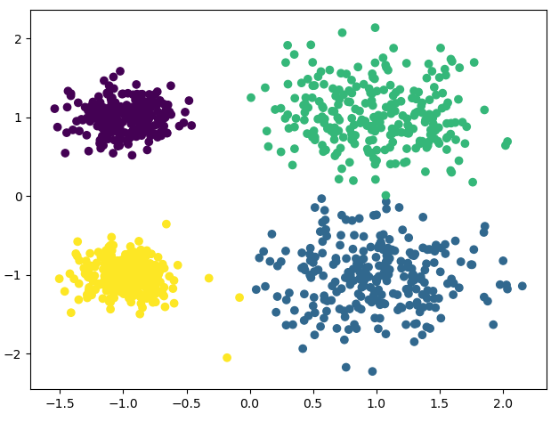

# K-Means 聚类算法

## 1. K-Means 简介

1. K-Means 原理: 对于给定的样本集，按照样本之间的距离大小，将样本集划分为K个簇。让簇内的点尽量紧密的连在一起，而让簇间的距离尽量的大
2. 传统 K-Means 流程
   1. 选择k值
   2. 随机选择k个初始化质心
   3. 计算样本到各个质心的距离, 按照距离最小划分类别
   4. 重新选择质心, 重复第3步骤
   5. 若质心向量不变则输出分区, 负责重新选择质心
3. K-Means++ 算法
   1. 质心优化: 第一个质心随机选择, 与当前质心距离较远的点被选择聚类中心的概率较大
4. K-Means 距离计算优化 elkan
   1. 目的是减少不必要的距离计算
   2. 原理:三角形两边之和大于等于第三边, 两边只差小于第三边
      1. 如果预先知道两个质心的距离D(j1, j2), 若点x到满足2D(x, j1) < D(x, j2), 则D(x, j1) < D(x, j2)
      2. D(x, j1) ≥ max{0, D(x, j1)-D(j1, j2)}
   3. 样本稀疏的情况下不适用
5. 大样本优化 Mini Batch K-Means
   1. 用样本中的一部分样本(batch size)来做传统的K-Means
   2. 精度会有所下降, 一般会多跑几次, 选择最优

## 2. 源码

1. 基于sklearn的K-Means算法

   ```python
   from sklearn.cluster import KMeans
   import matplotlib.pyplot as plt
   from sklearn.datasets import make_blobs

   # 创建数据集
   # x为样本特征, y为样本簇类别, 1000样本, 每个样本两个特征
   # 共4个簇, 簇中心为[1, 1], [1, -1], [-1, 1], [-1, -1], 簇方差为分别[0.4, 0.4, 0.2, 0.2]
   x, y = make_blobs(n_samples=1000, n_features=2, centers=[[1, 1], [1, -1], [-1, 1], [-1, -1]],
                  cluster_std=[0.4, 0.4, 0.2, 0.2])

   # plt.scatter(x[:, 0], x[:, 1], marker='o')
   # plt.show()

   # n_clusters: K值
   # max_iter: 最大迭代次数
   # n_init: 用不同初始化之心运行算法的次数, 默认10. K较大时可适当增大
   # init: 初始值选择方式, 随机选择'random', 优化过的'k-means++', 一般用默认的'k-means++'
   # algorithm: 'auto', 'full', 'elkan'三种选择, 一般用默认'auto'
   # random_state: 用于随机产生中心的随机序列
   y_pred = KMeans(n_clusters=4, random_state=2).fit_predict(x)
   # 下面三行与上面这句等价
   # km = KMeans(n_clusters=4, random_state=2)
   # km.fit(x)
   # y_pred = km.predict(x)
   plt.scatter(x[:, 0], x[:, 1], c=y_pred)
   plt.show()

   ```

2. 输出结果

   

## 3. 参考

- [K-Means聚类算法原理](https://www.cnblogs.com/pinard/p/6164214.html)
