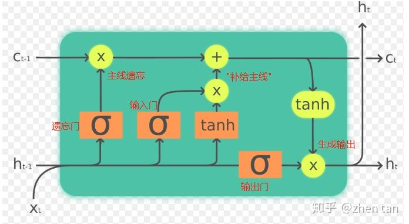

# LSTM 学习笔记

## 1. LSTM

### 1.1. LSTM原理

1. 普通RNN的问题：

    > 在RNN中信息原的记忆要进过长途跋涉才能抵达最后一个时间点. 然后我们得到误差, 而且在反向传递得到的误差的时候, 他在每一步都会 乘以一个自己的参数 W.
    > 如果这个 W 是一个小于1 的数, 比如0.9. 这个0.9 不断乘以误差, 误差传到初始时间点也会是一个接近于零的数, 所以对于初始时刻, 误差相当于就消失了. 我们把这个问题叫做梯度消失或者梯度弥散 Gradient vanishing.
    > 反之如果 W 是一个大于1 的数, 比如1.1 不断累乘, 则到最后变成了无穷大的数, RNN被这无穷大的数撑死了, 这种情况我们叫做剃度爆炸, Gradient exploding. 这就是普通 RNN 没有办法回忆起久远记忆的原因.

2. LSTM（long short-term memory）长短期记忆

    > LSTM 和普通 RNN 相比, 多出了三个控制器. (输入控制, 输出控制, 忘记控制).

    

3. 参考资料

   - [什么是LSTM](https://morvanzhou.github.io/tutorials/machine-learning/keras/2-4-B-LSTM/)
   - [快速理解LSTM，从懵逼到装逼](https://zhuanlan.zhihu.com/p/88892937)

### 1.2. LSTM 预测

1. 前提：

    > 个人认为程序的预测的关键首先在于训练集与测试集的选择，好的训练集与测试集应当有合理的、可预期的规律，而不是拿上数据就开始训练：在预测某一时段的数据时，并不只是用之前的数据直接做训练，而应该考虑该数据是否有一定的分布规律。
    比如一个数据有每天有一定的相似性，那么是否应该将过去几天同一时刻的数据纳入训练模型，从而分配有针对性的数据集。之后才是模型调参、训练等。

2. 代码详解

    ```python
    import pandas as pd
    import numpy as np
    import matplotlib.pyplot as plt
    import seaborn as sns
    from keras.models import Sequential
    from keras.layers import Dense, Activation
    from keras.layers import LSTM, Dropout
    from sklearn.preprocessing import MinMaxScaler
    from keras.callbacks import EarlyStopping
    from keras import losses

    # 读取数据
    file = 'xxx.csv'
    df1 = pd.read_csv(file, decimal=',', header=0, low_memory=False, error_bad_lines=False)
    df_all = pd.DataFrame()

    v1 = df_all['col1'][0:500000]
    time = df_all['time'][141120:141180]

    # 数据归一化处理：将原始数据映射到0—1范围内
    data = v1.values
    data = data.astype('float32')
    data = np.reshape(data, (-1, 1))
    scaler = MinMaxScaler(feature_range=(0, 1))
    data = scaler.fit_transform(data)
    # 根据数据量分训练集和测试集大小，这里的数据是1min一个点，一天1440条数据
    train_size = 1380
    test_size = 60


    # 创建数据集，非固定格式
    def create_data(start, size, day):  # 起始位置，数据长度，天数
        x, y = [], []  # 出入，输出
        for m in range(start, start + size):  # size条输入
            old_data = []  # 其中一条输入
            for n in range(day):
                old_data.append(data[m + n * 7 * 1440])  # 第n周第m点的数据
            x.append(old_data)
            y.append(data[m + 1440 * 7 * day])  # 第day周第i点数据
        return np.array(x), np.array(y)

    # 用过去14周第一天的数据去预测第15周第一天的数据
    days = 14  
    # x_train：训练集输入，y_train：训练集输出
    x_train, y_train = create_data(0, train_size, days)
    # x_test：测试集输入，y_test：测试集输出
    x_test, y_test = create_data(train_size, test_size, days)

    # x_train.shape(训练数据组数，时间间隔，数据维数(特征个数))
    x_train = np.reshape(x_train, (x_train.shape[0], x_train.shape[1], 1))
    x_test = np.reshape(x_test, (x_test.shape[0], x_test.shape[1], 1))
    print(x_train.shape)

    # 模型结构
    model = Sequential()
    # 定义 LSTM 模型，第一个隐藏层含有 100 个神经元
    model.add(LSTM(100, input_shape=(x_train.shape[1], x_train.shape[2])))
    model.add(Dropout(0.25))  # 暂时从网络中移除神经网络中的单元
    model.add(Dense(1))  # 输出维数
    model.add(Activation('relu'))  # 激活函数

    # 使用均方差损失函数，优化器Adam，评估标准
    model.compile(loss=losses.mean_squared_error,  # 损失函数mse
                optimizer='adam',  # 优化器
                metrics=['mae', 'acc'])  # 评估标准

    # 模型将会进行 30 个 epochs 的训练，每个 batch 的大小为 100
    history = model.fit(x_train, y_train, epochs=30, batch_size=100,
                        validation_data=(x_test, y_test),
                        callbacks=[EarlyStopping(monitor='val_loss', patience=10)],
                        verbose=1, shuffle=False)
    model.summary()

    # 做出预测
    test_predict = model.predict(x_test)
    train_predict = model.predict(x_train)
    # 预测值求逆
    test_predict = scaler.inverse_transform(test_predict)
    train_predict = scaler.inverse_transform(train_predict)
    # 真实值求逆
    y_test = scaler.inverse_transform(y_test)
    y_train = scaler.inverse_transform(y_train)

    ```

## 2. Attention 注意力机制
