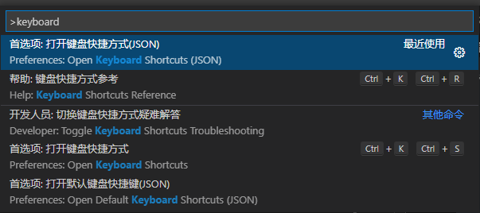

# VSCode 小技巧

## 1. 新装 VSCode

1. 设置自动保存：文件 -> 自动保存
2. 安装插件
3. 设置快捷键
   1. 格式化：修改为 Ctrl+Alt+L

## 2. 插件

| 插件                                 | ID                                  | 功能                                            | 推荐指数 |
| ------------------------------------ | ----------------------------------- | ----------------------------------------------- | -------- |
| Auto Complete Tag                    | formulahendry.auto-complete-tag     | 配合上面 Auto Close Tag 的使用                  | `前端`   |
| background                           | shalldie.background                 | 背景图片插件                                    | `体验`   |
| Beautify                             | HookyQR.beautify                    | 代码格式化插件                                  | `必备`   |
| Bracket Pair Colorizer 2             |                                     | 改变代码括号颜色（与 Markdown All in One 冲突） | `一般`   |
| C/C++                                | ms-vscode.cpptools                  | C/C++开发基础工具                               | `C/C++`  |
| Code Runner                          | formulahendry.code-runner           | 代码运行                                        | `推荐`   |
| Excel Viewer                         |                                     | 查看 excel、csv                                 | `一般`   |
| GitLens                              | eamodio.gitlens                     | git 扩展                                        | `必备`   |
| Git Graph                            | mhutchie.git-graph                  | git 可视化                                      | `一般`   |
| LiveCode for python                  | xirider.livecode                    | 动态显示 python 变量的输出（复杂的不太行）      | `一般`   |
| Markdown All in One                  | yzhang.markdown-all-in-one          | Markdown 编辑                                   | `必备`   |
| markdown image                       | hancel.markdown-image               | makrdown 插入图片                               | `推荐`   |
| Markdown Navigation                  |                                     | markdown 目录，与大纲功能重叠                   | `一般`   |
| Markdown PDF                         |                                     | Markdown 转 pdf                                 | `一般`   |
| Markdown Preview Enhanced            | shd101wyy.markdown-preview-enhanced | Markdown 预览                                   | `必备`   |
| markdown toc                         | AlanWalk.markdown-toc               | 自动创建目录（需要设置 eol）                    | `一般`   |
| markdown-formatter                   |                                     | markdown 格式化工具                             | `一般`   |
| markdownlint                         |                                     | markdown 格式检查工具                           | `必备`   |
| markmap                              |                                     | makrdown 思维导图                               | `推荐`   |
| Mermaid Markdown Syntax Highlighting |                                     | Markdown 结构图代码高亮                         | `一般`   |
| Open In Default Browser              |                                     | 调用浏览器打开 html                             | `前端`   |
| Pangu Markdown                       | xlthu.Pangu-Markdown                | 自动修改 markdown 中的空格和标点                | `推荐`   |
| Path Autocomplete                    |                                     | 路径自动补全                                    | `一般`   |
| Project Manager                      |                                     | 项目管理                                        | `必备`   |
| SandDance for VSCode                 |                                     | 数据可视化工具                                  | `体验`   |
| Seti-icons                           | qinjia.seti-icons                   | 图标美化插件                                    | `体验`   |
| SFTP                                 | Natizyskunk.sftp                    | 远程同步工具                                    | `推荐`   |
| Remote-SSH                           | ms-vscode-remote.remote-ssh         | ssh 工具                                        | `推荐`   |

### 2.1. Remote-SSH 配置

1. 远程服务器配置

   ```bash
   Host 虚拟机  # 服务器名
   HostName 192.168.1.1  # IP
   User root  # 用户名
   ```

2. 远程服务器需要关闭配置中的`Use Local Server`
3. 配置免密登录
   1. 本地打开`Git bash`, 用下面的命令生成密钥

      ```bash
      ssh-keygen -t rsa -P '' -f ~/.ssh/id_rsa
      ```

   2. 查看密钥

      ```bash
      cd ~/.ssh
      cat id_rsa.pub
      ```

   3. 上传密钥到服务器，然后就可以实现免密登录

      ```bash
      ssh-copy-id root@192.168.1.1
      ```

### 2.2. SFTP 插件使用方法

1. 安装

     

2. `Ctrl+Shift+P` 选择 `SFTP: Config` 打开配置文件 `sftp.json`

    ```json
    // 原始配置文件没有的选项可以自行添加
    {
        "name": "名字随便起",   // 服务器名
        "host": "127.0.0.1",    // IP 地址
        "protocol": "sftp",
        "port": 22,     // 端口号
        "username": "用户名",
        "password": "密码",
        "context": "本地路径，不设置的话就是当前目录",  // 可以不配
        "remotePath": "远程路径，从/home/开始",
        "uploadOnSave": true,   // 保存后自动上传，可以不配
        "connectTimeout":50000, // 可以不配
        "useTempFile": false,   // 可以不配
        "openSsh": false    // 可以不配
    }
    ```

3. 多路径配置

    ```json
    [
        {
            // 第一个配置
        },
        {
            // 第二个配置
        }
    ]
    ```

## 3. 快捷键

1. 修改快捷键：文件 -> 首选项 -> 键盘快捷方式
2. 多行选中
   1. Alt + 左键：手动选择
   2. 中键移动：批量选择

## 4. 自定义补全

1. 设置 MarkDown 补全代码
   1. VSCode 首选项->用户代码片段->MarkDown

      

   2. 设置补全内容，如 cpp 代码块

      ```json
      "cpp": {
         "prefix": "cpp",  //  触发词
         "body": [  // 补全内容
            "```c++",
            "$1",  // 光标停留位置
            "```"
         ],
         "description": "Add C++ code block"  // 注释
      }
      ```

2. 打开自定义补全功能
   1. 文件->首选项->设置->（右上角）打开设置，将下面这段设置写入 setting.json 文件

      ```json
      "[markdown]":  {
            "editor.quickSuggestions": true
         }
      ```

      
3. 实现效果

   

## 5. 设置脚本

1. 功能说明：为方便编辑 markdown 文档，实现一键格式化，包括如下功能：
   - 实现自动更新 markdown 文件目录编号（通过插件：Markdown TOC)
   - 实现自动切换文档中的中英文符号（通过插件：Pangu-Markdown)
   - 实现自动格式化 markdown 文档（通过插件：Markdown All in One)
   - 保存文档
2. 安装插件

    > 名称：macros
    > ID: ctf0.macros
    > 说明：automate repetitive actions with custom macros
    > 版本：0.0.4
    > 发布者：ctf0
    > VS Marketplace 链接：<https://marketplace.visualstudio.com/items?itemName=ctf0.macros>

3. 配置 settings.json

    ```json
    // settings.json
    "macros.list": {
        // 脚本名
        "markdown_format":[
            // 命令 1: 更新 markdown sections
            "extension.updateMarkdownSections",
            // 命令 2: 延时 50ms, 主要是和 pangu 冲突，所以要增加延时
            {
                "command": "$delay",
                "args": {
                    "delay": 50
                }
            },
            // 命令 3:pangu 格式化
            "pangu.format",
            // 命令 4: 格式化文档
            "editor.action.formatDocument",
            // 命令 5: 保存工作区
            "workbench.action.files.save",
        ]
    },
    ```

4. 配置快捷键，`ctrl+alt+p` 输入 `keyboard` 进入 keybindings.json 配置快快捷键

     

   ```js
   // keybings.json
   {
        // 快捷键
        "key": "ctrl+s",
        // 快捷键出发的脚本
        "command": "macros.markdown_format",
        // 触发条件：markdown 文件
        "when": "!notebookEditorFocused && editorLangId == 'markdown'"
    }
   ```

## 6. 问题处理

### 6.1. 因为在此系统上禁止运行脚本

1. 现象：在 vscode 运行 yarn 或 npm 脚本时出现无法运行的情况
2. 解决方法

    ```bash
    # 以管理员身份打开 vscode
    # 执行 get-ExecutionPolicy, 显示 Restricted 表示状态被禁止
    > get-ExecutionPolicy
    Restricted
    # 执行 set-ExecutionPolicy RemoteSigned, 允许运行脚本
    > set-ExecutionPolicy RemoteSigned
    # 再次执行 get-ExecutionPolicy, 显示 RemoteSigned
    > get-ExecutionPolicy
    RemoteSigned
    ```

3. 参考 [解决 VSCODE"因为在此系统上禁止运行脚本"报错🔗](https://blog.csdn.net/larpland/article/details/101349586)
