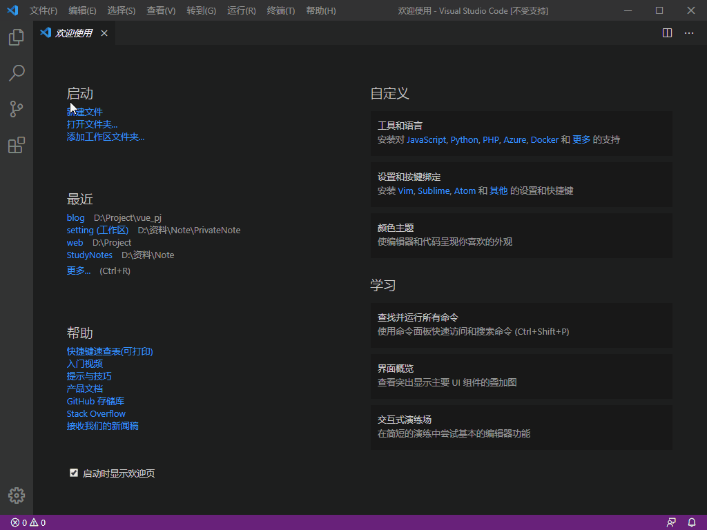
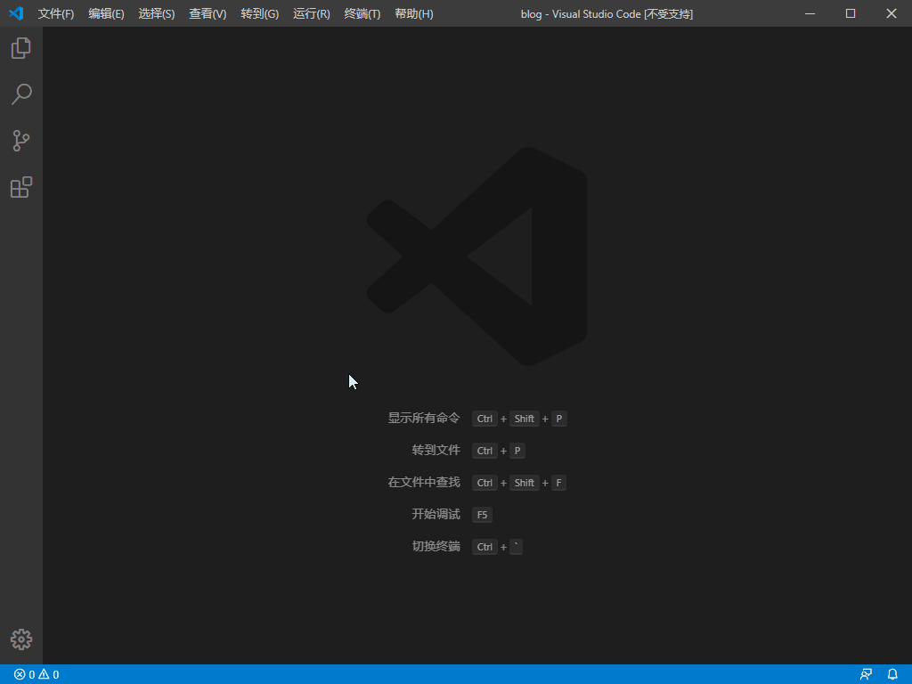
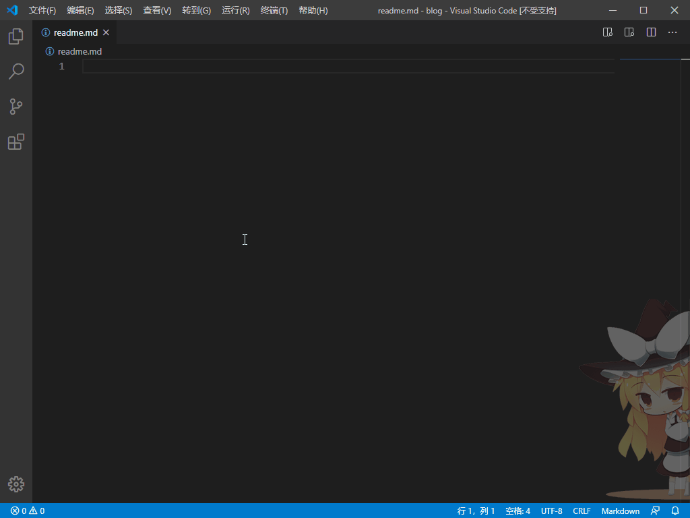

# VSCode 小技巧

## 1. 新装 VSCode

1. 设置自动保存：文件 -> 自动保存
2. 安装插件
3. 设置快捷键
   1. 格式化：修改为 Ctrl+Alt+L

## 2. 插件

| 插件                                 | 功能                         | 推荐指数 |
| ------------------------------------ | ---------------------------- | -------- |
| Auto Close Tag                       | html标签自动补全             | `前端`   |
| Auto Complete Tag                    | 配合上面的使用               | `前端`   |
| background                           | 背景图片插件                 | `体验`   |
| Beautify                             | 代码格式化插件               | `必备`   |
| Code Runner                          | 代码运行                     | `推荐`   |
| GitLens                              | git扩展                      | `必备`   |
| LiveCode for python                  | 动态显示python变量的输出     | `推荐`   |
| Markdown All in One                  | Markdown编辑                 | `必备`   |
| Markdown Preview Enhanced            | Markdown预览                 | `必备`   |
| markdown toc                         | 自动创建目录（需要设置eol）  | `一般`   |
| markdown-formatter                   | markdown格式化工具           | `一般`   |
| markdownlint                         | markdown格式检查工具         | `必备`   |
| Open In Default Browser              | 调用浏览器打开html           | `前端`   |
| Path Autocomplete                    | 路径自动补全                 | `一般`   |
| Project Manager                      | 项目管理                     | `必备`   |
| Paste Image                          | Markdown插入图片             | `一般`   |
| Markdown PDF                         | Markdown转pdf                | `一般`   |
| Seti                                 | 图标美化插件                 | `体验`   |
| Excel Viewer                         | 查看excel、csv               | `一般`   |
| SandDance for VSCode                 | 数据可视化工具               | `体验`   |
| Markdown Navigation                  | markdown目录，与大纲功能重叠 | `一般`   |
| Mermaid Markdown Syntax Highlighting | Markdown结构图代码高亮       | `一般`   |
| Remote-SSH                           | ssh工具                      | `推荐`   |

## 3. 快捷键

1. 修改快捷键：文件 -> 首选项 -> 键盘快捷方式
2. 多行选中
   1. Alt + 左键：手动选择
   2. 中键移动：批量选择

## 4. 自定义补全

1. 设置 MarkDown 补全代码
   1. VSCode 首选项->用户代码片段->MarkDown

      

   2. 设置补全内容，如cpp代码块

      ```json
      "cpp": {
         "prefix": "cpp",  //  触发词
         "body": [  // 补全内容
            "```c++",
            "$1",  // 光标停留位置
            "```"
         ],
         "description": "Add C++ code block"  // 注释
      }
      ```

2. 打开自定义补全功能
   1. 文件->首选项->设置->(右上角)打开设置，将下面这段设置写入setting.json文件

      ```json
      "[markdown]":  {
            "editor.quickSuggestions": true
         }
      ```

      
3. 实现效果

   

## 5. Remote-SSH配置

1. 远程服务器配置

   ```bash
   Host 虚拟机  # 服务器名
   HostName 192.168.1.1  # IP
   User root  # 用户名
   ```

2. 远程服务器需要关闭配置中的`Use Local Server`
3. 配置免密登录
   1. 本地打开`Git bash`, 用下面的命令生成密钥

      ```bash
      ssh-keygen -t rsa -P '' -f ~/.ssh/id_rsa
      ```

   2. 查看密钥

      ```bash
      cd ~/.ssh
      cat id_rsa.pub
      ```

   3. 上传密钥到服务器, 然后就可以实现免密登录

      ```bash
      ssh-copy-id root@192.168.1.1
      ```
