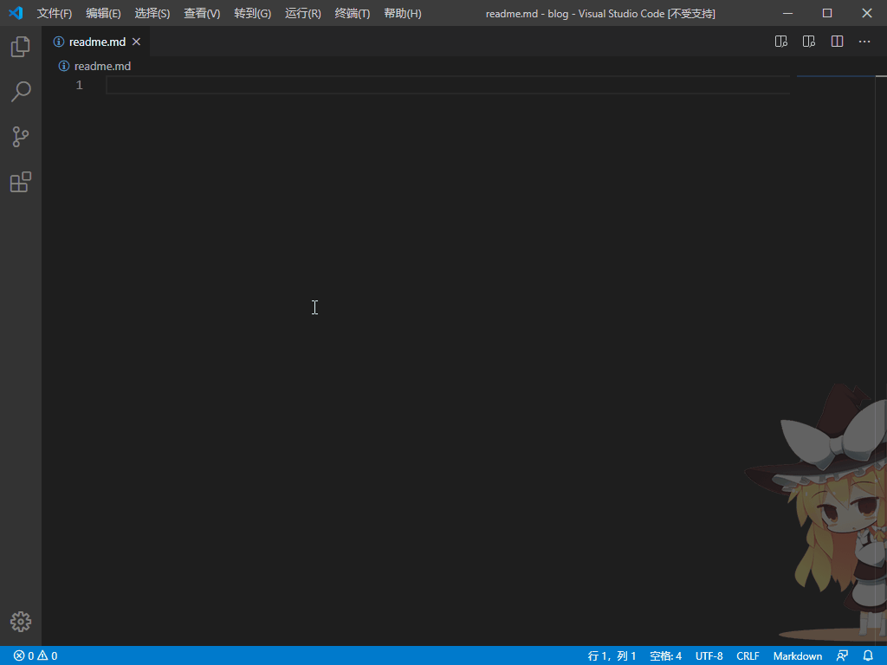

# VSCode 自定义补全

1. 设置 MarkDown 补全代码
   1. VSCode 首选项->用户代码片段->MarkDown

      

   2. 设置补全内容，如cpp代码块

      ```json
      "cpp": {
         "prefix": "cpp",  //  触发词
         "body": [  // 补全内容
            "```c++",
            "$1",  // 光标停留位置
            "```"
         ],
         "description": "Add C++ code block"  // 注释
      }
      ```

2. 打开自定义补全功能
   1. 文件->首选项->设置->(右上角)打开设置，将下面这段设置写入setting.json文件

      ```json
      "[markdown]":  {
            "editor.quickSuggestions": true
         }
      ```

      
3. 实现效果

   
