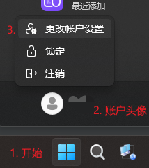

# Windows 笔记

## 1. Windows 文件共享

1. 不建议用 Windows 账号进行共享，容易出现各种连不上的情况，因此需要创建本地账号
2. Win11 点击 开始->账户头像->更改账户设置
      

3. 再设置中点击`改用本地账户登录`, 根据提示创建本地账户

## 2. 重启打印服务

1. 如果打印总是出现文档被挂起或打印失败，可以尝试重启打印服务，前提：
   - 确保网络链接正常
   - 在尝试过安装打印机驱动后依然无法解决时
2. 重启打印服务
   1. 搜索并打开服务
   2. 找到 Print Spooler 服务，重启之

    
