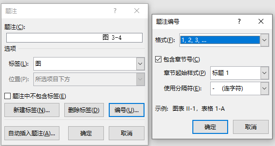
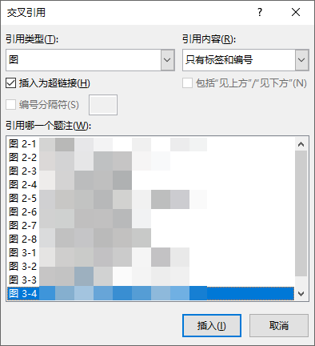
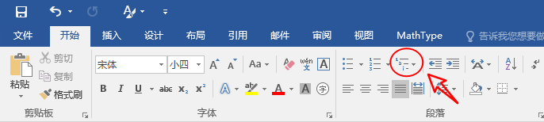
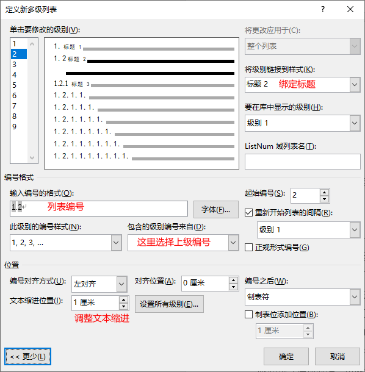
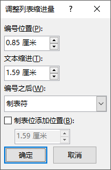

# Word 技巧

## 1. 图表标注

1. 插入图标标注，选择 `引用 > 插入题注`, 选择自己需要的类型

      

2. 没有合适的题注可以进行自定义
   1. 在上图中点击新建标签
   2. 点击编号，勾选章节号

3. 正文中引用图标
   1. 选择 `引用 > 交叉引用`
   2. 引用类型根据需要选择图或表之类的，引用内容一般选择只有标签和编号

      

## 2. 编号

### 2.1. 定义章节编号

1. 光标置于第一个标题，选择 `开始` 菜单表格第三列 `定义新的多级列表`
      

2. 先点击`更多`展示完整界面
      

### 2.2. 正文编号缩进

1. 在编号所在位置右键选择 `调整列表缩进`
     
