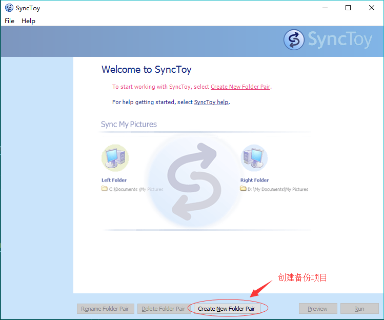
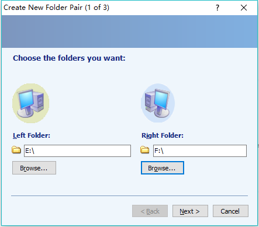
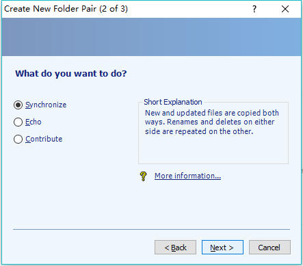
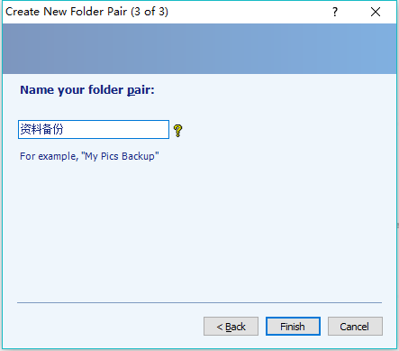
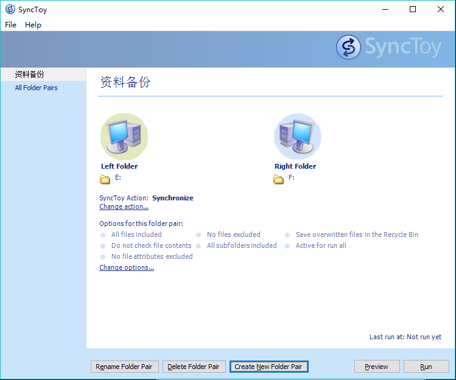

# 微软官方硬盘备份软件SyncToy

## 1. 前言

最近用硬盘检测工具发现硬盘坏道有点多，状态不佳，折腾了一阵还差点把硬盘搞坏，好在重装系统解决了问题（重装大法好）。再加上现在网上对资源限制越来愈大，所以对数据安全有了新的认识，备份数据提上日程。

好了，说了这么多，进入主题。为了备份数据有以下几种方法

- NAS 土豪解决方案，功能强大，但买得起的盘位太少，盘位多得贼TM贵，都够自己配一台不错的PC了
- 网盘 屌丝解决方案，成本低，简单易用，但非会员限速严重，且资源有被封风险
- Raid 极客解决方案，用的好省空间，成本相对较低，需要会折腾，折腾不好死得惨
- SyncToy 平民解决方案，本文方案，使用简单，成本低，但不能节省空间，说白了就是该软件可以让两个指定文件夹内的内容保持同步
- FreeFileSync 后来发现的一款文件同步软件，更好用，免费且保持更新，现在已经替代了SyncToy，新用户可以移步 [FreeFileSync]()

## 2. 环境

- PC
- Windows 10
- 需要额外用于备份的硬盘

## 3. 方法

1. 准备好两块硬盘，一个装有资料的硬盘，一个用于备份的硬盘，没有其他要求，甚至同一块硬盘都行，不过这样就没什么意义了。
2. 去微软官网下载[SyncToy][1]并安装，虽然是个英文软件，但是安装使用并没有多大困难。
3. 开始使用软件，点击Create New Folder Pair创建备份

   

4. 选择需要备份的文件与备份文件，我这里选择了两个分区，两个文件也可以，点击Next

   

5. 选择模式，有三个模式可选，模式介绍见备注

   

6. 自定义备份名称，随意命名即可，点击Finish

   

7. 点击右下角Run，软件就开始自动对比两个文件内容，并开始备份。要是觉得不保险的话可以先跑一下Preview，看一下有哪些变化，再Run，电脑本地磁盘上的东西删除后放入回收站，可以恢复，外部存储请谨慎操作。

   

## 4. 备注

### 4.1. 模式介绍

这部分参考[SyncToy 2.1 微軟出品易用型檔案同步工具詳解][2]

1. Synchronize

   该模式会让两个文件夹保持完全同步，无论左右增删修改都会同步到另一边

2. Echo

   单向同步，左边的增删改会同步到右边，但右边的改变不会同步到左边

3. Contribute

   在Echo的基础上，删除不会被同步，相对安全

[1]:https://www.microsoft.com/en-us/download/details.aspx?id=15155
[2]:https://www.playpcesor.com/2008/02/synctoy20.html
