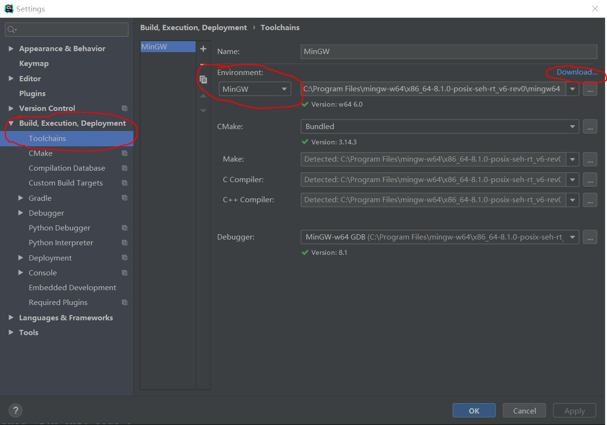
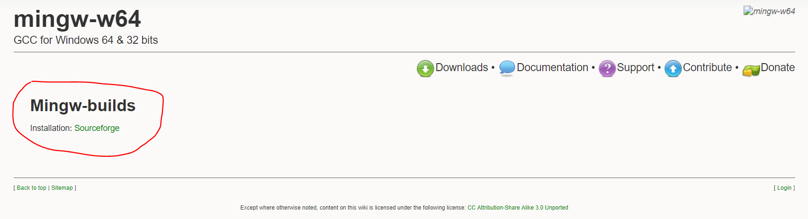

# Clion&MinGW的使用方法

## 安装MinGW

1. 安装好[Clion](https://www.jetbrains.com/clion/)
2. 安装MinGW
   1. 在Clion设置菜单`Toolchains`
   2. Environment下面选择MinGW，可以点击右上角的download直接进入MinGW下载页面

        

   3. 从网站中下载[MinGW](http://mingw-w64.org/doku.php/download/mingw-builds)安装包，默认安装即可，要记住安装目录

        

   4. 在Clion设置选择MinGW的安装路径即可
