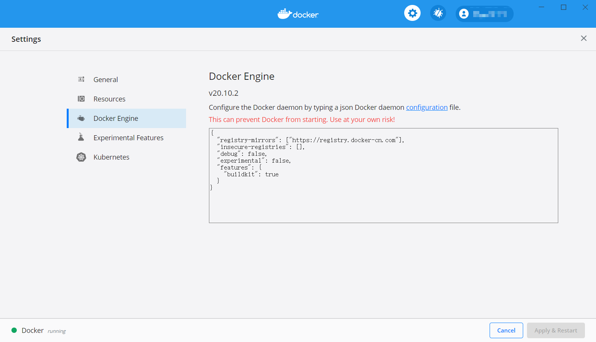

# Docker

## 1. 安装

### 1.1. Windows 安装

1. 下载安装 [Docker🔗](https://www.docker.com/)
2. 更换国内源
   > 在 Docker Seting 中修改 Doker Engine 的配置文件，在"registry-mirrors"配置中添加国内镜像，比如使用官方中国区`https://registry.docker-cn.com`

    

### 1.2. Linux 安装

1. 安装 docker

    ```bash
    # 官方安装脚本
    curl -fsSL https://get.docker.com | bash -s docker --mirror Aliyun
    ```

2. 使用 [清华源方法🔗](https://mirrors.tuna.tsinghua.edu.cn/help/docker-ce/)

## 2. 配置使用

### 2.1. docker 架构

1. 镜像 images: 相当于一个 root 文件系统
2. 容器 container: 是镜像的运行时的实体，可以被创建、启动、停止、删除
3. 仓库 repository: 可以看成代码控制中心，用来存储镜像

### 2.2. docker 使用

1. 拉取（下载）容器

    ```bash
    # 自动下载最新的 ubuntu
    docker pull ubuntu
    # 也可以指定版本
    docker pull ubuntu:20.04
    ```

2. 创建并进入容器 ubuntu

    ```bash
    # 创建容器
    docker run -it ubuntu /bin/bash

    # 创建并进入容器
    docker run -it --name ubuntu1 ubuntu:18.04 /bin/bash

    # 进入已创建好的容器
    ```

3. 常用命令

    | 命令                                     | 功能                           |
    | ---------------------------------------- | ------------------------------ |
    | docker -v  或  docker version            | 查看 docker 版本命令           |
    | docker start [container_name]            | 运行容器                       |
    | docker attach [container_id]             | 进入容器                       |
    | docker exec -it [container_name] /bin/sh | 在容器中开启一个交互模式的终端 |
    | docker restart [container_id]            | 重启容器                       |
    | docker rm [container_name]               | 删除容器                       |
    | docker images 或 docker image ls         | 显示已抽取的镜像               |
    | docker ps                                | 显示运行中的镜像               |
    | docker ps -a                             | 显示所有镜像                   |
    | exit                                     | 退出容器                       |

4. 安装 wget

    ```bash
    apt-get update
    apt-get install wget
    ```

5. 容器自启动

    ```bash
    # 先查询容器 id
    docker ps -a
    # 将容器 id 放入自启动，可以同时放多个容器 id
    docker update --restart=always 容器 id
    ```
