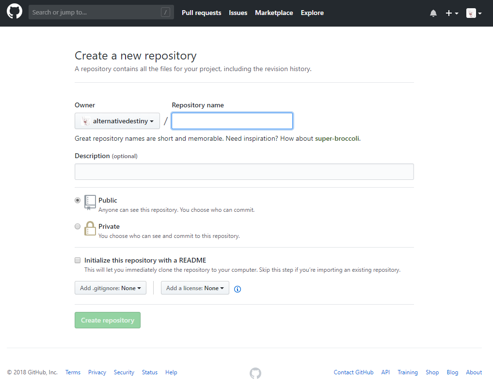
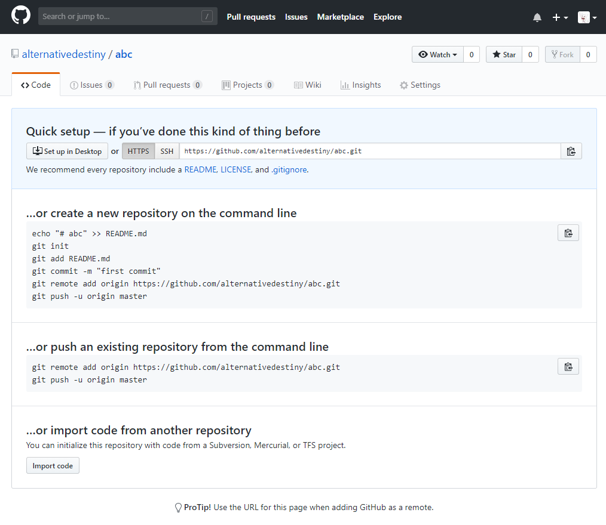

# Git 学习笔记

## 1. 前言

Git分区：工作区—暂存区—Git仓库

## 2. 设定和查询用户名、邮箱

1. 设定用户名、邮箱

    ```git
    # 设定
    git config --global user.name "xx"
    git config --global user.email "xxxx"
    # 查询
    git config user.name
    git config user.email
    ```

## 3. 基础语法

1. 新文件初始化

    ```git
    git init
    ```

2. 把工作目录的文件添加到暂存区域

    ```git
    git add xxx
    # 添加目录下的所有文件
    git add .
    ```

3. 把暂存区域提交到Git仓库

    ```git
    git commit -m "声明"
    ```

    合并添加和提交

    ```git
    git commit -am "声明 "
    ```

4. 把Git仓库文件还原到暂存区域

    ```git
    git reset
    ```

    --mixed（默认）：快照回滚到暂存区域
    --soft选项：只移动head指向
    --hard选项：不仅移动head，还把暂存区文件还原到工作目录

5. 查询Git状态

    ```git
    git status
    ```

6. 查看记录

    ```git
    git log
    ```

7. 文件比较

    ```git
    git diff
    ```

8. 更正最近一次提交

    ```git
    git commit --amend
    ```

    如果需要提交新的说明

    ```git
    git commit --amend -m
    ```

9. 文件被删后，把暂存区文件还原到工作目录

    ```git
    git checkout -- xxx
    ```

    注意--前后各有一个空格
10. 删除文件

    ```git
    git rm xxx
    ```

    然后执行

    ```git
    git reset --soft HEAD~
    ```

11. 重命名文件

    ```git
    git mv name1 name2
    ```

## 4. 进阶

1. 创建分支

    ```git
    git branch 分支名
    ```

2. 切换分支

    ```git
    git checkout 分支名
    ```

3. 显示分支

    ```git
    git log --decorate --all --graph --oneline
    ```

4. 合并分支

    ```git
    git merge 分支名
    ```

    将选定分支合并到HEAD所在分支
5. 删除分支

    ```git
    git branch -d 分支名
    ```

## 5. 使用Git 工具将本地文件上传到Github

### 5.1. 方法

1. 打开Github网站，登陆账户，点击头像旁边的加号，选择“New repository”创建一个新的工程。

   

2. 创建好工程后会跳转到工程页面，其实此时的页面里面就清楚写着上传项目的方法，不过第一次用并不知道这堆英文是什么意思，不过网上有部分教程可能是因为太老了，指令不正确，此时按照这个页面上操作肯定是不会有什么问题。

   

3. 创建一个文件夹，把要上传的文件放到该文件夹里，比如创建一个readme.txt文件，然后右键点击“Git Bash Here”弹出一个命令框，按照下面指令一步一步操作。# 后是注释，不要输入！

    ```git
    git init  # 初始化Git
    git add readme.txt  # 添加文件，注意替换文件名
    git commit -m "注释"  # 文件入库
    git remote add origin https://github.com/alternativedestiny/DataShowWebsite.git  # 链接之前在Github上面创建的工程，注意更换地址
    git push -u origin master  # 上传项目文件，第一次会出现一个登陆窗口，需要登陆你的Github账户，之后就不会出现了。登陆之后出现下面这些文字表示上传成功
    ```

### 5.2. 备注

- origin 添加错误或需要更换origin执行下面指令，删除原有origin，然后重新添加就行

    ```git
    git remote rm origin
    ```

## 6. 老瓶装新酒（新设备在已有项目的基础上继续更新）

1. 克隆项目到本地，在目标文件下

    ```git
    git clone xxx.git
    ```

2. 在git配置好的情况下直接使用即可

## 7. gitignore文件配置

1. 忽略目录下的全部内容：folder/*
2. 忽略文件类型：*.csv
3. 反选模式：!
