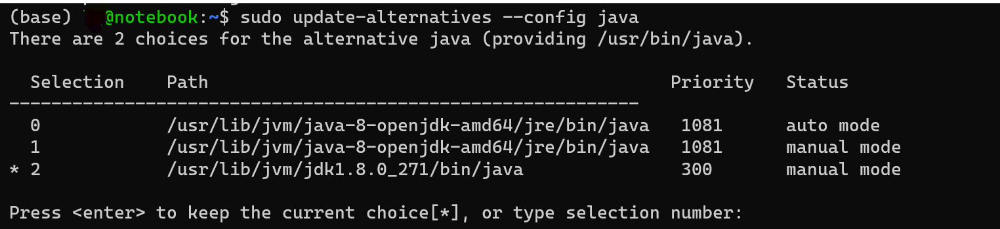

# Java笔记

## 1. 安装

### 1.1. Windows 安装

### 1.2. Linux 安装

1. 安装方法参考[Ubuntu18.04安装Java JDK8的三种方式](https://blog.csdn.net/zbj18314469395/article/details/86064849)
   1. 安装openjdk

        ```bash
        sudo apt-get update
        sudo apt-get install openjdk-8-jdk
        ```

   2. 安装Oracle jdk, 离线安装包的方式
      1. 在[官网](https://www.oracle.com/java/technologies/javase-downloads.html)找到想要的jdk下载
      2. 创建目录

            ```bash
            sudo mkdir /usr/lib/jvm
            ```

      3. 解压下载好的文件

            ```bash
            sudo tar -zxvf jdk-xxx-linux-x64.gz -C /usr/lib/jvm
            ```

      4. 修改环境变量

            ```bash
            sudo vi ~/.bashrc
            ```

            将下边几行添加到文件中

            ```bash
            export JAVA_HOME=/usr/lib/jvm/jdk1.8.0_271
            export JRE_HOME=${JAVA_HOME}/lib:${JRE_HOME}/lib
            export CLASSPATH=.:${JAVA_HOME}/lib:${JRE_HOME}/lib
            export PATH=${JAVA_HOME}/bin:$PATH
            ```

            生效文件

            ```bash
            source ~/.bashrc
            ```

2. 查看安装好的java版本

    ```bash
    java -version
    ```

3. 多版本java切换, 输入序号选择版本

    ```bash
    sudo update-alternatives --config java
    ```

    

## 2. 基本语法

### 2.1. 变量

1. 变量类型

    | 符号   | 名称       | 范围                 |
    | ------ | ---------- | -------------------- |
    | byte   | 字节       | -128 ~ 127           |
    | short  | 短整型     | 2字节 -2^15 ~ 2^15-1 |
    | int    | 整型       | 4字节 -2^31 ~ 2^31-1 |
    | long   | 长整型     | 8字节 -2^63~2^63-1   |
    | float  | 浮点       | 4字节                |
    | double | 双精度浮点 | 8字节                |

2. Java变量类型
   1. 类变量：独立于方法之外的变量，用static修饰
   2. 实例变量：独立于方法之外的变量，没有static修饰
   3. 局部变量：类的方法中的变量

### 2.2. 字符&字符串

1. 字符 (用 ' 表示)

   1. 创建字符

       ```java
       // 字符
       char ch = 'a';
       System.out.println(ch);  // a
       ```

   2. 方法

       | 方法           | 功能                  |
       | -------------- | --------------------- |
       | isLetter()     | 是否是一个字母        |
       | isDigit()      | 是否是一个数字        |
       | idWhitespace() | 是否是一个空白字符    |
       | isUpperCase()  | 是否是大写字母        |
       | isLowerCase()  | 是否是小写字母        |
       | toUpperCase()  | 转换成大写字母        |
       | toLowerCase()  | 转换成小写字母        |
       | toString()     | 转换成字符串，长度为1 |

2. 字符串 (用 " 表示)

   1. 创建字符串

       ```java
       String he = "hello";
       System.out.println(s.length());  // 5
       ```

   2. 方法

       ```java
       // 连接字符串
       string1.concat(string2)
       string1 + string2

       // 格式化字符串
       String s;
       s = String.format("abc %f %d", 3.14, 5);  // abc 3.140000 5
       ```

### 2.3. 数组

1. 创建数组

    ```java
    // 声明数组
    dataType[] arrayRefVar = new dataType[arraySize];  // 方法1
    dataType[] arrayRefVar = {value0, value1, ..., valuek};  // 方法2

    // eg
    class arr {
        public static void main() {
            int[] arr1 = {1, 2, 3};  //数组
            char[] arr2 = new char[3];  // 字符数组
            arr2[0] = 'a';
            arr2[2] = 'b';
            String[] arr3 = {"hello", " ", "world", "!"};  // 字符串组
            System.out.println(Arrays.toString(arr1));  // [1, 2, 3]
            System.out.println(arr2);  // a b
            for (String s : arr3) {  // hello world!
                System.out.print(s);
            }
        }
    }

    ```

2. 遍历

    ```java
    // 基本循环
    int[] x = {1, 2, 3};
    for (int i = 0; i < x.length; i++){
        System.out.println(x[i]);
    }
    // for-each循环
    for (int value : x) {
        System.out.println(value);
    }
    ```

### 2.4. print的几种方法

- print 一般标准输出，不换行
- println 和print一样，但是会换行
- printf 格式化输出，不换行
  - 'd' 整数 结果被格式化为十进制整数
  - 'o' 整数 结果被格式化为八进制整数
  - 'x', 'X' 整数 结果被格式化为十六进制整数
  - 'e', 'E' 浮点 结果被格式化为用计算机科学记数法表示的十进制数
  - 'f' 浮点 结果被格式化为十进制数
  - 'g', 'G' 浮点 根据精度和舍入运算后的值，使用计算机科学记数形式或十进制格式对结果进行格式化。
  - 'a', 'A' 浮点 结果被格式化为带有效位数和指数的十六进制浮点数

```java
public static void main(String[] args) {
    double i = 3.14;
    System.out.print("打印i：" + i);  // 不带换行
    System.out.println("打印i：" + i);  // 带换行
    System.out.printf("打印i：%f", i);
    System.out.printf("打印i：%f \n", i);  // \n换行
    System.out.printf("打印i：%.3f \n", i);  // 保留3位小数
}
// 输出
// 打印i：3.14打印i：3.14
// 打印i：3.140000
// 打印i：3.140
```

### 2.5. 修饰符

1. 访问修饰符：保护对类、变量、方法和构造方法的访问
   1. default：默认，什么也不写，同一包内可见
   2. private：同一类内可见
   3. public：所有类可见
   4. protected：同一包内类和所有子类可见
2. 非访问修饰符
   1. static
      1. 类变量：也叫静态变量，只有一份拷贝
      2. 类方法：也叫静态方法，不能使用类的非静态变量
   2. final：赋值后不能重新赋值，常与static一起使用来创建类常量
   3. abstract
      1. 抽象类：声明抽象类的唯一目的是将来对该类进行扩充
      2. 抽象方法：该方法的具体实现由子类提供
