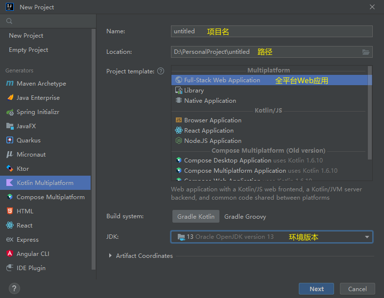
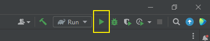
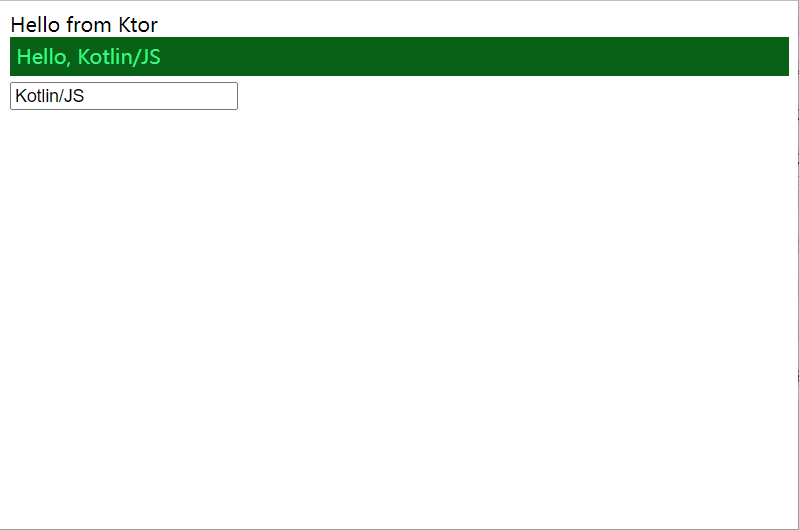

# Kotlin 笔记

## 1. 环境搭建

1. 安装 jdk 环境，参考 [Java 学习笔记](Java%E5%AD%A6%E4%B9%A0%E7%AC%94%E8%AE%B0.md)
2. 安装 [Idea](https://www.jetbrains.com/zh-cn/idea/download/#section=windows), 可以下载社区版 (Community) 免费正版，下载安装即可

## 2. 新建 Kotlin 全平台项目

1. 新建项目

      

2. 创建完成后会有一个模板程序，直接点击右上角的运行，第一次编译时间会很长

      

3. 浏览器内访问 (<http://127.0.0.1/>), 默认端口 8000, 看到如下界面表示运行成功

      

4. 工程介绍

## 3. 基础语法

### 3.1. 基本数据类型

1. 变量

    | 标识    | 类型       |
    | ------- | ---------- |
    | Int     | 整型       |
    | Float   | 浮点       |
    | Double  | 双精度浮点 |
    | Long    | 长整型     |
    | Short   | 短整型     |
    | Byte    | 字节       |
    | Char    | 字符       |
    | String  | 字符串     |
    | Boolean | 布尔型     |

2. 
