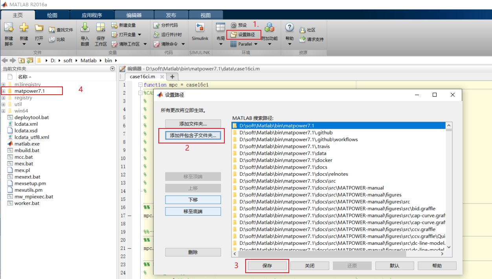
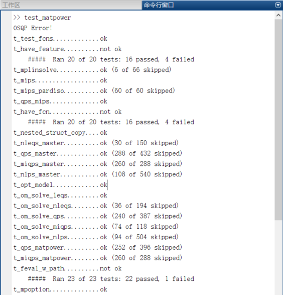

# MATLAB 笔记

## 1. MATPOWER

### 1.1. 安装

1. 在 [MATPOWER 的 GitHub 页面](https://github.com/MATPOWER/matpower) 下载安装的压缩包
2. 将压缩包解压并放到 matlab 安装目录的 bin 目录下，即`../Matlab/bin`，也可以根据需求放到其他目录下
3. 添加 matpower 路径
   1. 点击主页`设置路径`
   2. 点击`添加并包含子文件夹`选择 matpower 文件夹，并保存
   3. 发现 matpower 文件夹变成黑色字体表示添加成功

    

4. 在命令窗口输入`test_matpower`

   > 有许多 ok 输出表示安装成功，失败不用在意

    

### 1.2. 使用

1. 运行简单的牛顿潮流

    ```matlab
    %% 默认 9 节点 case9
    runpf()

    %% 指定节点文件
    runpf('case5')
    ```

2. 计算最优潮流

    ```matlab
    %% 30 节点
    runopf('case30')
    %% 关闭高耗机组
    runuopf('case30')
    ```

### 1.3. 数据说明

1. 以`case33bw`数据为例
2. 节点名

    ```matlab
    function mpc = case33bw
    ```

3. 数据格式的版本，新版本一般都用 version2, 不需要修改

    ```matlab
    mpc.version = '2';
    ```

4. bus 母线字段

    | 字段      | 说明                                                           |
    | --------- | -------------------------------------------------------------- |
    | bus_i     | 节点号                                                         |
    | type      | 母线类型，1-PQ 节点，2-PV 节点，3-平衡（参考）节点，4-孤立节点 |
    | Pd,Qd     | 设置母线注入负荷的有功功率和无功功率                           |
    | Gs,Bs     | 设置与母线并联的电导和电纳                                     |
    | area      | 设置电网断面号，设置范围 1~100，一般设为 1                     |
    | Vm,Va     | 设置母线电压的初始幅值和相角                                   |
    | baseKV    | 设置母线的基准电压（有名值）                                   |
    | zone      | 设置分区号，可设置范围为 1~999，一般设置为 1                   |
    | Vmax,Vmin | 设置工作时母线电压的最高值和最低值                             |

5. generator 发电机字段

    | 字段                   | 说明                               |
    | ---------------------- | ---------------------------------- |
    | bus                    | 节点号                             |
    | Pg,Qg                  | 设置发电机有功无功功率（有名值）   |
    | Qmax,Qmin              | 设置发电机无功功率最大最小值       |
    | Vg                     | 设置发电机工作电压                 |
    | mBase                  | 设置接入发电机的功率基准           |
    | status                 | 设置发电机工作状态，1-运行，2-停运 |
    | Pmax,Pmin              | 设置发电机有功功率最大最小值       |
    | Pc1,Pc2                | 发电机特征量，一般设为 0           |
    | Qc1min,Qc1max          | 发电机特征量，一般设为 0           |
    | Qc2min,Qc2max          | 发电机特征量，一般设为 0           |
    | ramp_agc               | 发电机特征量，一般设为 0           |
    | ramp_10,ramp_30,ramp_q | 发电机特征量，一般设为 0           |
    | apf                    | 发电机特征量，一般设为 0           |

6. branch 支路字段

    | 字段          | 说明                                                                                                       |
    | ------------- | ---------------------------------------------------------------------------------------------------------- |
    | fbus          | 支路起始节点号                                                                                             |
    | tbus          | 支路终止节点号                                                                                             |
    | r,x,b         | 支路电阻，电抗，电纳                                                                                       |
    | rateA         | 支路长期允许功率                                                                                           |
    | rateB         | 支路短期允许功率                                                                                           |
    | rateC         | 支路紧急允许功率                                                                                           |
    | ratio         | 支路变比，若该支路仅仅为导线则设置为 0，若含有变压器，则该变比为 fbus 侧母线基准电压与 tbus 侧基准变压之比 |
    | angle         | 支路的相位角度，如果支路元件为变压器，则就是变压器的转角，如果支路元件不是变压器，则相位角度为 0 度        |
    | status        | 支路工作状态，1-入运行，0-退出运行                                                                         |
    | angmin,angmax | 支路相位角最小最大值                                                                                       |

7. generator cost data 发电成本

    | 字段     | 说明                                                             |
    | -------- | ---------------------------------------------------------------- |
    | model    | 模型，1-分段线性，2-多项式                                       |
    | startup  | 启动成本（美元）                                                 |
    | shutdown | 关闭成本（美元）                                                 |
    | n        | 多项式成本函数遵循的成本系数数，或分段线性遵循的数据点数         |
    | 其余参数 | 定义总成本函数 f§的参数，f 和 p 的单位分别是$/hr 和 MW（或 MVAr) |

8. convert branch impedances from Ohms to p.u. 将支路阻抗从欧姆转换为 p.u.
9. convert loads from kW to MW 负荷从 kW 转 MW

### 1.4. 备注

1. 参考

   - [MATPOWER 快速上手及应用实例](https://blog.csdn.net/qq_29629293/article/details/108610843)
   - [基于 Matpower 的电力系统潮流计算原理及仿真设计（详细）](https://blog.csdn.net/Gentleheng/article/details/112980489?ops_request_misc=%257B%2522request%255Fid%2522%253A%2522162979368816780265477280%2522%252C%2522scm%2522%253A%252220140713.130102334..%2522%257D&request_id=162979368816780265477280&biz_id=0&spm=1018.2226.3001.4187)
