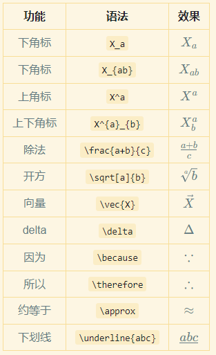

# Markdown 语法速览

## 1. 标题

1. Makrdown 标题也可以作为目录，许多 Markdown 工具都会根据标题自动生成目录
2. Markdown 的标题使用井号`#`表示，一级标题用一个`#`号，二级标题用两个`#`依次类推，但是不建议使用四级以上标题，容易造成目录过于复杂

    ```md
    # 一级标题
    ## 二级标题
    ### 三级标题
    ```

## 2. 列表

### 2.1. 有序列表

1. 由数字加点号构成，与正文之间用空格隔开，比如

    ```md
    1. 列表 1
    2. 列表 2
    3. 列表 3
    ```

    效果如下

    1. 列表 1
    2. 列表 2
    3. 列表 3

### 2.2. 无序列表

1. 由`-`或`*`构成，与正文之间用空格隔开，比如

    ```md
    - 无序列表 1
    - 无序列表 2
    ```

    部分 Markdown 工具会将无序列表解析成有序列表，效果如下

    - 无序列表 1
    - 无序列表 2

### 2.3. todo list

1. 一般常用无序列表加方括号组成 `- [ ]`，括号前后和括号内记得有空格

    ```markdown
    - [ ] todo1
    - [x] todo2
    ```

    eg.

    - [ ] todo1
    - [x] todo2

## 3. 链接与图片

1. Mardown 支持在文本中插入链接，其语法为`[链接名](链接)`

    ```markdown
    这是一个 [百度🔗](https://www.baidu.com/) 的链接，点击直接跳转
    ```

   > 这是一个 [百度🔗](https://www.baidu.com/) 的链接，点击直接跳转

2. 引用链接：如果链接过长不想放入文中可以采用引用链接

    ```markdown
    这是一个 [百度][1] 的链接

    [1]:https://www.baidu.com/
    ```

    eg. 这是一个 [百度][1] 的链接

    [1]:https://www.baidu.com/

3. Markwon 文本链接，可以跳转到当前或其他文档的指定目录
   1. 代码
        > 注意链接中的空格用 `-` 替代，中文的 `。` 要删除
        > 部分 Markdown 编辑器不支持章节跳转

        ```markdown
        - 跳转到本文档的 [标题](##-1.-标题)

        - 跳转到 [Pandas 笔记的数据处理章节](../Python/Py-05-Pandas.md##-2.-Pandas-数据处理)
        ```

   2. 效果如下

       - 跳转到本文档的 [标题](##-1.-标题)

       - 跳转到 [Pandas 笔记的数据处理章节](../Python/Py-05-Pandas.md##-2-Pandas-数据处理)

4. 图片其实就是一种链接，其语法为``, 图片名不会显示在最终效果中，但是当图片连接失效时会显示，比如
   1. 代码

        ```markdown
        这是一张图片
        
        这是一张错误的图片
        
        ```

   2. 效果如下
        这是一张图片
        

        这是一张错误的图片
        

5. 还有一种插入图片的方式是直接插入 html 标签，好处是可以控制图片的大小，但是部分编辑器不支持，比如
   1. 代码

        ```markdown
        
        ```

   2. 效果如下

        

## 4. 表格

1. Markdown 可以通过字符的方式创建表格，使用`|`作为列分隔符，使用`-`作为表头分隔符（两三个即可），使用方法如下
   1. 代码

        ```markdown
        | 表头 1       | 表头 2 | 表头 3 |
        | ------------ | :----: | -----: |
        | 内容 1       | 内容 2 | 内容 3 |
        | 默认靠左对齐 |  居中  | 右对齐 |
        ```

   2. 效果如下：

        | 表头 1       | 表头 2 | 表头 3 |
        | ------------ | :----: | -----: |
        | 内容 1       | 内容 2 | 内容 3 |
        | 默认靠左对齐 |  居中  | 右对齐 |

## 5. 字体

|   类型   |           符号            |          效果           |
| :------: | :-----------------------: | :---------------------: |
|   加粗   |        `**文本**`         |        **文本**         |
|   斜体   |         `*文本*`          |         *文本*          |
|  删除线  |        `~~文本~~`         |        ~~文本~~         |
|  下划线  |       `<u>文本</u>`       |       <u>文本</u>       |
|   上标   |       `文本^上标^`        |       文本^上标^        |
|   下标   |       `文本~下标~`        |       文本~下标~        |
| 小号字体 | `<small>小号字体</small>` | <small>小号字体</small> |
| 大号字体 |   `<big>大号字体</big>`   |   <big>大号字体</big>   |

## 6. 代码块

1. 行内代码，使用 ` 号围起来（数字 1 左边的键）, 比如

    ```markdown
    这是一段`行内代码`
    ```

    效果如下

    这是一段`行内代码`

2. 整段代码，使用连续三个 ` 号围起来，首行后面加上代码语言，比如

    ```markdown
    这是一个整段 Python 代码
        ```python
        import pandas as pd
        
        print('abc')
        ```
    ```

    效果如下
    这是一个整段 Python 代码

    ```python
    import pandas as pd
    
    print('abc')
    ```

## 7. 公式

1. 公式的语法为`$$ 公式内容 $$` 或`$ 公式内容 $`, 比如

    ```markdown
    $$ a = b + c $$
    ```

    效果如下：
    $$ a = b + c $$

2. 常用公式语法

    |   功能   |       语法        |        效果         |
    | :------: | :---------------: | :-----------------: |
    |  下角标  |       `X_a`       |       $ X_a $       |
    |  下角标  |     `X_{ab}`      |      $ X_{ab}$      |
    |  上角标  |       `X^a`       |       $ X^a $       |
    | 上下角标 |    `X^{a}_{b}`    |    $ X^{a}_{b} $    |
    |   除法   |  `\frac{a+b}{c}`  |  $ \frac{a+b}{c} $  |
    |   开方   |   `\sqrt[a]{b}`   |   $ \sqrt[a]{b}$    |
    |   向量   |     `\vec{X}`     |     $ \vec{X} $     |
    |  delta   |     `\delta`      |     $ \Delta $      |
    |   因为   |    `\because`     |    $ \because $     |
    |   所以   |   `\therefore`    |   $ \therefore $    |
    |  约等于  |     `\approx`     |     $ \approx $     |
    |  下划线  | `\underline{abc}` | $ \underline{abc} $ |

3. 部分 Markdown 解析器不支持表格内的公式，下面以图片展示

    

## 8. 布局

1. 居中

    ```markdown
    <center>居中字符</center>
    ```

    <center>居中字符</center>

2. 靠右

    ```markdown
    <p style="text-align:right">居右对齐</p>
    ```

    <p style="text-align:right">居右对齐</p>
