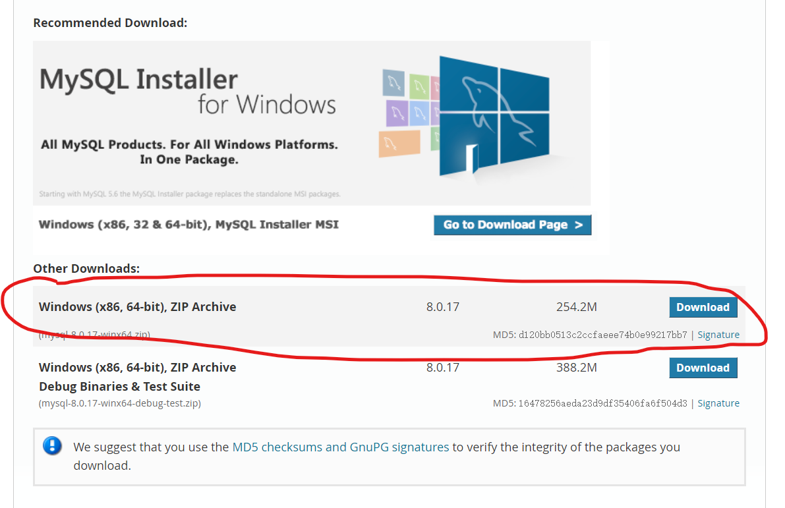
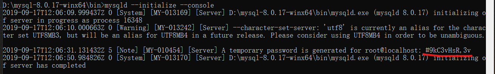
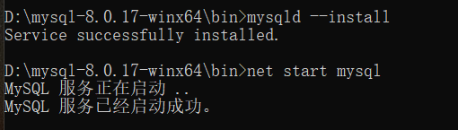

# MySQL笔记

## 1. 安装

1. 下载[MySQL](https://dev.mysql.com/downloads/mysql/)

    

2. 解压文件到安装目录，如D:\mysql-8.0.17-winx64

3. 创建配置文件my.ini

    ```ini
    [mysqld]
    # 设置3306端口
    port=3306
    # 设置mysql的安装目录
    basedir=D:\mysql-8.0.17-winx64
    # 设置mysql数据库的数据的存放目录
    datadir=D:\mysql-8.0.17-winx64\data
    # 允许最大连接数
    max_connections=20
    # 允许连接失败的次数。这是为了防止有人从该主机试图攻击数据库系统
    max_connect_errors=10
    # 服务端使用的字符集默认为UTF8
    character-set-server=utf8
    # 创建新表时将使用的默认存储引擎
    default-storage-engine=INNODB
    # 默认使用“mysql_native_password”插件认证
    default_authentication_plugin=mysql_native_password
    [mysql]
    # 设置mysql客户端默认字符集
    default-character-set=utf8
    [client]
    # 设置mysql客户端连接服务端时默认使用的端口
    port=3306
    default-character-set=utf8

    ```

4. 以管理员身份打开cmd，加载至MySQL安装目录，初始化命令：mysqld --initialize --console

    画横线处为初始密码

    

5. 启动服务，分别执行

   mysqld --install

   mysqld --net start mysql

   

6. 停止服务

    net stop mysql

## 2. mysql使用

### 2.1. 基本用法

1. 进入MySQL

    ```bash
    D:\mysql-8.0.17-winx64\bin>mysql -u root -p
    Enter password: ******
    ```

2. 创建数据库

    ```sql
    mysql> create database test1;
    ```

3. 创建表格：直接创建比较复杂，可以使用Navicat等工具
4. 进入表格：use test1

    ```sql
    mysql> use test1
    Database changed
    ```

5. 插入数据

    ```sql
    mysql> insert into table2(OCCUR_TIME) values ('ac');
    Query OK, 1 row affected (1.49 sec)
    ```

6. 退出

    ```sql
    mysql> exit
    Bye
    ```

### 2.2. MySQL插入数据

```python
import pymysql

# 连接数据库：ip，username，password，sqlname
db = pymysql.connect("localhost", "root", "123456", "test1")
# 创建游标
cursor = db.cursor()

# 一次插入10条语句
for i in range(10):
    d = df.iloc[i, :]
    # sql语句
    sql = "insert into table_name(col1_name, col2_name) " \
        "values ('%s', '%s')" \
        % (data[0], data[1])
    # 执行sql语句
    cursor.execute(sql)

# 提交到数据库执行
db.commit()

# 关闭数据库
db.close()
```

### 2.3. MySQL查询

1. 查找

    ```sql
    select 列名 from 表名
    ```

2. 筛选

    ```sql
    where 筛选条件
    ```

3. 排序

### 2.4. 函数

1. 命令
    | 关键字           | 功能                         |
    | ---------------- | ---------------------------- |
    | Distinct         | 不同/去重                    |
    | Order by asc/dsc | 升降序排列                   |
    | Update           | 修改表数据                   |
    | Top/Limit        | 限定条目                     |
    | Like             | 模糊查找                     |
    | In               | 多值操作                     |
    | Between          | 介于两值之间                 |
    | As               | 别名                         |
    | Join             | 多个表之间的关系             |
    | Union            | 合并多个Select结果           |
    | Select Into      | 从一个表中取数据放入另一个表 |
2. 约束 Constraints
    | 关键字         | 功能                     |
    | -------------- | ------------------------ |
    | not null       | 强制不接受Null值         |
    | unique         | 约束唯一标识             |
    | primary key    | 主键                     |
    | foreign key    | 指向另一个表中的主键     |
    | check          | 用于限制列中值的范围     |
    | default        | 默认值                   |
    | create index   | 创建索引                 |
    | drop           | 删除索引、表、数据库     |
    | alter          | 在表中添加、修改或删除列 |
    | auto increment | 自增字段                 |
    | view           | 可视化表                 |
    | date           | 日期                     |

3. 函数
    | 函数名              | 功能                           |
    | ------------------- | ------------------------------ |
    | avg(col_name)       | 平均值（不包含Null）           |
    | count(col_name)     | 制定列值的数目（不含Null）     |
    | first(col_name)     | 返回指定字段中第一个记录的值   |
    | last(col_name)      | 返回指定字段中最后一个记录的值 |
    | max(col_name)       | 返回一列中的最大值             |
    | min(col_name)       | 返回一列中的最小值             |
    | sum(col_name)       | 返回数值列的总和               |
    | group by(col_namae) | 根据一个或多个列对结果进行分组 |
    | having              | where不能和合计函数一起使用    |
    | ucase               | 把字段值转换成大写             |
    | lcase               | 把字段值转换成小写             |
    | mid                 | 从文本字段中提取字符           |
    | len                 | 返回文本字段长度               |
    | round               | 把数值字段舍入为指定小数位     |
    | now                 | 返回当前的日期和时间           |
    | formart             | 对字段的显示进行格式化         |

### 2.5. SQL性能优化

1. 减少数据访问
2. 返回更少的数据
3. 减少交互次数
4. 减少数据库服务器CPU运算
5. 利用更多的资源

## 3. 备注

1. MySQL大小写不敏感
2. MySQL字符或英文的问题
   1. 错误提示`pymysql.err.InternalError: (1054, "Unknown column 'xxxxx' in 'field list'")`
   2. 解决方法：在SQL语句中将 %s 加引号改成 '%s'

## 4. Navicat可视化工具

1. [安装激活教程](https://www.jianshu.com/p/5f693b4c9468)
2. 连接数据库并修改初始密码

   
