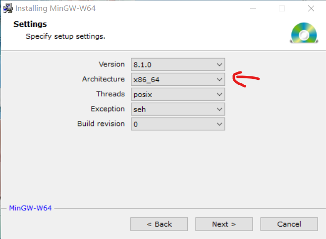
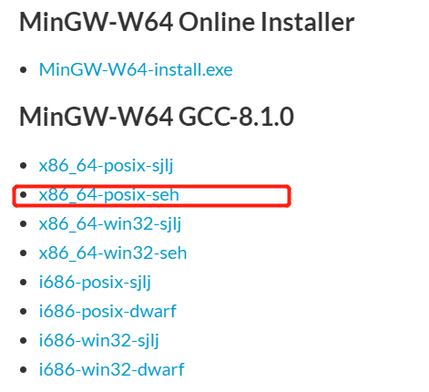

# C++学习笔记

## 1. 环境配置

### 1.1. MinGW & Clion

1. 安装好[Clion](https://www.jetbrains.com/clion/)
2. 在Clion设置菜单`Toolchains`
3. Environment下面选择MinGW，可以点击右上角的download直接进入MinGW下载页面
    

4. 在线安装mingw
   1. 从网站中下载[MinGW](http://mingw-w64.org/doku.php/download/mingw-builds)安装包
        

   2. 这个是在线安装的安装包，根据设备选择架构，i686表示32位，x86_64是64位架构，要记住安装目录
        

   3. 在Clion设置选择MinGW的安装路径即可
5. 网络不好时可以选择离线安装
   1. [下载地址](https://sourceforge.net/projects/mingw-w64/files/mingw-w64/)
   2. 根据系统选择版本，Windows建议x86_64-posix-seh
        
   3. 解压下载的压缩文件即可

### 1.2. VSCode 配置

1. 安装 C/C++ 插件
    

2. 配置方法，这里以C++为例，C的配置方法相同，只不过生成的配置文件略有区别
   1. 先创建一个测试的cpp文件，比如

        ```cpp
        #include <iostream>
        using namespace std;

        int main()
        {
            cout << "hello" << endl;
            return 0;
        }
        ```

   2. 按 `f5` 依次选择环境 `C++(GDB/LDB)`，选择配置 `g++.exe`，系统就会自动生成配置和编译文件，然后就可以开始调试了
        

3. 也有一种不用配置的方法，下载安装插件：C/C++ Compile Run，安装查
        

## 2. print的用法

1. print类型
   - d：十进制带符号整数
   - o：八进制无符号整数
   - f：浮点数
   - p：指针
   - s：字符串*char
   - x：十六进制
   - I64d：用于int64或long long
   - %m.n：m指域宽，n指精度，右对齐（-左对齐）

- [参考链接-printf格式化输出](https://blog.csdn.net/xiexievv/article/details/6831194)

## 3. 数据类型

### 3.1. 数字 & 数组

1. 数组定义

```cpp
int num[] = {1, 2, 3};
```

### 3.2. Array

1. array：与数组一样，array对象的长度也是固定的，也是用栈（静态内存分配），而不是自由存储区，因此其效率与数组相同，但更方便，更安全。
2. 基本操作
   1. 定义：`array<typeName, number> name = {};`

```cpp

```

### 3.3. 字符串 String & Char

1. 创建字符串

    ```cpp
    // 头文件
    #include <string>

    string s1 = "what is your name"
    string s2 = "is"
    ```

2. 增

    ```cpp
    // 插入
    s1.insert(int num, string s)  // 在num位置插入s

    // 追加
    s1.append(string s)  // 追加字符串
    s1.append(int n, char c)  // 追加n个c字符

    // 拼接
    int i = 5;
    string s = "station: " + to_string(i);

    // 拷贝
    #include <string.h>
    strcpy(s1, s2)  // 把s2拷贝到s1中
    ```

3. 删

    ```cpp
    // 擦除
    s1.erase(int a, int b)  // 删除a之后的b个字符
    ```

4. 改

    ```cpp
    // 替换
    s1.replace(int num1, int num2, string s)  // 用s替换num1后面的num2-1个字符
    s1.replace(int num1, int num2, string s, int num3, int num4)  // 用s的第num3后面的num4-1个字符替换num1后面的num2-1个字符

    // 字符串截取
    s1.substr(int a, int b)  // 起始位a，长度b
    s1.substr(int a)  // 截取第a个之后的字符串
    ```

5. 查

    ```cpp
    // 查找
    s1.find(s2)     // 返回起始位置或-1，大小写敏感
    s1.rfind(s2)    // 从后往前查找，其他同上

    s1.find_first_of(s2)    // 查找s2第一次出现的位置
    s1.find_last_of(s2)     // 查找s2最后一次出现的位置
    s1.find_first_not_of(s2)    // 在s1中查找第一个不再s2中的字符
    s1.find_last_not_of(s2) // 与上面相似

    p = strchr(s1, s2); // 查找s2在s1中第一次出现的位置

    ```

6. 比较

    ```cpp
    // 比较
    s1.compare(s2)  // 大于：1；小于：-1；等于：0
    strcmp(s1, s2)  // 同上
    ```

- [参考链接](https://blog.csdn.net/tengfei461807914/article/details/52203202)

### 3.4. 日期时间

1. 创建时间格式

    ```cpp
    #include <time.h>
    time_t now = time(NULL);    // 获取系统当前时间
    ```

### 变量转换

1. String
   1. String->Int: `stoi(s)`
2. Int
   1. Int->Sting: `to_string(i)`

### 3.5. 获取长度

1. 总览

    ```cpp
    #include<iostream>
    #include<string>

    using namespace std;

    xx.size()
    xx.length()
    sizeof(xx)  // 运算符，返回所占空间的字节数
    strlen(xx)  // 函数，返回字符数组或字符串所占的字节数
    ```

2. 获取数组长度

    ```cpp
    int a[] = {1, 2, 3, 4}; // 数组
    sizeof(a)/sizeof(a[0]);  //数组长度
    ```

3. 获取字符串长度

- [参考链接](https://blog.csdn.net/z_qifa/article/details/77744482)

## 4. 数据结构

## 5. 指针

1. `*`：间接寻址运算符，一元运算符，返回操作数所指定地址的变量的值
2. `&`：取地址运算符，一元运算符，返回操作数的内存地址

```c
int a = 1;
int *p = &a;    // √
int *p = a;     // ×

cout << a << endl;      // 1
cout << &a << endl;     // 0x61fe14
cout << p << endl;      // 0x61fe14
cout << *p << endl;     // 1

*p = 10;
cout << a << endl;      // 10
cout << p << endl;      // 0x61fe14
cout << *p << endl;     // 10

cout << typeid(a).name() << endl;       // i
cout << typeid(p).name() << endl;       // Pi
cout << typeid(*p).name() << endl;      // i
```

## 6. 面向对象

### 6.1. 类&对象

1. 类的定义

    ```cpp
    class Box{
        // 除了public还可以定义成private或protect
        public:
            double length;
            double breadth;
            double height;
    }
    ```

2. 访问数据成员

    ```cpp
    Box Box1;  // 声明Box1，类型为Box

    // 定义box1的长宽高
    Box1.length = 10.0;  
    Box1.breadth = 12.0;
    Box1.height = 9.0；

    // 访问变量
    double volume = Box1.length * Box1.bredth  * Box1.height;
    ```

### 6.2. 成员函数

1. 类内定义

    ```cpp
    class Box(){
        public:
            double length;
            double breadth;
            double height;

            double getVolume(void){
                return length*breadth*height;
            }
    }

    // 访问函数
    Box Box1;
    double volume  = Box1.getVolume();

    ```

2. 类外定义

    ```cpp
    class Box(){
        public:
            double length;
            double breadth;
            double height;
            // 成员函数声明
            double getVolume(void);
    }
    double Box::getVolume(void){
        return length * breadth * height;
    }

    // 访问函数
    Box Box1;
    double volume  = Box1.getVolume();

    ```

### 6.3. 类访问修饰符

1. public公有成员：类的外部可以访问
2. private私有成员：类的外部不可访问，不可查看，默认情况下，类的所有成员都是私有的。可以使用成员函数对数据进行初始化。
3. protected保护成员：与私有成员类似，但是保护成员在派生类（子类）中可以访问。

### 6.4. 构造函数&析构函数

1. 构造函数
   - 是一类特殊的成员函数，他会在`每次创建类的新对象时执行`
   - `构造函数的名称与类的名称是完全相同`的，并且不会返回任何类型，也不会返回 void
   - 构造函数可用于为某些成员变量设置初始值
   - 默认的构造函数没有任何参数，但如果需要，构造函数也可以带有参数

2. 析构函数
   - 类的析构函数是类的一种特殊的成员函数，它会在`每次删除所创建的对象时执行`
   - `析构函数的名称与类的名称是完全相同的`，只是在前面加了个波浪号（~）作为前缀，它不会返回任何值，也不能带有任何参数。析构函数有助于在跳出程序（比如关闭文件、释放内存等）前释放资源

3. 代码

    ```cpp
    class Line
    {
        public:
            void setLength( double len );
            double getLength( void );
            Line();   // 这是构造函数声明
            ~Line();  // 这是析构函数声明
    };

    // 成员函数定义，包括构造函数
    Line::Line(void)
    {
        cout << "Object is being created" << endl;
    }
    Line::~Line(void)
    {
        cout << "Object is being deleted" << endl;
    }
    ```

## 7. 信号处理

1. 信号是由操作系统传给进程的中断，会提早终止一个程序，信号定义包含在头文件<csignal>中
2. 信号功能表

    | 信号    | 功能                                       |
    | ------- | ------------------------------------------ |
    | SIGABRT | 程序的异常终止，如调用abort                |
    | SIGFPE  | 错误的算数运行，比如除以零或导致溢出的操作 |
    | SIGILL  | 检测非法指令                               |
    | SIGINT  | 程序终止（interrupt）信号                  |
    | SIGSEGV | 非法访问内存                               |
    | SIGTERM | 发送到程序的终止请求                       |

3. 样例

    ```cpp
    #include <iostream>
    #include <csignal>

    using namespace std;

    void signaSigfpe(int signum) {
        printf("data error code %d\n", signum);
        exit(signum);
    }

    int main() {

        signal(SIGFPE, signaSigfpe);
        int a = 10;
        int b = 0;
        cout << a / b << endl;

        return 0;
    }

    ```

    b=5时，正常运行
    
    b=0时，出现错误
    

## 8. 备注

### 8.1. ASCII码转换

```cpp
string s = (char) (n + 64);
int n = (int)('a')
```

### 8.2. 单引号`'`和双引号`"`

1. 单引号是字符型，单引号引起的字符代表一个整数
2. 双引号是字符串型，双引号的字符串指向一个无名数组起始字符的指针
